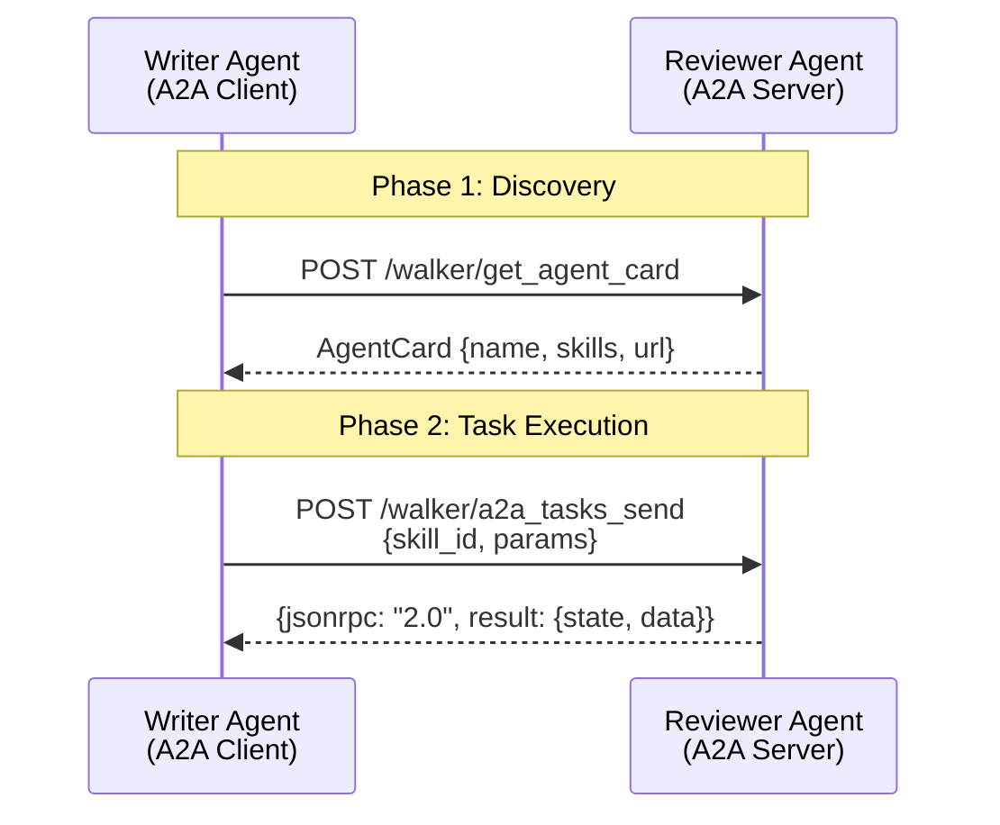
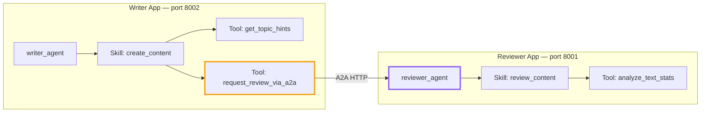
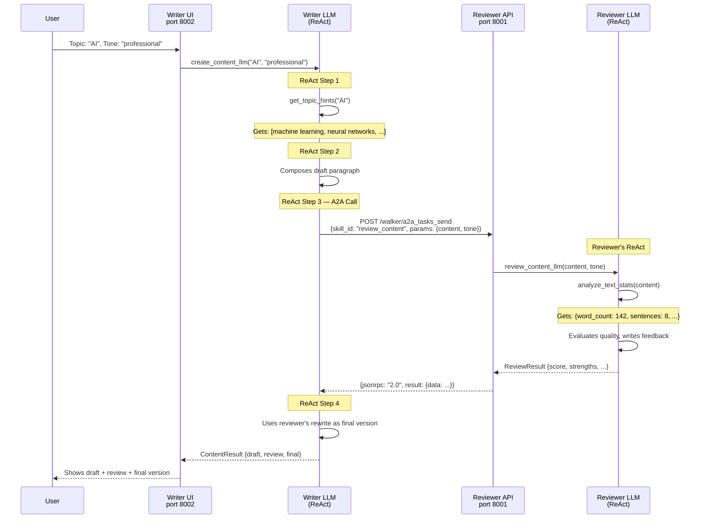
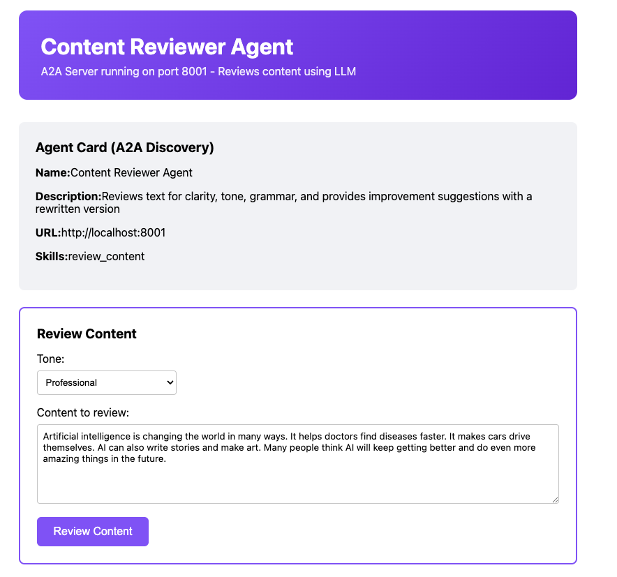
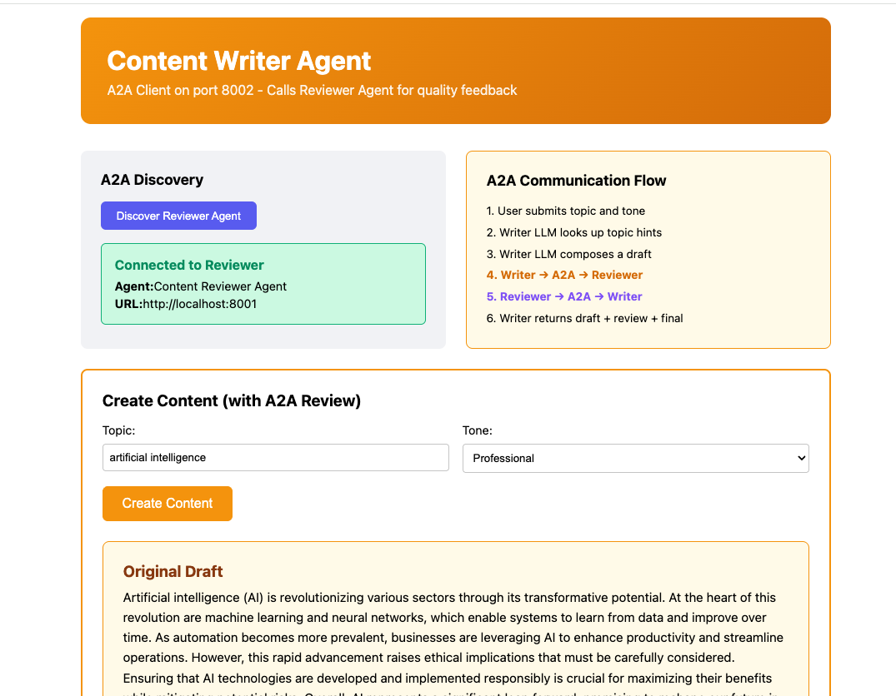

# When AI Agents Talk: Building Agent-to-Agent Communication with byLLM

There's a growing assumption in the AI world that smarter agents will solve harder problems. Build a bigger model, give it more tools, and eventually it handles everything. But anyone who's actually built production AI systems knows this falls apart quickly. A single agent that handles customer support, writes content, manages finances, and analyzes data becomes a tangled mess of prompts, tools, and edge cases. The same architectural lesson we learned with monolithic software applies here: **decomposition wins**.

<!-- more -->

What if AI agents could specialize in one thing and collaborate with other specialized agents to solve complex problems? That's exactly what the **A2A (Agent-to-Agent) protocol** enables in Jac. Two independent byLLM agents, running on separate servers, discovering each other's capabilities and working together through a clean HTTP-based protocol.

This post walks through building a real A2A system: a **Writer Agent** that composes content and a **Reviewer Agent** that provides quality feedback. Both use `by llm()` for tasks that genuinely require language understanding — not the kind of thing you can fake with arithmetic.

## Why Not Just One Agent?

Before diving in, it's worth asking: why not give a single agent both writing and reviewing capabilities?

Three reasons:

1. **Separation of concerns** — A writer and a reviewer have fundamentally different objectives. Combining them creates conflicting optimization goals in a single prompt.
2. **Independent deployment** — The reviewer can serve any agent that needs content analysis, not just the writer. It's a reusable service.
3. **Independent scaling** — If reviewing is the bottleneck, scale the reviewer. If content generation gets more traffic, scale the writer.

This is the microservices philosophy applied to AI agents. Each agent does one thing well and exposes its capability through a standardized protocol.

## The A2A Protocol

A2A is deliberately simple. It has two operations:

**Discovery** — An agent describes itself through an **Agent Card**: its name, what it does, and what skills it offers.

**Task Execution** — One agent sends a task to another by specifying a skill ID and parameters. The receiving agent executes the skill and returns a structured result.



Both endpoints are just Jac walkers exposed as HTTP APIs. No special infrastructure needed — if you can run `jac start`, you can participate in A2A.

## The Architecture

Here's what we're building: two completely independent Jac applications that collaborate through A2A.



The Writer Agent has two tools available to its LLM: a local knowledge base (`get_topic_hints`) and an A2A bridge (`request_review_via_a2a`). The LLM decides when and how to use each one through ReAct reasoning. The key insight is that **calling another agent is just another tool** — the LLM treats it the same way it treats any local function.

## Building the Reviewer Agent

Let's start with the simpler piece. The Reviewer Agent is an A2A **server** — it exposes a skill that other agents can call.

### The Agent Card

Every A2A agent needs to describe itself. In Jac, this is a simple object attached to the agent node:

```jac
obj AgentCard {
    has name: str,
        description: str,
        url: str = "",
        skills: list[dict] = [];
}

node reviewer_agent {
    has agent_card: AgentCard = AgentCard(
        name="Content Reviewer Agent",
        description="Reviews text for clarity, tone, grammar, and provides improvement suggestions with a rewritten version",
        url="http://localhost:8001",
        skills=[
            {
                "id": "review_content",
                "name": "Review Content",
                "description": "Analyze text quality and provide a score (1-10), strengths, improvements, and a rewritten version"
            }
        ]
    );
}
```

The `skills` array is the contract. Any agent that discovers this card knows exactly what it can ask for: send text, get back a score and feedback.

### The Review Skill: LLM with Tools

Here's where byLLM shines. The reviewer needs to actually *understand* writing quality — something a regular function can't do. We give the LLM a `analyze_text_stats` tool that provides objective metrics, and let the LLM do the subjective evaluation:

```jac
obj ReviewResult {
    has score: int,
        strengths: str,
        improvements: str,
        rewritten: str;
}

node reviewer_agent {
    # ... agent_card from above ...

    def analyze_text_stats(text: str) -> dict {
        words: list = text.split();
        word_count: int = len(words);
        # ... sentence counting, avg word length, etc.
        return {
            "word_count": word_count,
            "sentence_count": sentence_count,
            "avg_word_length": avg_word_len,
            "longest_sentence_words": longest
        };
    }

    """
    Review the given text content written in the specified tone.
    First use analyze_text_stats to get text statistics, then evaluate:
    - Clarity and readability
    - Tone consistency
    - Grammar and structure
    Provide a score from 1-10, list key strengths, suggest improvements,
    and rewrite the text incorporating your suggestions.
    """
    def review_content_llm(content: str, tone: str) -> ReviewResult
        by llm(method="ReAct", tools=[self.analyze_text_stats]);
}
```

Notice the pattern: the function *signature* defines what goes in and what comes out (`ReviewResult` — a structured type). The *docstring* tells the LLM what to do. The `method="ReAct"` lets the LLM reason step-by-step and call tools. The function has **no body** — `by llm()` replaces it entirely.

The LLM will:

1. Call `analyze_text_stats` to get objective metrics
2. Read the content and evaluate it against the requested tone
3. Reason about strengths and weaknesses
4. Write a rewritten version incorporating its suggestions
5. Return a structured `ReviewResult`

This is a task that genuinely needs language understanding. No amount of if-else logic can evaluate whether prose is "clear" or whether the tone matches "professional."

### Exposing as A2A Endpoint

The walker that handles incoming A2A requests is straightforward:

```jac
walker :pub a2a_tasks_send {
    has skill_id: str = "review_content",
        params: dict = {};

    can start with `root entry {
        visit [-->(`?reviewer_agent)];
    }

    can execute with reviewer_agent entry {
        result = here.execute_skill(self.skill_id, self.params);
        report {
            "jsonrpc": "2.0",
            "result": {
                "id": str(uuid.uuid4()),
                "state": "completed",
                "data": result
            }
        };
    }
}
```

When another agent POSTs to `/walker/a2a_tasks_send`, this walker receives the skill ID and parameters, walks to the reviewer agent node, executes the skill, and returns the result wrapped in a JSON-RPC envelope.

## Building the Writer Agent

The Writer Agent is the A2A **client** — it calls the Reviewer when it needs feedback.

### The A2A Client

First, a simple HTTP wrapper for making A2A calls:

```jac
import requests;

obj A2AClient {
    has base_url: str;

    def discover -> dict {
        response = requests.post(
            f"{self.base_url}/walker/get_agent_card", timeout=10
        );
        return response.json();
    }

    def send_task(skill_id: str, params: dict) -> dict {
        response = requests.post(
            f"{self.base_url}/walker/a2a_tasks_send",
            json={"skill_id": skill_id, "params": params},
            timeout=30
        );
        return response.json();
    }
}
```

Nothing fancy. `discover()` fetches the agent card. `send_task()` executes a skill. The A2A protocol is just HTTP POSTs with JSON payloads.

### The Writing Skill: LLM with A2A as a Tool

Here's the critical design choice. The Writer Agent's LLM has two tools: a local knowledge base and **the A2A call to the Reviewer**:

```jac
obj ContentResult {
    has topic: str,
        tone: str,
        draft: str,
        review_score: int,
        review_strengths: str,
        review_improvements: str,
        final_version: str;
}

node writer_agent {
    has reviewer: A2AClient = A2AClient(base_url="http://localhost:8001");

    has topic_hints: dict = {
        "artificial intelligence": ["machine learning", "neural networks",
            "automation", "ethical implications", "transformative potential"],
        "climate change": ["renewable energy", "carbon emissions",
            "extreme weather", "sustainability", "global cooperation"],
        # ... more topics
    };

    def get_topic_hints(topic: str) -> dict {
        # Returns relevant themes for the topic
        # ...
    }

    def request_review_via_a2a(content: str, tone: str) -> dict {
        print(f"\n[A2A] Writer -> Reviewer: Sending for review");
        result = self.reviewer.send_task(
            skill_id="review_content",
            params={"content": content, "tone": tone}
        );
        return result;
    }

    """
    Create content on the given topic with the specified tone.
    Steps:
    1. Use get_topic_hints to find relevant themes for the topic
    2. Write a well-structured paragraph (100-150 words)
    3. Send the draft to the Reviewer Agent via request_review_via_a2a
    4. Use the reviewer's rewritten version as the final_version
    Return a ContentResult with the draft, review feedback, and final version.
    """
    def create_content_llm(topic: str, tone: str) -> ContentResult
        by llm(method="ReAct",
               tools=[self.get_topic_hints, self.request_review_via_a2a]);
}
```

Look at what's happening: `request_review_via_a2a` is passed to the LLM as a tool alongside `get_topic_hints`. The LLM doesn't know or care that one is a local function and the other makes an HTTP call to a different server. It just sees two tools and reasons about when to use them.

The ReAct reasoning chain will look something like:

> **Thought:** I need to write about artificial intelligence in a professional tone. Let me first check what themes are relevant.
>
> **Action:** `get_topic_hints("artificial intelligence")`
>
> **Observation:** `{suggested_themes: ["machine learning", "neural networks", ...]}`
>
> **Thought:** Now I'll write a draft incorporating these themes. Then I should get it reviewed.
>
> **Action:** *(writes draft)*
>
> **Action:** `request_review_via_a2a(draft, "professional")`
>
> **Observation:** `{score: 7, strengths: "...", improvements: "...", rewritten: "..."}`
>
> **Thought:** The reviewer scored it 7/10 and provided a rewritten version. I'll use that as the final version.

The LLM orchestrates the entire workflow — including the cross-server A2A call — through its own reasoning.

## The Full Dance: Step by Step

Here's what happens when a user clicks "Create Content" on the Writer UI:



Two LLMs on two separate servers, each doing ReAct reasoning with their own tools, collaborating through a clean protocol. The Writer's LLM doesn't know the implementation details of the Reviewer — it just knows there's a tool that returns review feedback.

## Why byLLM Makes This Work

This example was deliberately designed so that both agents need genuine language understanding. Let's break down why `by llm()` is essential here, not a gimmick.

### The Reviewer Needs LLM

The reviewer evaluates:

- **Clarity**: Are sentences concise? Is vocabulary appropriate for the audience?
- **Tone consistency**: Does the writing match "professional" vs "casual" vs "academic"?
- **Structural quality**: Is the argument well-organized?
- **Rewriting**: Producing an improved version of the text

These are subjective language tasks. You can't write a `check_tone()` function with if-else statements. The `analyze_text_stats` tool gives the LLM *objective data* (word count, sentence length), but the *evaluation* requires understanding language.

### The Writer Needs LLM

The writer:

- **Generates original content** on arbitrary topics
- **Adapts to different tones** (professional, casual, academic, persuasive)
- **Incorporates topic hints** into coherent prose
- **Interprets review feedback** to select the best final version

Again, these are fundamentally generative and interpretive tasks.

### ReAct Ties It Together

The `method="ReAct"` is what makes A2A feel natural. Without ReAct, you'd need to hardcode the workflow: "first call this, then call that." With ReAct, the LLM *decides* the workflow:

| Approach | How A2A Happens | Flexibility |
|----------|----------------|-------------|
| Hardcoded | Fixed sequence of function calls | None — always same steps |
| ReAct | LLM reasons about when to call A2A | Adaptive — can skip review, retry, or change strategy |

The LLM might decide the first draft is good enough and skip the review. Or it might call the reviewer twice if the first score was low. The reasoning is dynamic, not scripted.

### Structured Returns: Type-Safe Agent Communication

Both agents return structured types (`ReviewResult`, `ContentResult`), not free-form text. This means:

```jac
obj ReviewResult {
    has score: int,        # Guaranteed integer 1-10
        strengths: str,    # Specific text
        improvements: str, # Specific text
        rewritten: str;    # Full rewritten content
}
```

The calling agent can reliably access `result.score` without parsing natural language. byLLM enforces the return type, so agent communication is as type-safe as any function call.

## The Agent Card Pattern

Agent Cards deserve special attention because they enable **dynamic discovery**. An agent doesn't need to know in advance what other agents exist — it can discover them at runtime:

```jac
walker :pub get_agent_card {
    can start with `root entry {
        visit [-->(`?reviewer_agent)];
    }

    can return_card with reviewer_agent entry {
        report here.agent_card.to_dict();
    }
}
```

A discovery call returns:

```json
{
    "name": "Content Reviewer Agent",
    "description": "Reviews text for clarity, tone, grammar...",
    "url": "http://localhost:8001",
    "skills": [
        {
            "id": "review_content",
            "name": "Review Content",
            "description": "Analyze text quality and provide a score..."
        }
    ]
}
```

This is the same idea as service discovery in microservices, adapted for AI agents. A new agent joining the network just needs to expose its agent card, and existing agents can discover and use its skills.

## Running the Example

### Setup

```bash
pip install jaclang byllm jac-client
export OPENAI_API_KEY="your-api-key"
```

### Start the Reviewer (Terminal 1)

```bash
cd reviewer_app
jac start reviewer_app.jac --port 8001
```

### Start the Writer (Terminal 2)

```bash
cd writer_app
jac start writer_app.jac --port 8002
```

### The Reviewer UI

Open http://localhost:8001 — the Reviewer runs standalone too. You can paste text and get a review directly.



### The Writer UI

Open http://localhost:8002 — enter a topic and tone, and watch the Writer compose content, call the Reviewer via A2A, and present the full pipeline: draft, review feedback, and final version.



## Why This Matters

The A2A pattern opens up a fundamentally different way of building AI applications. Instead of one monolithic agent that tries to do everything, you build a **network of specialized agents** that collaborate.

**Composability** — Need a sentiment analyzer? Build one agent. Need a translator? Another agent. Your application composes these capabilities through A2A calls without any of them knowing about each other's internals.

**Independent evolution** — The Reviewer can switch from GPT-4o to Claude without the Writer knowing or caring. Each agent owns its model choice, prompt engineering, and tool design.

**Reusability** — The Reviewer Agent isn't tied to the Writer. Any agent that produces text — an email composer, a report generator, a chatbot — can call the same Reviewer for quality feedback.

**Testability** — Each agent can be tested in isolation. The Reviewer has its own UI for standalone testing. The Writer can be tested with a mock reviewer.

This is the trajectory the industry is heading. Google's A2A protocol, Anthropic's MCP, and similar initiatives all point toward a future where AI agents are composable services, not monolithic applications. Jac's byLLM makes this particularly natural because A2A calls are just tools in a ReAct loop — the LLM reasons about cross-agent collaboration the same way it reasons about calling any other function.

The full example is available in the [Jaseci repository](https://github.com/Jaseci-Labs/jaseci) under `Agentic-AI/a2a-example/`.

## Further Reading

- [Jac Language Documentation](https://www.jac-lang.org/)
- [byLLM Plugin Documentation](https://www.jac-lang.org/)
- [Google A2A Protocol](https://google.github.io/A2A/)
