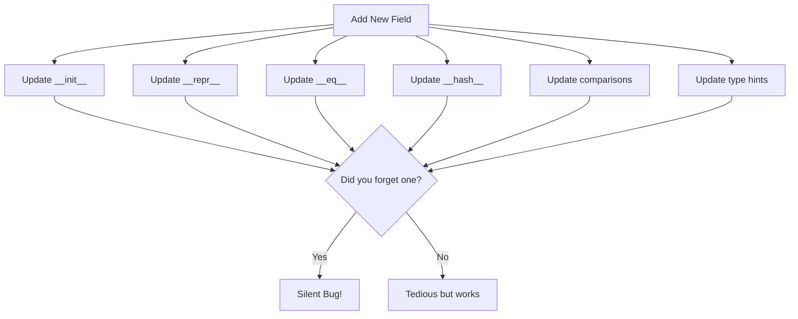
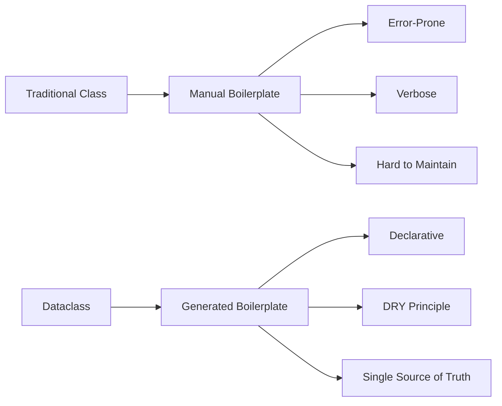
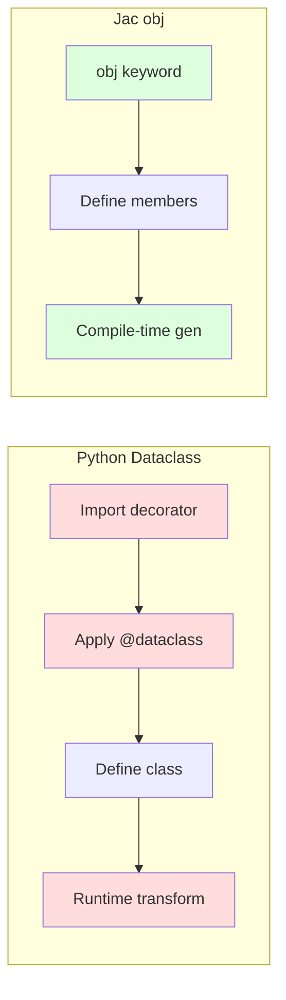

# Dataclasses: Python's Admission That Classes Are Broken (And How Jac Fixes It Properly)

There's an uncomfortable truth about Python that the community has slowly been coming to terms with: the way we define classes is kind of a mess. After decades of Python developers writing the same boilerplate over and over again, Python 3.7 introduced dataclasses as a band-aid solution. But this band-aid reveals something deeper—an admission that the traditional class system wasn't designed for how we actually use classes today.

And then there's Jac, which looked at both problems and said: "What if we just designed it right from the start?"

<!-- more -->

Let's explore why Python classes are broken, how dataclasses attempt to fix them, and how Jac's object archetypes represent a more thoughtful solution to the problem.

## The Problem: Python Classes Are Verbose and Error-Prone

Let's start with the elephant in the room. Here's how you define a simple data container in classic Python—a `Person` class that stores three fields and implements basic equality checking and a readable string representation:

<div class="code-block" data-lang="python">
```python
class Person:
    def __init__(self, name: str, age: int, email: str):
        self.name = name
        self.age = age
        self.email = email

    def __repr__(self):
        return f"Person(name={self.name!r}, age={self.age!r}, email={self.email!r})"

    def __eq__(self, other):
        if not isinstance(other, Person):
            return False
        return (self.name == other.name and
                self.age == other.age and
                self.email == other.email)

# Usage
p1 = Person("Alice", 30, "alice@example.com")
print(p1)
# Person(name='Alice', age=30, email='alice@example.com')

p2 = Person("Alice", 30, "alice@example.com")
print(f"p1 == p2: {p1 == p2}")
# p1 == p2: True
```
</div>

Look at this. We wrote the field names **three times** in `__init__`, **three times** in `__repr__`, and **three times** in `__eq__`. That's 9 repetitions for 3 fields! And we haven't even added:
- `__hash__` for using it in sets/dicts
- `__lt__`, `__le__`, `__gt__`, `__ge__` for comparisons
- Type checking
- Default values
- Immutability

This isn't just verbose—it's a maintenance nightmare. Add a field? Update 5+ methods. Change a type? Update multiple places. Forget to update one? Subtle bugs.

### Why Is This So Bad?



The core issue is **repetition and manual synchronization**. Every field declaration must be manually kept in sync across multiple methods. This violates the DRY principle (Don't Repeat Yourself) at a fundamental level.

## Python's Band-Aid: Dataclasses

Python 3.7 introduced `@dataclass` as a decorator that generates the boilerplate for you:

<div class="code-block" data-lang="python">
```python
from dataclasses import dataclass

@dataclass
class Person:
    name: str
    age: int
    email: str

# Automatically generates:
# - __init__
# - __repr__
# - __eq__
# - __hash__ (if frozen=True)
# - __lt__, __le__, etc. (if order=True)

# Usage
p1 = Person("Alice", 30, "alice@example.com")
print(p1)
# Person(name='Alice', age=30, email='alice@example.com')

p2 = Person("Alice", 30, "alice@example.com")
print(f"p1 == p2: {p1 == p2}")
# p1 == p2: True
```
</div>

This is **significantly better**. We've gone from 15+ lines to 4 lines. The field definitions are the single source of truth.

### Dataclass Features: The Deep Dive

Let's explore what dataclasses can do:

#### 1. Default Values

Default values let you create instances without specifying every parameter—critical for configuration classes and optional settings:

<div class="code-block" data-lang="python">
```python
from dataclasses import dataclass

@dataclass
class Config:
    host: str = "localhost"
    port: int = 8080
    debug: bool = False

# Use defaults
config1 = Config()
print(config1)
# Config(host='localhost', port=8080, debug=False)

# Override some defaults
config2 = Config(host="example.com", port=443)
print(config2)
# Config(host='example.com', port=443, debug=False)
```
</div>

**Key point**: Default values work exactly as you'd expect—fields with defaults can be omitted, while others are still required.

#### 2. Immutability with `frozen=True`

The `frozen=True` parameter makes instances immutable after creation—they can't be modified, which makes them hashable and safe for use in sets and as dictionary keys:

<div class="code-block" data-lang="python">
```python
from dataclasses import dataclass

@dataclass(frozen=True)
class Point:
    x: float
    y: float

p = Point(3.0, 4.0)
print(f"Point: {p}")
# Point: Point(x=3.0, y=4.0)

# p.x = 5.0  # Would raise FrozenInstanceError!

# Can be used in sets (duplicates removed)
points = {Point(0, 0), Point(1, 1), Point(0, 0)}
print(f"Unique points: {len(points)}")
# Unique points: 2
```
</div>

**Key point**: Frozen dataclasses are immutable and automatically hashable. With regular classes, you'd need to manually implement `__setattr__`, `__delattr__`, and `__hash__`.

#### 3. Ordering with `order=True`

The `order=True` parameter automatically generates comparison methods (`__lt__`, `__le__`, `__gt__`, `__ge__`), enabling instances to be sorted. Comparison is done field-by-field in declaration order:

<div class="code-block" data-lang="python">
```python
from dataclasses import dataclass

@dataclass(order=True)
class Student:
    name: str
    grade: float

students = [
    Student("Charlie", 95.1),
    Student("Alice", 92.5),
    Student("Bob", 87.3)
]

students.sort()
print("Sorted students:")
for s in students:
    print(f"  {s.name}: {s.grade}")
# Sorted students:
#   Alice: 92.5
#   Bob: 87.3
#   Charlie: 95.1
```
</div>

**Key point**: Students are sorted alphabetically by name first, then by grade. Without `order=True`, you'd need to manually implement all comparison methods.

#### 4. Post-Initialization with `__post_init__`

Sometimes you need fields that are computed from other fields rather than passed to the constructor. The `__post_init__` method runs after the auto-generated `__init__`, perfect for derived values and validation:

<div class="code-block" data-lang="python">
```python
from dataclasses import dataclass, field

@dataclass
class Rectangle:
    width: float
    height: float
    area: float = field(init=False)

    def __post_init__(self):
        self.area = self.width * self.height

rect = Rectangle(5.0, 3.0)
print(f"{rect.width} x {rect.height} = {rect.area}")
# 5.0 x 3.0 = 15.0
```
</div>

**Key point**: The `area` field is excluded from `__init__` via `field(init=False)` but gets calculated automatically in `__post_init__` from the provided width and height.

#### 5. Field Metadata and Factory Functions

Mutable default values (like lists or dicts) are dangerous in Python—they get shared across all instances! The `default_factory` parameter solves this by calling a function to create a fresh object for each instance:

<div class="code-block" data-lang="python">
```python
from dataclasses import dataclass, field
from typing import List

@dataclass
class ShoppingCart:
    customer: str
    items: List[str] = field(default_factory=list)
    total: float = 0.0

    def add_item(self, item: str, price: float):
        self.items.append(item)
        self.total += price

cart1 = ShoppingCart("Alice")
cart1.add_item("Apple", 1.50)

cart2 = ShoppingCart("Bob")
cart2.add_item("Banana", 0.75)

print(f"{cart1.customer}: {cart1.items}")  # Alice: ['Apple']
print(f"{cart2.customer}: {cart2.items}")  # Bob: ['Banana']
```
</div>

**Key point**: Each cart gets its own separate list via `default_factory=list`. If you used `items: List[str] = []` directly, both carts would share the same list—a classic Python gotcha!

#### 6. Inheritance

Dataclasses support inheritance naturally—child classes automatically include parent fields in their constructor and generated methods:

<div class="code-block" data-lang="python">
```python
from dataclasses import dataclass

@dataclass
class Animal:
    name: str
    age: int

@dataclass
class Dog(Animal):
    breed: str

    def bark(self):
        return f"{self.name} says woof!"

dog = Dog(name="Buddy", age=3, breed="Labrador")
print(dog)
# Dog(name='Buddy', age=3, breed='Labrador')
print(dog.bark())
# Buddy says woof!
```
</div>

**Key point**: The `Dog` class automatically inherits `name` and `age` from `Animal`, and the generated `__init__` accepts all three parameters in order (parent fields first, then child fields).

### The Dataclass Design Philosophy



Dataclasses embrace a **declarative approach**: you describe *what* you want (fields with types), and Python generates *how* to implement it.

### But Dataclasses Still Have Problems...

Despite being a huge improvement, dataclasses aren't perfect:

1. **Decorator Magic**: You're still using a decorator to transform a class. The transformation happens at runtime, which can be confusing for tooling.

2. **Limited Customization**: Want custom `__repr__` but generated `__eq__`? You're mixing manual and generated code again.

3. **No Built-in Validation**: Need to validate `age > 0`? You're writing custom `__post_init__` or using third-party libraries like Pydantic.

4. **Still Just Classes**: Dataclasses don't solve deeper OOP issues—they're still mutable by default, still have implicit `self` parameter in methods, still don't integrate with any higher-level abstractions.

5. **Verbose Type Annotations**: While better than before, you're still repeating type information.

## Enter Jac: What If We Designed It Right?

Jac looked at the dataclass pattern and asked a fundamental question: "What if we made this the *default* way to define objects, not a special decorator?"

In Jac, the `obj` keyword provides dataclass semantics as a first-class language feature—no decorators, no magic, just clean declarations.

### The `obj` Keyword: Dataclasses as First-Class Citizens

Here's the same `Person` class in Jac—notice how clean it is without decorators or imports, and how the auto-generated `__repr__` works just like Python's dataclass:

<div class="code-block">
```jac
obj Person {
    has name: str;
    has age: int;
    has email: str;
}

with entry {
    person = Person(name="Alice", age=30, email="alice@example.com");
    print(person);
    # Person(name='Alice', age=30, email='alice@example.com')
}
```
</div>

Let's break down what's happening:

1. **`obj` keyword**: Declares an object with dataclass semantics
2. **`has` declarations**: Define fields with types
3. **Automatic generation**: Constructor, `__repr__`, `__eq__`, etc. are generated automatically
4. **Instance variables**: Every `has` field is an instance variable (each object gets its own copy)

### Key Insight: `obj` Uses Implicit `self`

One elegant touch in Jac: methods in `obj` don't require `self` in the parameter list—it's automatically available in the method body. This demonstrates how instance variables work independently for each object:

<div class="code-block">
```jac
obj Counter {
    has count: int = 0;

    def increment {  # No self parameter needed!
        self.count += 1;
    }

    def get_count -> int {
        return self.count;  # But self is available in the body
    }
}

with entry {
    c1 = Counter();
    c1.increment();
    c1.increment();
    print(f"Count: {c1.get_count()}");
    # Count: 2

    c2 = Counter();
    c2.increment();
    print(f"Count: {c2.get_count()}");
    # Count: 1
}
```
</div>

**Key point**: Each `Counter` instance (`c1`, `c2`) maintains its own separate `count` value—they don't interfere with each other. The method signature `def increment` is cleaner without the explicit `self` parameter.

```mermaid
graph LR
    subgraph "Python Dataclass"
        A[@dataclass<br/>class Counter] --> B[def increment<b>self</b>]
        B --> C[Explicit self in signature]
    end

    subgraph "Jac obj"
        D[obj Counter] --> E[def increment]
        E --> F[Implicit self<br/>cleaner signature]
    end
```

**Why this matters**: Less boilerplate, cleaner method signatures, but `self` is still available when you need it.


### Jac's `obj` Features: The Full Picture

#### 1. Clean Method Definitions

Methods in Jac objects are straightforward—define them with return types, access instance fields via `self`, and call them naturally:

<div class="code-block">
```jac
obj Rectangle {
    has width: float;
    has height: float;

    def area -> float {
        return self.width * self.height;
    }

    def perimeter -> float {
        return 2 * (self.width + self.height);
    }

    def describe {
        print(f"{self.width} x {self.height}");
        print(f"Area: {self.area()}, Perimeter: {self.perimeter()}");
    }
}

with entry {
    rect = Rectangle(width=5.0, height=3.0);
    rect.describe();
    # 5.0 x 3.0
    # Area: 15.0, Perimeter: 16.0
}
```
</div>

**Key point**: Methods have clean signatures (no `self` parameter), explicit return type annotations (`-> float`), and can call other methods naturally. The `describe` method demonstrates accessing both fields and computed methods.

#### 2. Post-Initialization with `postinit`

For derived or computed fields, use `by postinit` to exclude them from the constructor. The `postinit` method runs automatically after construction:

<div class="code-block">
```jac
obj Circle {
    has radius: float;
    has area: float by postinit;
    has circumference: float by postinit;

    def postinit {
        self.area = 3.14159 * self.radius * self.radius;
        self.circumference = 2 * 3.14159 * self.radius;
    }
}

with entry {
    circle = Circle(radius=5.0);
    print(f"Radius: {circle.radius}");
    print(f"Area: {circle.area:.2f}");
    print(f"Circumference: {circle.circumference:.2f}");
    # Radius: 5.0
    # Area: 78.54
    # Circumference: 31.42
}
```
</div>

**Key point**: The constructor only takes `radius` as a parameter—`area` and `circumference` are marked with `by postinit` so they're computed automatically from `radius`. This is cleaner than Python's `field(init=False)` syntax.

#### 3. Static Members

Static members (fields and methods) belong to the class itself, not individual instances. They're perfect for tracking class-level state or utility functions:

<div class="code-block">
```jac
obj BankAccount {
    has account_number: str;
    has balance: float = 0.0;

    static has total_accounts: int = 0;

    def postinit {
        BankAccount.total_accounts += 1;
    }

    static def get_total_accounts -> int {
        return BankAccount.total_accounts;
    }

    def deposit(amount: float) {
        self.balance += amount;
    }
}

with entry {
    acc1 = BankAccount(account_number="A001");
    acc2 = BankAccount(account_number="A002");
    acc3 = BankAccount(account_number="A003");

    print(f"Total accounts created: {BankAccount.get_total_accounts()}");
    # Total accounts created: 3

    acc1.deposit(100.0);
    print(f"Account {acc1.account_number} balance: ${acc1.balance}");
    # Account A001 balance: $100.0
}
```
</div>

**Key point**: The `total_accounts` static field is shared across all instances—every time a new `BankAccount` is created, the counter increments. Static methods like `get_total_accounts()` are called on the class itself, not on instances.

#### 4. Inheritance

Jac objects support inheritance—child objects automatically include parent fields and can override parent methods:

<div class="code-block">
```jac
obj Animal {
    has name: str;
    has age: int;

    def speak {
        print(f"{self.name} makes a sound");
    }
}

obj Dog(Animal) {
    has breed: str;

    def speak {  # Override parent method
        print(f"{self.name} barks: Woof!");
    }
}

with entry {
    dog = Dog(name="Buddy", age=3, breed="Labrador");
    dog.speak();
    # Buddy barks: Woof!
    print(f"{dog.name} is a {dog.age} year old {dog.breed}");
    # Buddy is a 3 year old Labrador
}
```
</div>

**Key point**: `Dog` inherits `name` and `age` from `Animal`, adds its own `breed` field, and overrides the `speak` method. The constructor automatically accepts all fields (parent fields first: `name`, `age`, then child field: `breed`).

#### 5. Access Modifiers

Jac provides built-in access control with `:pub` (public), `:prot` (protected), and `:priv` (private) modifiers for encapsulation:

<div class="code-block">
```jac
obj SecureData {
    has :pub id: str;           # Public
    has :prot internal_state: int = 0;  # Protected
    has :priv secret_key: str = "hidden";  # Private

    def get_info -> str {
        return f"ID: {self.id}";
    }
}

with entry {
    data = SecureData(id="DATA001");
    print(data.get_info());
    # ID: DATA001
    print(f"Public ID: {data.id}");
    # Public ID: DATA001
}
```
</div>

**Key point**: Access modifiers control field visibility. Public fields (`:pub`) can be accessed from anywhere, protected (`:prot`) from subclasses, and private (`:priv`) only within the class itself. This is built into the language, unlike Python's convention-based underscore prefixes.

### Side-by-Side: Python Dataclass vs Jac `obj`

Let's compare a real-world example that demonstrates post-initialization, default values, and method definitions. Both implementations create a `Product` class with automatic total value calculation and a restock method that updates inventory:

<div class="code-block" data-lang="python">
```python
# Python dataclass
from dataclasses import dataclass, field

@dataclass
class Product:
    name: str
    price: float
    quantity: int = 0
    total_value: float = field(init=False)

    def __post_init__(self):
        self.total_value = self.price * self.quantity

    def restock(self, amount: int):
        self.quantity += amount
        self.total_value = self.price * self.quantity

# Usage
product = Product("Widget", 9.99, 10)
print(f"{product.name}: ${product.total_value:.2f}")
# Widget: $99.90
product.restock(5)
print(f"After restock: {product.quantity} units, ${product.total_value:.2f}")
# After restock: 15 units, $149.85
```
</div>

<div class="code-block">
```jac
// Jac obj
obj Product {
    has name: str;
    has price: float;
    has quantity: int = 0;
    has total_value: float by postinit;

    def postinit {
        self.total_value = self.price * self.quantity;
    }

    def restock(amount: int) {
        self.quantity += amount;
        self.total_value = self.price * self.quantity;
    }
}

with entry {
    product = Product(name="Widget", price=9.99, quantity=10);
    print(f"{product.name}: ${product.total_value:.2f}");
    # Widget: $99.90
    product.restock(5);
    print(f"After restock: {product.quantity} units, ${product.total_value:.2f}");
    # After restock: 15 units, $149.85
}
```
</div>

**What's different:**
1. **No decorator** in Jac—`obj` is a keyword, not runtime magic
2. **Implicit `self`** in methods (no `self` in parameter lists)
3. **Cleaner syntax** (`by postinit` vs `field(init=False)`)
4. **Less import overhead** (no dataclass module needed)



## A Complete Example: Product Inventory

Let's see `obj` in a realistic scenario that brings together all the features we've covered: nested objects (Product contains Category), computed fields via `postinit`, instance methods for business logic (sell, restock), static members for tracking class-level state, and collections. This inventory management system demonstrates how clean and expressive Jac code can be:

<div class="code-block">
```jac
obj Category {
    has name: str;
    has tax_rate: float;
}

obj Product {
    has name: str;
    has price: float;
    has quantity: int = 0;
    has category: Category;
    has total_value: float by postinit;

    def postinit {
        self.total_value = self.price * self.quantity;
    }

    def restock(amount: int) {
        self.quantity += amount;
        self.total_value = self.price * self.quantity;
    }

    def sell(amount: int) -> bool {
        if amount <= self.quantity {
            self.quantity -= amount;
            self.total_value = self.price * self.quantity;
            return True;
        }
        return False;
    }

    def price_with_tax -> float {
        return self.price * (1.0 + self.category.tax_rate);
    }
}

obj Inventory {
    has products: list = [];

    static has total_products_created: int = 0;

    def add_product(product: Product) {
        self.products.append(product);
        Inventory.total_products_created += 1;
    }

    def total_value -> float {
        total = 0.0;
        for product in self.products {
            total += product.total_value;
        }
        return total;
    }

    def low_stock_report(threshold: int) {
        print(f"\nProducts with quantity <= {threshold}:");
        for product in self.products {
            if product.quantity <= threshold {
                print(f"  {product.name}: {product.quantity} units");
            }
        }
    }
}

with entry {
    # Create categories
    electronics = Category(name="Electronics", tax_rate=0.08);
    food = Category(name="Food", tax_rate=0.02);

    # Create inventory
    inventory = Inventory();

    # Add products
    laptop = Product(name="Laptop", price=999.99, quantity=5, category=electronics);
    inventory.add_product(laptop);

    mouse = Product(name="Mouse", price=29.99, quantity=20, category=electronics);
    inventory.add_product(mouse);

    apple = Product(name="Apple", price=0.99, quantity=100, category=food);
    inventory.add_product(apple);

    print(f"Initial inventory value: ${inventory.total_value():.2f}");
    # Initial inventory value: $5149.45

    # Sell some items
    laptop.sell(2);
    print(f"\nAfter selling 2 laptops:");
    print(f"  Laptops in stock: {laptop.quantity}");
    print(f"  Inventory value: ${inventory.total_value():.2f}");
    # After selling 2 laptops:
    #   Laptops in stock: 3
    #   Inventory value: $3149.47

    # Restock
    laptop.restock(10);
    print(f"\nAfter restocking 10 laptops:");
    print(f"  Laptops in stock: {laptop.quantity}");
    # After restocking 10 laptops:
    #   Laptops in stock: 13

    # Low stock report
    inventory.low_stock_report(15);
    # Products with quantity <= 15:
    #   Laptop: 13 units

    # Price with tax
    print(f"\nLaptop price: ${laptop.price:.2f}");
    print(f"Laptop price with tax: ${laptop.price_with_tax():.2f}");
    # Laptop price: $999.99
    # Laptop price with tax: $1079.99

    print(f"\nTotal products created: {Inventory.total_products_created}");
    # Total products created: 3
}
```
</div>

This example shows:
- **Nested `obj`** (Product contains Category)
- **Computed fields** with `postinit`
- **Instance methods** (sell, restock, price_with_tax)
- **Static counters** (total_products_created)
- **Collections** (list of products)
- **Clean business logic** without boilerplate

## The Bigger Picture

Python dataclasses were an admission that the traditional class syntax wasn't designed for how we actually use classes. Most classes are data containers, and data containers should be simple to define.

Jac takes this insight and makes it foundational. Instead of requiring a decorator and imports, `obj` is a keyword—dataclass semantics are a first-class citizen of the language.

```mermaid
graph LR
    subgraph "Python's Journey"
        A[class verbose] --> B[@dataclass added]
        B --> C[Better, but still decorator magic]
    end

    subgraph "Jac's Approach"
        D[obj keyword] --> E[Built-in from day one]
        E --> F[No decorators, no imports, just clean code]
    end

    style C fill:#ffd
    style F fill:#dfd
```

### Why This Matters

When you're writing modern applications:
- **80% of your classes** are just data containers
- **You don't want boilerplate** for the common case
- **You want clean, readable code** that's easy to maintain

Jac's `obj` gives you:
- ✅ **No decorators** - it's a keyword, not runtime magic
- ✅ **Implicit self** - cleaner method signatures
- ✅ **Instance variables** by default - no confusing class variable gotchas
- ✅ **Built-in access modifiers** - encapsulation when you need it
- ✅ **Clean postinit** - computed fields made simple
- ✅ **Static members** - class-level state and behavior

It's not just about fixing dataclasses—it's about designing from first principles. What if dataclass semantics were the default, not the exception?

---

## Try It Yourself

Want to experiment with Jac's `obj` keyword? Install Jac and try these examples:

```bash
pip install jaclang
```

Create a file `objects.jac` with any of the examples above, then run:

```bash
jac run objects.jac
```

## Further Reading

- [Jac Language Reference](https://www.jac-lang.org/)
- [Python dataclasses documentation](https://docs.python.org/3/library/dataclasses.html)
- [How Does Python Get Jac'd?](/blog/posts/python-getting-jacd) - Learn about Jac's architecture

