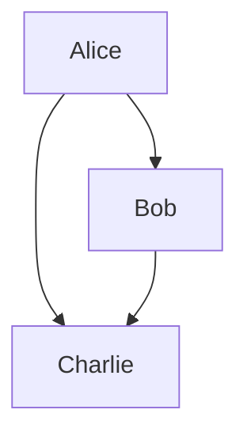
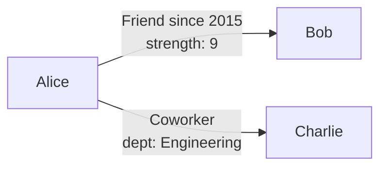
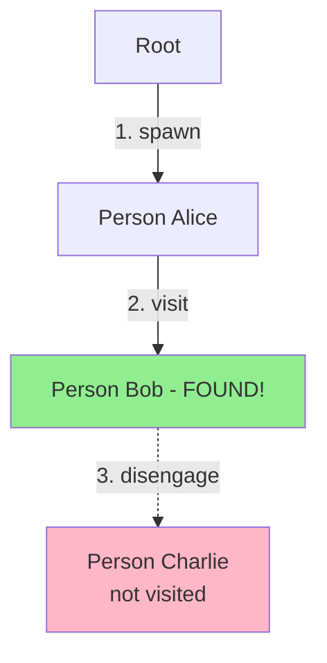
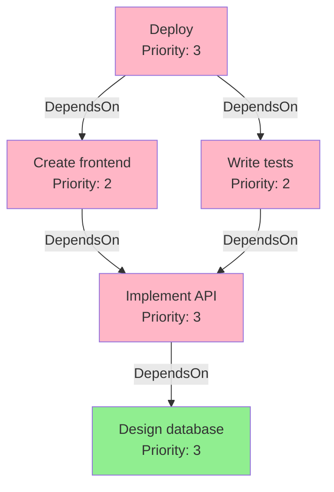

# You just have to learn 4 things to know Object-Spatial Programming

Most programming paradigms ask you to learn dozens of concepts, patterns, and best practices. Object-Spatial Programming (OSP) is different. At its core, there are really just **four fundamental concepts** you need to understand. Master these four things, and you'll have unlocked an entirely new way of thinking about computation—one that's particularly well-suited for modern applications dealing with complex relationships, graph structures, and distributed data.

This article will teach you the complete model of Object-Spatial Programming through these four conceptual buckets. Each builds naturally on the last, and by the end, you'll understand why OSP represents a genuine paradigm shift in how we structure programs.

<!-- more -->

## What is Object-Spatial Programming?

Before we dive into the four concepts, let's establish what makes Object-Spatial Programming fundamentally different from traditional Object-Oriented Programming (OOP).

**Traditional OOP:**
```
Data sits still → You bring computation to the data
(Call methods on objects)
```

**Object-Spatial Programming:**
```
Data is arranged in space → You send computation to travel through the data
(Walkers visit nodes in a graph)
```

### The Restaurant Analogy

Think of it this way:

- **OOP**: You're at home, you call restaurants and have food delivered to you
- **OSP**: You send a robot out to visit different restaurants and collect food

Both get you fed, but they work fundamentally differently! In OSP, computation is **mobile** and data is **spatial**.

---

## Concept 1: The Spatial Object Model (Nodes & Edges)

The first thing you need to understand is how objects are structured in Object-Spatial Programming. Instead of thinking about isolated objects, you think about **objects arranged in space with explicit relationships**.

> **🔑 Core Insight:** Everything in OSP is built on classes. `node`, `edge`, and `walker` are **not** new primitive types—they're classes that inherit all OOP capabilities (methods, properties, inheritance, polymorphism) **and add** spatial/traversal semantics. This means OSP extends OOP rather than replacing it.

### The Two Pillars of the Spatial Object Model

| Type | What It Is | Purpose | Traditional Analogy |
|------|------------|---------|-------------------|
| `node` | **Class with spatial semantics** | Data locations that can be connected in graphs | Houses on a map |
| `edge` | **Class representing relationships** | First-class connections between nodes | Roads between houses |

**Key point:** Nodes and edges are full-featured classes with methods, inheritance, and properties—PLUS spatial connection capabilities.

### Creating Nodes

**Important: Nodes are classes!** They have all the semantics of regular classes (methods, inheritance, polymorphism) PLUS the ability to be connected in spatial graphs.

<div class="code-block">

```jac
node Person {
    has name: str;
    has age: int;

    def greet -> str {
        return f"Hello, I'm {self.name}!";
    }

    def celebrate_birthday {
        self.age += 1;
        print(f"{self.name} is now {self.age}!");
    }
}

with entry {
    alice = Person(name="Alice", age=25);
    bob = Person(name="Bob", age=30);

    print(alice.greet());
    alice.celebrate_birthday();
    print(bob.greet());
}
```

</div>

At this point, nodes work exactly like regular classes. The spatial magic happens when we connect them...

### Connecting Nodes: The Spatial Operators

This is where OSP diverges from traditional OOP. You can **directly connect** nodes using spatial operators:

<div class="code-block run-dot">

```jac
node Person {
    has name: str;
}

with entry {
    alice = Person(name="Alice");
    bob = Person(name="Bob");
    charlie = Person(name="Charlie");

    # Build the graph structure
    alice ++> bob;      # Alice → Bob
    alice ++> charlie;  # Alice → Charlie
    bob ++> charlie;    # Bob → Charlie

    root ++> alice;
    
    # Query connections
    connections = [alice -->];
    print(f"Alice is connected to {len(connections)} person(s)");
}
```

</div>

**Visual representation:**



### Connection Operators Reference

| Operator | Direction | Example | Result |
|----------|-----------|---------|--------|
| `++>` | Forward | `alice ++> bob;` | alice → bob |
| `<++` | Backward | `alice <++ bob;` | bob → alice |
| `<++>` | Both ways | `alice <++> bob;` | alice ↔ bob |


### Typed Edges: First-Class Relationships

Here's what makes OSP truly revolutionary: **relationships are first-class objects** with their own types and properties!

**Important: Edges are also classes!** Like nodes, edges have all the semantics of regular classes—they can have methods, properties, and behavior—PLUS they represent connections in the graph.

<div class="code-block run-dot">

```jac
node Person {
    has name: str;
}

edge Friend {
    has since: int;
    has strength: int = 5;

    def years_of_friendship(current_year: int) -> int {
        return current_year - self.since;
    }

    def is_strong -> bool {
        return self.strength >= 7;
    }
}

edge Coworker {
    has department: str;
}

with entry {
    alice = Person(name="Alice");
    bob = Person(name="Bob");
    charlie = Person(name="Charlie");

    root ++> alice;
    alice +>:Friend(since=2015, strength=9):+> bob;
    alice +>:Coworker(department="Engineering"):+> charlie;

    friends = [alice ->:Friend:->];
    coworkers = [alice ->:Coworker:->];
    print(f"Alice has {len(friends)} friend(s) and {len(coworkers)} coworker(s)");
}
```

</div>

**This is a paradigm shift!** In traditional OOP, relationships are just data in lists or dictionaries. In OSP, relationships are **classes in their own right** that exist in the spatial model and can have methods, properties, and behavior.



### Querying the Graph: Edge References

Once you've built a graph structure, you can query it using **edge references** with square brackets:

<div class="code-block run-dot">

```jac
node Person {
    has name: str;
}

edge Friend {
    has since: int;
}

with entry {
    alice = Person(name="Alice");
    bob = Person(name="Bob");
    charlie = Person(name="Charlie");

    root ++> alice;
    alice +>:Friend(since=2015):+> bob;
    alice +>:Friend(since=2020):+> charlie;

    all_connections = [alice -->];
    print(f"Total connections: {len(all_connections)}");

    friends = [alice ->:Friend:->];
    print(f"Friends: {len(friends)}");

    old_friends = [alice ->:Friend:since < 2018:->];
    print(f"Friends since before 2018: {len(old_friends)}");
}
```

</div>

### Edge Reference Patterns

| Pattern | Direction | Type Filter | Example |
|---------|-----------|-------------|---------|
| `[node -->]` | Outgoing | Any | All outgoing connections |
| `[node <--]` | Incoming | Any | All incoming connections |
| `[node <-->]` | Both | Any | All connections |
| `[node ->:Type:->]` | Outgoing | Specific | Specific edge type |
| `[node ->:Type:property > 5:->]` | Outgoing | Filtered | With property filter |

### Why This Matters: Traditional vs Spatial

**Traditional OOP approach:**

```jac
obj Person {
    has name: str;
    has connections: list = [];
}

obj Connection {
    has conn_type: str;
    has target: object;
}

def find_friends(person: Person) -> list {
    friends = [];
    for connection in person.connections {
        if connection.conn_type == "friend" {
            friends.append(connection.target);
        }
    }
    return friends;
}

with entry {
    alice = Person(name="Alice");
    bob = Person(name="Bob");

    conn = Connection(conn_type="friend", target=bob);
    alice.connections.append(conn);

    friends = find_friends(alice);
    print(f"Alice's friends: {len(friends)}");
}
```

**OSP approach:**

<div class="code-block run-dot">

```jac
# Concise, declarative, type-safe
node Person {
    has name: str;
}

edge Friend {}

with entry {
    alice = Person(name="Alice");
    bob = Person(name="Bob");

    root ++> alice;
    alice +>:Friend:+> bob;

    friends = [alice ->:Friend:->];
    print(f"Alice has {len(friends)} friend(s)");
}
```

</div>

**Key advantages:**
1. **Natural representation**: Relationships are explicit in the structure
2. **Type safety**: Edges have their own types and properties
3. **Declarative queries**: Express what you want, not how to get it
4. **Visual clarity**: The code structure mirrors the data structure

### Nodes and Edges Support Full OOP

Since nodes and edges are classes, they support all standard OOP features:

```jac
node Entity {
    has id: str;
    has created_at: str;
}

node Person(Entity) {
    has name: str;
    has email: str;

    def send_notification(message: str) {
        print(f"Sending to {self.email}: {message}");
    }
}

node Organization(Entity) {
    has company_name: str;
    has industry: str;

    def get_display_name -> str {
        return f"{self.company_name} ({self.industry})";
    }
}

edge Employment {
    has role: str;
    has start_date: str;
}

with entry {
    alice = Person(id="1", created_at="2020-01-01", name="Alice", email="alice@example.com");
    acme = Organization(id="2", created_at="2015-01-01", company_name="Acme Corp", industry="Tech");

    root ++> alice;
    alice +>:Employment(start_date="2020-06-01", role="Engineer"):+> acme;

    alice.send_notification("Welcome!");
    print(acme.get_display_name());

    jobs = [alice ->:Employment:->];
    print(f"Alice has {len(jobs)} job(s)");
}
```

**The key insight:** `node`, `edge`, and `walker` are not restrictions—they're **extensions** of regular classes that add spatial semantics while preserving all OOP capabilities.

Now that you understand how objects are structured spatially, let's see how computation moves through that space.

---

## Concept 2: The Mobile Computation Model (Walkers)

The second concept is about **how computation moves through spatial structures**. Instead of bringing data to static functions, you send mobile units of computation—walkers—through your object graph.

### What is a Walker?

A **walker** is a mobile unit of computation that travels through the graph, visiting nodes and performing actions. Think of it as an autonomous agent that navigates your object graph.

**Important: Walkers are also classes!** They have all the semantics of regular classes (state, methods, inheritance) PLUS the ability to move through the graph and trigger abilities based on what they visit.

<div class="code-block">

```jac
node Person {
    has name: str;
}

walker Greeter {
    has greeting_count: int = 0;

    can start with `root entry {
        print("Starting journey!");
        visit [-->];
    }

    can greet with Person entry {
        print(f"Hello, {here.name}!");
        self.greeting_count += 1;
        visit [-->];
    }
}

with entry {
    alice = Person(name="Alice");
    bob = Person(name="Bob");
    charlie = Person(name="Charlie");

    root ++> alice ++> bob ++> charlie;

    greeter = Greeter();
    root spawn greeter;
    print(f"Total greetings: {greeter.greeting_count}");
}
```

</div>

The walker travels through the graph, greeting each person it encounters. Output shows the journey:
```
Starting journey!
Hello, Alice!
Hello, Bob!
Hello, Charlie!
Total greetings: 3
```

### Walker Structure

Walkers are classes with state (using `has`) and abilities (using `can`):

```jac
walker MyWalker {
    has counter: int = 0;
    has visited_names: list = [];

    can ability_name with NodeType entry {
        # Logic executes when visiting NodeType
    }
}
```

### Navigation with Visit

The `visit` statement controls where walkers go next. It uses the same edge reference syntax you learned for queries:

```jac
walker Explorer {
    can explore with Person entry {
        print(f"Visiting {here.name}");
        visit [-->];  # Continue to outgoing connections
    }
}
```


| Visit Pattern | Navigates To |
|--------------|--------------|
| `visit [-->];` | All nodes via outgoing edges |
| `visit [<--];` | All nodes via incoming edges |
| `visit [<-->];` | All connected nodes (any direction) |
| `visit [->:Type:->];` | Nodes via specific edge type |
| `visit [->:Type:property > 5:->];` | Nodes via filtered edges |
| `visit node_list;` | Specific nodes in a list |

### Special References in Walkers

Within walker abilities, three references are always available:

| Reference | What It Is |
|-----------|------------|
| `self` | The walker instance (access walker state) |
| `here` | The current node being visited (access node properties) |
| `root` | The global root node (always available anchor) |

```jac
walker DataCollector {
    has collected_data: list = [];

    can collect with Person entry {
        self.collected_data.append(here.name);
        print(f"Collected: {here.name}");
        visit [-->];
    }
}
```

### Example: Finding a Specific Node

<div class="code-block run-dot">

```jac
node Person {
    has name: str;
}

walker FindPerson {
    has target: str;
    has found: bool = False;

    can start with `root entry {
        visit [-->];
    }

    can search with Person entry {
        if here.name == self.target {
            print(f"Found {here.name}!");
            self.found = True;
            disengage;
        }
        visit [-->];
    }
}

with entry {
    alice = Person(name="Alice");
    bob = Person(name="Bob");
    charlie = Person(name="Charlie");

    root ++> alice ++> bob ++> charlie;

    finder = FindPerson(target="Bob");
    root spawn finder;

    print(f"Search result: {finder.found}");
}
```

</div>



This fundamental shift—from bringing data to computation, to sending computation to data—enables natural graph traversal, automatic type-based dispatching, and the potential for distributed execution across machine boundaries.

---

## Concept 3: The Event-Driven Interaction Model (Abilities)

The third concept defines how walkers and nodes interact through **abilities**—methods that automatically execute when walkers visit nodes.

### What are Abilities?

**Abilities** are special methods that automatically execute based on type matching between walkers and nodes. They define what happens when a walker visits a specific node type.

```jac
walker MyWalker {
    can meet_person with Person entry {
        print(f"Meeting {here.name}");
    }

    can visit_city with City entry {
        print(f"Visiting {here.name}");
    }
}
```

### When Abilities Execute

| Pattern | When It Triggers |
|---------|------------------|
| `with NodeType entry` | Walker enters a node of this type |
| `with NodeType exit` | Walker leaves a node of this type |
| `with WalkerType entry` | A walker of this type visits (node perspective) |
| `with \`root entry` | Walker spawns at root node |

### Walker Abilities: The Walker's Perspective

Walker abilities define what happens when the walker visits different node types:

<div class="code-block run-dot">

```jac
node Person {
    has name: str;
    has age: int;
}

node City {
    has name: str;
    has population: int;
}

walker Tourist {
    has places_visited: int = 0;

    can start with `root entry {
        print("Starting tour!");
        visit [-->];
    }

    can meet_person with Person entry {
        print(f"Met {here.name}, age {here.age}");
        self.places_visited += 1;
        visit [-->];
    }

    can visit_city with City entry {
        print(f"Visiting {here.name}, population {here.population}");
        self.places_visited += 1;
        visit [-->];
    }
}

with entry {
    alice = Person(name="Alice", age=30);
    paris = City(name="Paris", population=2161000);

    root ++> alice ++> paris;
    root spawn Tourist();
}
```

</div>

### Node Abilities: The Node's Perspective

Nodes can also define abilities that trigger when specific walker types visit them:

<div class="code-block run-dot">

```jac
node Person {
    has name: str;
    has greeting_count: int = 0;

    can be_greeted with Greeter entry {
        self.greeting_count += 1;
        print(f"{self.name} has been greeted {self.greeting_count} time(s)");
    }
}

walker Greeter {
    can greet with Person entry {
        print(f"Hello, {here.name}!");
        visit [-->];
    }
}

with entry {
    alice = Person(name="Alice");
    bob = Person(name="Bob");

    root ++> alice ++> bob;
    root spawn Greeter();
}
```

</div>

### Bidirectional Polymorphism: The Revolutionary Part

Here's what makes OSP unique: **both nodes and walkers can define abilities for the same interaction**. When a walker visits a node, **both abilities execute**!

<div class="code-block run-dot">

```jac
node Person {
    has name: str;

    can greet_visitor with Visitor entry {
        print(f"{self.name} says: Welcome!");
    }
}

walker Visitor {
    can meet_person with Person entry {
        print(f"Visitor says: Hello, {here.name}!");
        visit [-->];
    }
}

with entry {
    alice = Person(name="Alice");
    root ++> alice;
    root spawn Visitor();
}
```

</div>

Both abilities execute automatically, creating a bidirectional interaction contract.

When a walker visits a node, abilities execute in order: **node ability first**, then **walker ability**. This bidirectional execution enables powerful coordination between spatial data and mobile computation.

In this example, both the node and walker define abilities, and both execute automatically when the walker visits:

```
Visitor says: Hello, Alice!
Alice says: Welcome!
```

Abilities enable automatic type-based dispatch, separation of concerns between walkers and nodes, and bidirectional interaction contracts—capabilities that have no direct equivalent in traditional OOP.

---

## Concept 4: The Traversal & Control Flow (Navigation & Results)

The fourth concept covers how to control walker navigation, collect results, and orchestrate computation across your spatial graph.

### Visit Strategies

Visit statements support sophisticated navigation patterns:

| Pattern | Purpose |
|--------|---------|
| `visit [-->];` | All outgoing connections |
| `visit [->:Friend:->];` | Only Friend edge types |
| `visit [->:Friend:since < 2020:->];` | Filtered by edge property |
| `visit [here ->:Friend:-> ->:Friend:->];` | Multi-hop (friends of friends) |

You can also query first, then visit specific nodes from a filtered list.

### Collecting Results: Report vs Return

Unlike `return` (which stops execution), **`report`** streams values back while the walker continues executing.

<div class="code-block run-dot">

```jac
node Person {
    has name: str;
    has age: int;
}

walker AgeCollector {
    has ages: list = [];

    can start with `root entry {
        visit [-->];
    }

    can collect with Person entry {
        self.ages.append(here.age);
        visit [-->];
    }
}

with entry {
    alice = Person(name="Alice", age=25);
    bob = Person(name="Bob", age=30);
    charlie = Person(name="Charlie", age=28);

    root ++> alice ++> bob ++> charlie;

    collector = AgeCollector();
    root spawn collector;
    print(f"Collected ages: {collector.ages}");  # [25, 30, 28]
    print(f"Average age: {sum(collector.ages) / len(collector.ages):.2f}");  # 27.67
}
```

</div>

Walker state accumulates data as it traverses, allowing you to access collected information after execution completes.

| Feature | `return` | `report` |
|---------|----------|----------|
| Stops execution | Yes | No |
| Sends value back | One value | Multiple values (stream) |
| Continues walking | No | Yes |
| Result type | Single value | List of values |

### Early Exit: Disengage

Use `disengage` to stop walker execution immediately, no matter where it is in the graph. This is useful for search operations where you want to stop once a condition is met.

<div class="code-block run-dot">

```jac
node Person {
    has name: str;
}

walker FindPerson {
    has target: str;
    has found: bool = False;

    can start with `root entry {
        visit [-->];
    }

    can search with Person entry {
        if here.name == self.target {
            print(f"Found {here.name}!");
            self.found = True;
            disengage;
        }
        visit [-->];
    }
}

with entry {
    alice = Person(name="Alice");
    bob = Person(name="Bob");
    charlie = Person(name="Charlie");

    root ++> alice ++> bob ++> charlie;

    finder = FindPerson(target="Bob");
    root spawn finder;
    print(f"Search result: {finder.found}");
}
```

</div>

You can combine `report` and `disengage` to find and return the first matching node, then stop immediately.

Visit patterns naturally create depth-first traversal (visiting all connections recursively). For breadth-first or custom ordering, maintain a queue in walker state. Conditional traversal is achieved by filtering visit statements with edge types or properties.

### Complete Example: Friend Recommendations

Here's how all traversal concepts work together:

<div class="code-block run-dot">

```jac
node User {
    has username: str;
}

edge Friendship {
    has since: int;
}

walker FriendRecommender {
    has recommendations: list = [];

    can start with `root entry {
        visit [-->];
    }

    can find_recommendations with User entry {
        # Get friends of friends (2 hops)
        friends_of_friends = [here ->:Friendship:-> ->:Friendship:->];
        
        # Get direct friends to exclude
        direct_friends = [here ->:Friendship:->];
        
        for person in friends_of_friends {
            if person not in direct_friends and person != here {
                if person.username not in self.recommendations {
                    self.recommendations.append(person.username);
                }
            }
        }
        
        disengage;
    }
}

with entry {
    alice = User(username="alice");
    bob = User(username="bob");
    charlie = User(username="charlie");

    root ++> alice;
    alice +>:Friendship(since=2020):+> bob;
    bob +>:Friendship(since=2021):+> charlie;

    recommender = FriendRecommender();
    alice spawn recommender;
    print(f"Recommendations: {recommender.recommendations}");
}
```

</div>

This example demonstrates multi-hop queries, filtering, and early exit—all core traversal patterns in OSP.

| Mechanism | Purpose | Stops Walker? | Returns Data? |
|-----------|---------|---------------|---------------|
| `visit` | Navigate to nodes | No | No |
| `report` | Stream values back | No | Yes (multiple) |
| `disengage` | Stop immediately | Yes | No |
| `return` | Exit current ability | No | No |

---

## Putting It All Together: The Four Concepts

Here's how all four concepts work together in a complete example:

<div class="code-block run-dot">

```jac
node Task {
    has title: str;
    has status: str = "pending";
    has priority: int = 1;
}

edge DependsOn {}

walker TaskAnalyzer {
    has ready_tasks: list = [];
    has blocked_tasks: list = [];

    can start with `root entry {
        visit [-->];
    }

    can analyze with Task entry {
        if here.status != "pending" {
            return;
        }

        dependencies = [here ->:DependsOn:->];
        all_done = True;

        for dep in dependencies {
            if dep.status != "complete" {
                all_done = False;
                break;
            }
        }

        if all_done {
            self.ready_tasks.append(here.title);
        } else {
            self.blocked_tasks.append(here.title);
        }

        visit [-->];
    }
}

walker MarkComplete {
    has task_title: str;

    can start with `root entry {
        visit [-->];
    }

    can mark with Task entry {
        if here.title == self.task_title {
            here.status = "complete";
            print(f"Completed: {here.title}");
            disengage;
        }
        visit [-->];
    }
}

with entry {
    task1 = Task(title="Design database", priority=3);
    task2 = Task(title="Implement API", priority=3);
    task3 = Task(title="Create frontend", priority=2);
    task4 = Task(title="Write tests", priority=2);
    task5 = Task(title="Deploy", priority=3);

    task2 +>:DependsOn:+> task1;
    task3 +>:DependsOn:+> task2;
    task4 +>:DependsOn:+> task2;
    task5 +>:DependsOn:+> task3;
    task5 +>:DependsOn:+> task4;

    root ++> task1;
    root ++> task2;
    root ++> task3;
    root ++> task4;
    root ++> task5;

    analyzer = TaskAnalyzer();
    root spawn analyzer;
    print(f"Ready: {analyzer.ready_tasks}");
    print(f"Blocked: {analyzer.blocked_tasks}");

    root spawn MarkComplete(task_title="Design database");

    analyzer2 = TaskAnalyzer();
    root spawn analyzer2;
    print(f"\nAfter completion:");
    print(f"Ready: {analyzer2.ready_tasks}");
    print(f"Blocked: {analyzer2.blocked_tasks}");
}
```

</div>

**Dependency Graph:**



---

## The Four Concepts: Summary Table

| Concept | What It Is | Key Elements | What It Enables |
|---------|-----------|--------------|-----------------|
| **1. Spatial Object Model** | How objects are structured using **classes with spatial semantics** | `node` (class), `edge` (class), `++>`, `[-->]` | First-class relationships, declarative queries, full OOP |
| **2. Mobile Computation** | How computation moves using **walker classes** | `walker` (class), `spawn`, `visit` | Autonomous traversal, data-centric computation |
| **3. Event-Driven Interaction** | How things react via **abilities** (special methods) | Abilities, `with entry`, `here`, `self` | Automatic dispatch, bidirectional polymorphism |
| **4. Traversal & Control** | How you navigate & collect data | `visit` patterns, `report`, `disengage` | Sophisticated navigation, streaming results |

**Remember:** Nodes, edges, and walkers are all full-featured classes. They support inheritance, methods, properties, and all OOP features—OSP adds spatial and traversal capabilities on top.

---

## When to Use Object-Spatial Programming

OSP shines in specific scenarios:

### Perfect For:

✓ **Social networks** - Users, friendships, followers
✓ **Knowledge graphs** - Concepts and their relationships
✓ **Recommendation systems** - Users, products, ratings
✓ **Workflow systems** - Tasks with dependencies
✓ **Transportation networks** - Cities, routes, connections
✓ **Organization charts** - People and reporting structures
✓ **Dependency management** - Packages, versions, requirements

### Not Ideal For:

✗ Simple CRUD applications
✗ Data with no significant relationships
✗ Performance-critical tight loops
✗ Simple list/table processing

---

**The fundamental difference:**

| Traditional OOP | Object-Spatial Programming |
|-----------------|---------------------------|
| Objects are isolated | Objects (nodes) are spatially connected |
| Relationships are data in lists/dicts | Relationships are first-class objects (edges) |
| Computation is static | Computation is mobile (walkers) |
| Method calls are explicit | Abilities dispatch automatically |
| One-way interaction | Bidirectional interaction |

---

## Conclusion: Just Four Things

You've now learned the complete model of Object-Spatial Programming through four fundamental concepts:

1. **The Spatial Object Model** - Structure your objects in space with nodes and edges (classes with spatial semantics)
2. **The Mobile Computation Model** - Send walkers (classes) to travel through your object graph
3. **The Event-Driven Interaction Model** - Define abilities (special methods) for automatic, bidirectional interaction
4. **The Traversal & Control Flow** - Navigate with visit, collect with report, control with disengage

That's it. Four concepts that unlock an entirely new way of thinking about computation.

**The fundamental insight about OSP:**

> Nodes, edges, and walkers are **not new constructs**—they're classes with all the power of OOP (methods, inheritance, polymorphism) **plus** spatial and traversal capabilities.

This means you keep all the programming knowledge you already have and add spatial semantics on top. When your problem domain involves complex relationships and interconnected data, Object-Spatial Programming provides a natural, powerful way to model and solve it.

The key insight:
> "Don't bring data to computation. Send computation to where the data lives."

This simple shift in perspective—from static objects to spatial objects, from method calls to mobile computation—opens up new possibilities for how we structure programs. Welcome to Object-Spatial Programming.

---

## Further Learning

Want to dive deeper? Explore these resources:

- **Jac Language Documentation** - Complete language reference
- **Example Projects** - Real-world OSP applications
- **Graph Algorithms in OSP** - Classic algorithms reimagined
- **Distributed OSP** - Scaling walkers across machines

**Ready to build something?** Start with a simple social network, then work your way up to more complex graph-based applications. The four concepts you've learned here are all you need to get started.

Happy spatial programming! 🚀
