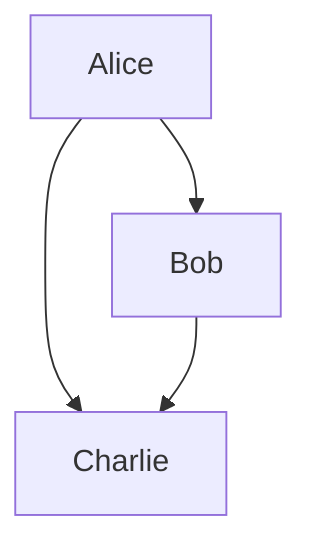
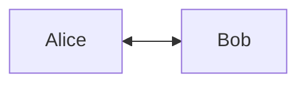
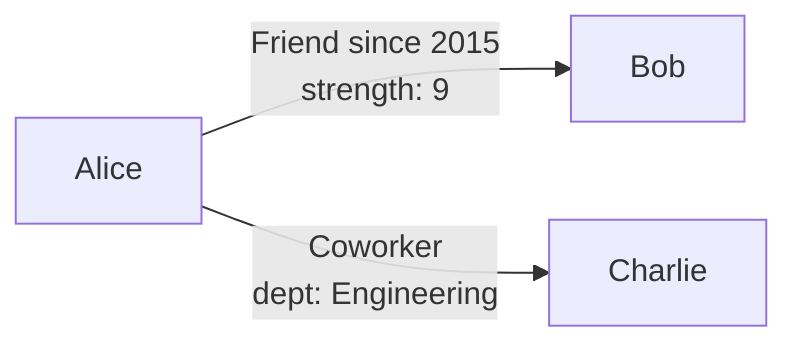
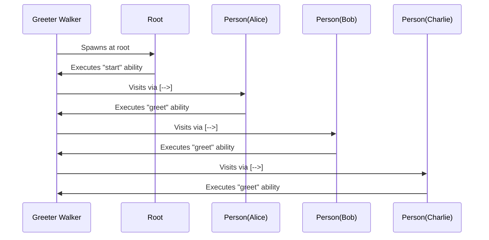
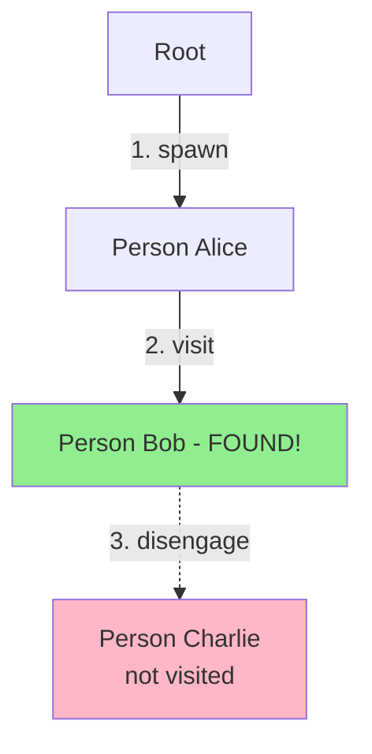
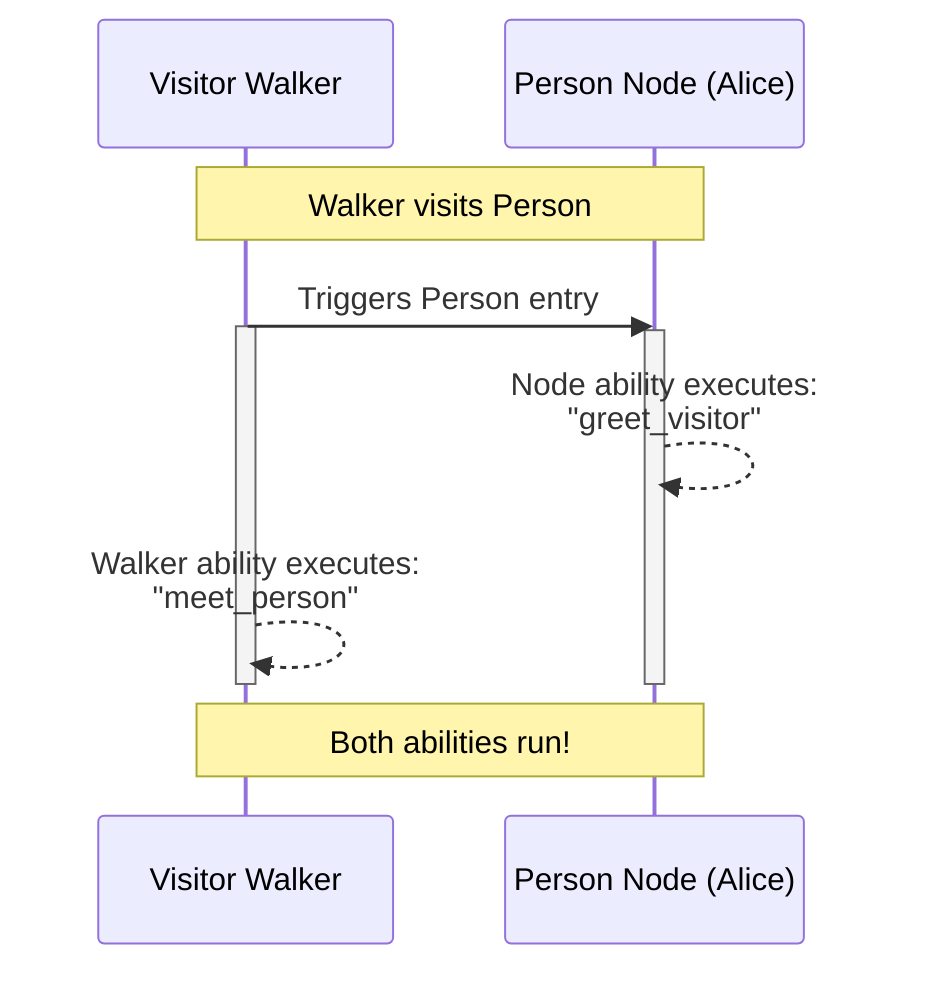
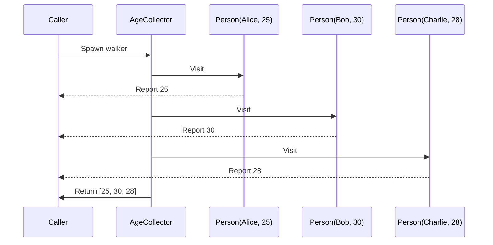
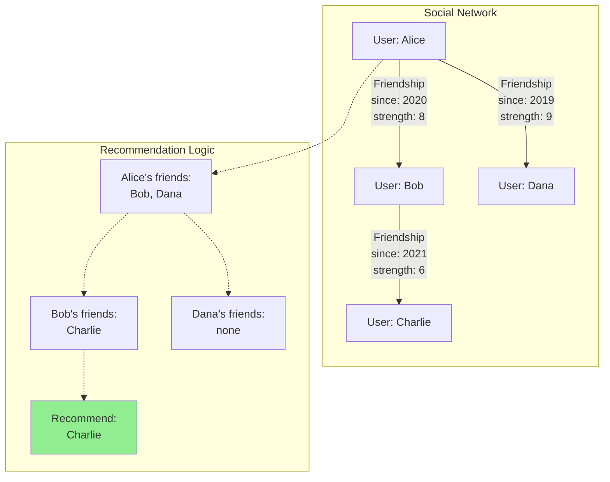
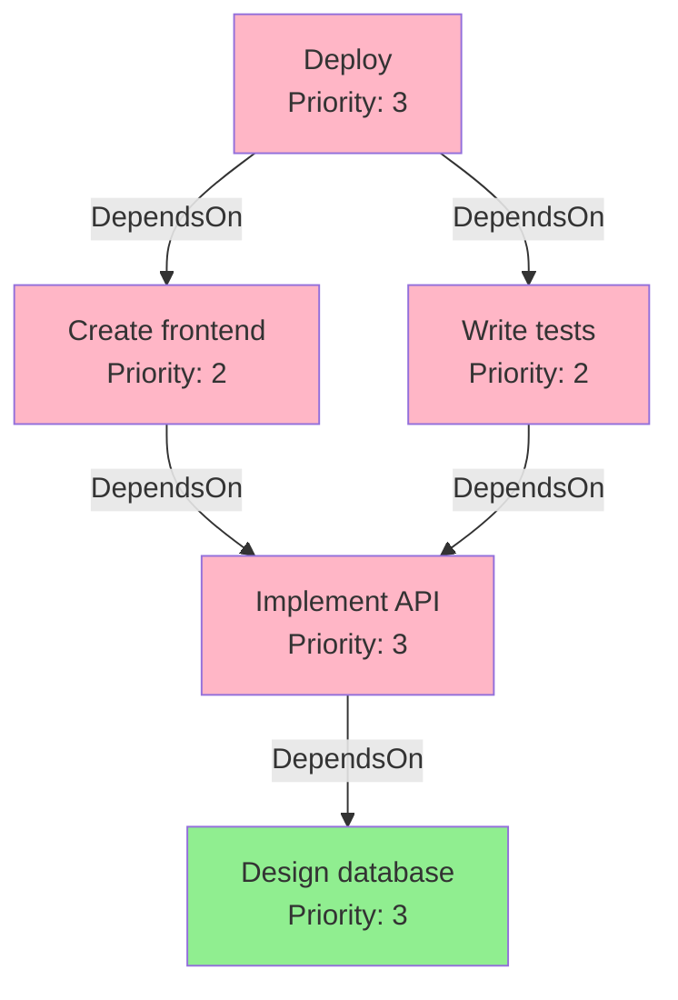
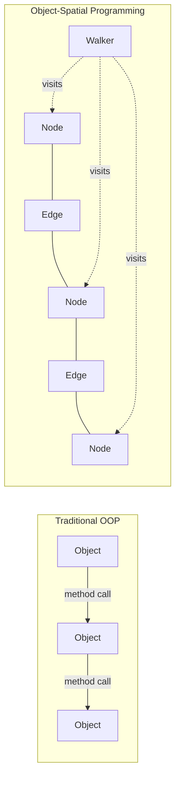

# You just have to learn 4 things to know Object-Spatial Programming

Most programming paradigms ask you to learn dozens of concepts, patterns, and best practices. Object-Spatial Programming (OSP) is different. At its core, there are really just **four fundamental concepts** you need to understand. Master these four things, and you'll have unlocked an entirely new way of thinking about computation—one that's particularly well-suited for modern applications dealing with complex relationships, graph structures, and distributed data.

This article will teach you the complete model of Object-Spatial Programming through these four conceptual buckets. Each builds naturally on the last, and by the end, you'll understand why OSP represents a genuine paradigm shift in how we structure programs.

<!-- more -->

## What is Object-Spatial Programming?

Before we dive into the four concepts, let's establish what makes Object-Spatial Programming fundamentally different from traditional Object-Oriented Programming (OOP).

**Traditional OOP:**
```
Data sits still → You bring computation to the data
(Call methods on objects)
```

**Object-Spatial Programming:**
```
Data is arranged in space → You send computation to travel through the data
(Walkers visit nodes in a graph)
```

### The Restaurant Analogy

Think of it this way:

- **OOP**: You're at home, you call restaurants and have food delivered to you
- **OSP**: You send a robot out to visit different restaurants and collect food

Both get you fed, but they work fundamentally differently! In OSP, computation is **mobile** and data is **spatial**.

---

## Concept 1: The Spatial Data Model (Nodes & Edges)

The first thing you need to understand is how data is structured in Object-Spatial Programming. Instead of thinking about isolated objects, you think about **data arranged in space with explicit relationships**.

> **🔑 Core Insight:** Everything in OSP is built on classes. `node`, `edge`, and `walker` are **not** new primitive types—they're classes that inherit all OOP capabilities (methods, properties, inheritance, polymorphism) **and add** spatial/traversal semantics. This means OSP extends OOP rather than replacing it.

### The Two Pillars of Spatial Data

| Type | What It Is | Purpose | Traditional Analogy |
|------|------------|---------|-------------------|
| `node` | **Class with spatial semantics** | Data locations that can be connected in graphs | Houses on a map |
| `edge` | **Class representing relationships** | First-class connections between nodes | Roads between houses |

**Key point:** Nodes and edges are full-featured classes with methods, inheritance, and properties—PLUS spatial connection capabilities.

### Creating Nodes

**Important: Nodes are classes!** They have all the semantics of regular classes (methods, inheritance, polymorphism) PLUS the ability to be connected in spatial graphs.

<div class="code-block">

```jac
node Person {
    has name: str;
    has age: int;

    # Regular method - just like any class
    def greet -> str {
        return f"Hello, I'm {self.name}!";
    }

    def celebrate_birthday {
        self.age += 1;
        print(f"{self.name} is now {self.age}!");
    }
}

with entry {
    alice = Person(name="Alice", age=25);
    bob = Person(name="Bob", age=30);

    # Use like regular objects
    print(alice.greet());
    alice.celebrate_birthday();
}
```

</div>

At this point, nodes work exactly like regular classes. The spatial magic happens when we connect them...

### Connecting Nodes: The Spatial Operators

This is where OSP diverges from traditional OOP. You can **directly connect** nodes using spatial operators:

<div class="code-block">

```jac
node Person {
    has name: str;
}

with entry {
    alice = Person(name="Alice");
    bob = Person(name="Bob");
    charlie = Person(name="Charlie");

    # Build the graph structure
    alice ++> bob;      # Alice → Bob
    alice ++> charlie;  # Alice → Charlie
    bob ++> charlie;    # Bob → Charlie
}
```

</div>

**Visual representation:**



### Connection Operators Reference

| Operator | Direction | Example | Result |
|----------|-----------|---------|--------|
| `++>` | Forward | `alice ++> bob;` | alice → bob |
| `<++` | Backward | `alice <++ bob;` | bob → alice |
| `<++>` | Both ways | `alice <++> bob;` | alice ↔ bob |

<div class="code-block">

```jac
with entry {
    alice = Person(name="Alice");
    bob = Person(name="Bob");

    # Bidirectional connection (mutual friendship)
    alice <++> bob;
}
```

</div>



### Typed Edges: First-Class Relationships

Here's what makes OSP truly revolutionary: **relationships are first-class objects** with their own types and properties!

**Important: Edges are also classes!** Like nodes, edges have all the semantics of regular classes—they can have methods, properties, and behavior—PLUS they represent connections in the graph.

<div class="code-block">

```jac
node Person {
    has name: str;
}

edge Friend {
    has since: int;  # Year they became friends
    has strength: int = 5;  # Closeness rating 1-10

    # Regular method - edges can have behavior!
    def years_of_friendship(current_year: int) -> int {
        return current_year - self.since;
    }

    def is_strong -> bool {
        return self.strength >= 7;
    }
}

edge Coworker {
    has department: str;

    def same_department(other_dept: str) -> bool {
        return self.department == other_dept;
    }
}

with entry {
    alice = Person(name="Alice");
    bob = Person(name="Bob");
    charlie = Person(name="Charlie");

    # Different types of relationships with their own data
    alice +>:Friend(since=2015, strength=9):+> bob;
    alice +>:Coworker(department="Engineering"):+> charlie;

    # Access edge methods
    friendship = [alice ->:Friend:->][0];
    print(f"Friends for {friendship.years_of_friendship(2024)} years");
}
```

</div>

**This is a paradigm shift!** In traditional OOP, relationships are just data in lists or dictionaries. In OSP, relationships are **classes in their own right** that exist in the spatial model and can have methods, properties, and behavior.



### Querying the Graph: Edge References

Once you've built a graph structure, you can query it using **edge references** with square brackets:

<div class="code-block">

```jac
node Person {
    has name: str;
}

edge Friend {
    has since: int;
}

with entry {
    alice = Person(name="Alice");
    bob = Person(name="Bob");
    charlie = Person(name="Charlie");

    alice +>:Friend(since=2015):+> bob;
    alice +>:Friend(since=2020):+> charlie;

    # Query all connections
    all_connections = [alice -->];
    print(f"Alice has {len(all_connections)} connections");

    # Query specific edge types
    friends = [alice ->:Friend:->];
    print(f"Alice has {len(friends)} friends");

    # Query with filters on edge properties
    old_friends = [alice ->:Friend:since < 2018:->];
    print(f"Alice has {len(old_friends)} friends since before 2018");
}
```

</div>

### Edge Reference Patterns

| Pattern | Direction | Type Filter | Example |
|---------|-----------|-------------|---------|
| `[node -->]` | Outgoing | Any | All outgoing connections |
| `[node <--]` | Incoming | Any | All incoming connections |
| `[node <-->]` | Both | Any | All connections |
| `[node ->:Type:->]` | Outgoing | Specific | Specific edge type |
| `[node ->:Type:property > 5:->]` | Outgoing | Filtered | With property filter |

### Why This Matters: Traditional vs Spatial

**Traditional OOP approach:**

<div class="code-block">

```jac
# Verbose, imperative, error-prone
obj Person {
    has name: str;
    has connections: list = [];
}

obj Connection {
    has conn_type: str;
    has target: object;
}

def find_friends(person: Person) -> list {
    friends = [];
    for connection in person.connections {
        if connection.conn_type == "friend" {
            friends.append(connection.target);
        }
    }
    return friends;
}

with entry {
    alice = Person(name="Alice");
    bob = Person(name="Bob");

    conn = Connection(conn_type="friend", target=bob);
    alice.connections.append(conn);

    friends = find_friends(alice);
}
```

</div>

**OSP approach:**

<div class="code-block">

```jac
# Concise, declarative, type-safe
node Person {
    has name: str;
}

edge Friend {}

with entry {
    alice = Person(name="Alice");
    bob = Person(name="Bob");

    alice +>:Friend:+> bob;

    friends = [alice ->:Friend:->];
}
```

</div>

**Key advantages:**
1. **Natural representation**: Relationships are explicit in the structure
2. **Type safety**: Edges have their own types and properties
3. **Declarative queries**: Express what you want, not how to get it
4. **Visual clarity**: The code structure mirrors the data structure

### Nodes and Edges Support Full OOP

Since nodes and edges are classes, they support all standard OOP features:

<div class="code-block">

```jac
# Base node with common behavior
node Entity {
    has id: str;
    has created_at: str;

    def get_age_days(current_date: str) -> int {
        # Common method inherited by all entities
        return 100;  # Simplified
    }
}

# Specialized nodes via inheritance
node Person(Entity) {
    has name: str;
    has email: str;

    def send_notification(message: str) {
        print(f"Sending to {self.email}: {message}");
    }
}

node Organization(Entity) {
    has company_name: str;
    has industry: str;

    def get_display_name -> str {
        return f"{self.company_name} ({self.industry})";
    }
}

# Edge with inheritance
edge Relationship {
    has start_date: str;

    def is_active -> bool {
        return True;  # Base implementation
    }
}

edge Employment(Relationship) {
    has role: str;
    has salary: float;

    def get_description -> str {
        return f"{self.role} since {self.start_date}";
    }
}

with entry {
    alice = Person(id="1", created_at="2020-01-01", name="Alice", email="alice@example.com");
    acme = Organization(id="2", created_at="2015-01-01", company_name="Acme Corp", industry="Tech");

    # Create typed edge with inheritance
    alice +>:Employment(start_date="2020-06-01", role="Engineer", salary=120000.0):+> acme;

    # Use inherited and specific methods
    print(alice.get_age_days("2024-01-01"));  # Inherited from Entity
    alice.send_notification("Welcome!");      # Specific to Person
    print(acme.get_display_name());           # Specific to Organization

    # Access edge
    job = [alice ->:Employment:->][0];
    print(job.get_description());             # Specific to Employment
    print(job.is_active());                   # Inherited from Relationship
}
```

</div>

**The key insight:** `node`, `edge`, and `walker` are not restrictions—they're **extensions** of regular classes that add spatial semantics while preserving all OOP capabilities.

---

## Concept 2: The Mobile Computation Model (Walkers)

Now that you understand how data is structured spatially, the second concept is about **how computation moves through that space**. This is where walkers come in.

### What is a Walker?

A **walker** is a mobile unit of computation that travels through the graph, visiting nodes and performing actions. Think of it as an autonomous agent that navigates your data structure.

**Important: Walkers are also classes!** They have all the semantics of regular classes (state, methods, inheritance) PLUS the ability to move through the graph and trigger abilities based on what they visit.

<div class="code-block">

```jac
node Person {
    has name: str;
}

walker Greeter {
    # Walker state - like class attributes
    has greeting_count: int = 0;

    # Regular methods work too!
    def get_stats -> str {
        return f"Greeted {self.greeting_count} people";
    }

    # Spatial ability - triggers when visiting root
    can start with `root entry {
        print("Walker starting journey!");
        visit [-->];  # Visit all connected nodes
    }

    # Spatial ability - triggers when visiting Person nodes
    can greet with Person entry {
        print(f"Hello, {here.name}!");
        self.greeting_count += 1;  # Update walker state
        visit [-->];  # Continue to this person's connections
    }
}

with entry {
    # Build graph
    alice = Person(name="Alice");
    bob = Person(name="Bob");
    charlie = Person(name="Charlie");

    root ++> alice ++> bob ++> charlie;

    # Spawn walker at root
    greeter = Greeter();
    root spawn greeter;

    # Access walker state after traversal
    print(greeter.get_stats());
}
```

</div>

**Output:**
```
Walker starting journey!
Hello, Alice!
Hello, Bob!
Hello, Charlie!
```



### Walker Anatomy

<div class="code-block">

```jac
walker MyWalker {
    // Walker state (like object attributes)
    has counter: int = 0;
    has visited_names: list = [];

    // Abilities define what happens at different nodes
    can ability_name with NodeType entry {
        // Your logic here
    }
}
```

</div>

### The Visit Statement

The `visit` statement is how walkers navigate the graph. It tells the walker **where to go next**.

<div class="code-block">

```jac
walker Explorer {
    can explore with Person entry {
        print(f"Visiting {here.name}");

        # Different visit patterns:
        visit [-->];          # Visit all outgoing connections
        # visit [<--];        # Visit all incoming connections
        # visit [<-->];       # Visit all connections (both directions)
        # visit [->:Friend:->]; # Visit only via Friend edges
    }
}
```

</div>

### Visit Pattern Reference

| Pattern | Meaning |
|---------|---------|
| `visit [-->];` | Visit all nodes connected via outgoing edges |
| `visit [<--];` | Visit all nodes connected via incoming edges |
| `visit [<-->];` | Visit all nodes connected in any direction |
| `visit [->:Type:->];` | Visit only via specific edge type |
| `visit [->:Type:property > 5:->];` | Visit via filtered edges |
| `visit node_list;` | Visit specific nodes in a list |

### Special References in Walkers

When writing walker code, you have access to special references:

| Reference | Meaning | Use Case |
|-----------|---------|----------|
| `self` | The walker itself | Access walker state |
| `here` | The current node being visited | Access node properties |
| `root` | The global root node | Always available anchor point |

<div class="code-block">

```jac
walker DataCollector {
    has collected_data: list = [];

    can collect with Person entry {
        # self = the walker
        # here = the current Person node

        self.collected_data.append(here.name);
        print(f"Walker has collected: {self.collected_data}");
        visit [-->];
    }
}
```

</div>

### Example: Finding a Specific Node

<div class="code-block">

```jac
node Person {
    has name: str;
}

walker FindPerson {
    has target: str;
    has found: bool = False;

    can start with `root entry {
        visit [-->];
    }

    can search with Person entry {
        if here.name == self.target {
            print(f"Found {here.name}!");
            self.found = True;
            disengage;  # Stop immediately (we'll cover this in Concept 4)
        }
        visit [-->];
    }
}

with entry {
    alice = Person(name="Alice");
    bob = Person(name="Bob");
    charlie = Person(name="Charlie");

    root ++> alice ++> bob ++> charlie;

    finder = FindPerson(target="Bob");
    root spawn finder;

    print(f"Search result: {finder.found}");
}
```

</div>



### Why Mobile Computation Matters

Traditional programming brings data to computation:

```python
# Traditional approach
def process_all(data_list):
    for item in data_list:
        process(item)  # Computation happens here
```

OSP sends computation to data:

```jac
// OSP approach
walker Processor {
    can process with DataNode entry {
        // Computation happens AT the data
        visit [-->];
    }
}
```

This shift enables:
- **Natural graph traversal**: No manual iteration through connections
- **Automatic dispatching**: Right code runs at right nodes
- **Distributed potential**: Walkers can move across machine boundaries
- **Declarative navigation**: Express intent, not mechanics

---

## Concept 3: The Event-Driven Interaction Model (Abilities)

The third concept is understanding how walkers and nodes interact. This happens through **abilities**—automatic methods that trigger when certain events occur.

### What are Abilities?

**Abilities** are methods that automatically execute based on **type matching** between walkers and nodes. They define the interaction protocol between mobile computation and spatial data.

<div class="code-block">

```jac
walker MyWalker {
    # Ability: runs when walker visits a Person node
    can meet_person with Person entry {
        print(f"Walker is meeting {here.name}");
    }

    # Ability: runs when walker visits a City node
    can visit_city with City entry {
        print(f"Walker is visiting {here.name}");
    }
}
```

</div>

### Ability Triggers

| Trigger | When it Executes |
|---------|------------------|
| `with NodeType entry` | When walker **enters** a node of type NodeType |
| `with NodeType exit` | When walker **leaves** a node of type NodeType |
| `with WalkerType entry` | When **a walker** of type WalkerType visits (node perspective) |
| `with \`root entry` | When walker spawns at the root node |

### Walker Abilities: The Walker's Perspective

These abilities define what the walker does when visiting different node types:

<div class="code-block">

```jac
node Person {
    has name: str;
    has age: int;
}

node City {
    has name: str;
    has population: int;
}

walker Tourist {
    has places_visited: int = 0;

    can start with `root entry {
        print("Starting tour!");
        visit [-->];
    }

    can meet_person with Person entry {
        print(f"Met {here.name}, age {here.age}");
        self.places_visited += 1;
        visit [-->];
    }

    can visit_city with City entry {
        print(f"Visiting {here.name}, population {here.population}");
        self.places_visited += 1;
        visit [-->];
    }

    can finish with exit {
        print(f"Tour complete! Visited {self.places_visited} places");
    }
}
```

</div>

### Node Abilities: The Node's Perspective

Nodes can also have abilities that define how they react to visiting walkers:

<div class="code-block">

```jac
node Person {
    has name: str;
    has greeting_count: int = 0;

    # Node's perspective: "When a Greeter visits me"
    can be_greeted with Greeter entry {
        self.greeting_count += 1;
        print(f"{self.name} has been greeted {self.greeting_count} times");
    }
}

walker Greeter {
    # Walker's perspective: "When I visit a Person"
    can greet with Person entry {
        print(f"Hello, {here.name}!");
        visit [-->];
    }
}
```

</div>

### Bidirectional Polymorphism: The Revolutionary Part

Here's what makes OSP truly unique: **both nodes and walkers can define abilities for the same interaction**. When a walker visits a node, **both abilities execute**!

<div class="code-block">

```jac
node Person {
    has name: str;

    # Node's perspective
    can greet_visitor with Visitor entry {
        print(f"{self.name} says: Welcome, visitor!");
    }
}

walker Visitor {
    # Walker's perspective
    can meet_person with Person entry {
        print(f"Visitor says: Hello, {here.name}!");
        visit [-->];
    }
}

with entry {
    alice = Person(name="Alice");
    root ++> alice;

    root spawn Visitor();
}
```

</div>

**Output:**
```
Visitor says: Hello, Alice!
Alice says: Welcome, visitor!
```



This is **bidirectional polymorphism**: the interaction is defined from both perspectives. This is unique to OSP and has no direct equivalent in traditional OOP.

### Ability Execution Order

When a walker visits a node, abilities execute in this order:

1. **Node's ability** for the walker type (if it exists)
2. **Walker's ability** for the node type (if it exists)

<div class="code-block">

```jac
node Counter {
    has count: int = 0;

    can increment with Incrementer entry {
        self.count += 1;
        print(f"Node: Count is now {self.count}");
    }
}

walker Incrementer {
    can process with Counter entry {
        print(f"Walker: Processing counter at {here.count}");
        visit [-->];
    }
}
```

</div>

**Execution:**
```
Node: Count is now 1
Walker: Processing counter at 1
```

### Real-World Example: Social Network

<div class="code-block">

```jac
node User {
    has username: str;
    has posts_viewed: int = 0;

    can track_view with ContentViewer entry {
        self.posts_viewed += 1;
        print(f"[{self.username}] Post views: {self.posts_viewed}");
    }
}

edge Follow {}

walker ContentViewer {
    has content_count: int = 0;

    can start with `root entry {
        visit [-->];
    }

    can view_content with User entry {
        self.content_count += 1;
        print(f"[Viewer] Viewing content from {here.username}");
        visit [->:Follow:->];  # Only follow edges
    }
}

with entry {
    alice = User(username="alice");
    bob = User(username="bob");
    charlie = User(username="charlie");

    root ++> alice;
    alice +>:Follow:+> bob;
    bob +>:Follow:+> charlie;

    root spawn ContentViewer();
}
```

</div>

**Output:**
```
[Viewer] Viewing content from alice
[alice] Post views: 1
[Viewer] Viewing content from bob
[bob] Post views: 1
[Viewer] Viewing content from charlie
[charlie] Post views: 1
```

### Why Event-Driven Interaction Matters

| Traditional OOP | OSP with Abilities |
|-----------------|-------------------|
| Explicit method calls | Automatic ability dispatch |
| One-sided interaction | Bidirectional interaction |
| Tight coupling | Loose coupling via types |
| Manual routing | Type-driven routing |

**Abilities enable:**
- **Automatic dispatch**: Right code runs without explicit routing
- **Separation of concerns**: Walker logic separate from node logic
- **Extensibility**: Add new walker types without changing nodes
- **Bidirectional contracts**: Both sides define interaction

---

## Concept 4: The Traversal & Control Flow (Navigation & Results)

The fourth and final concept is understanding how to control walker navigation and collect results. This is where you orchestrate the computation across your spatial data structure.

### Visit Strategies

You've seen basic `visit` statements, but there are sophisticated patterns for controlling traversal:

#### 1. Visit All Connections

```jac
visit [-->];   # All outgoing
visit [<--];   # All incoming
visit [<-->];  # All connections
```

#### 2. Visit Specific Edge Types

```jac
visit [->:Friend:->];      # Only Friend edges
visit [->:Coworker:->];    # Only Coworker edges
```

#### 3. Visit with Filters

```jac
# Visit friends from before 2020
visit [->:Friend:since < 2020:->];

# Visit high-strength friendships
visit [->:Friend:strength > 7:->];
```

#### 4. Multi-Hop Traversal

```jac
# Friends of friends (2 hops)
potential_friends = [here ->:Friend:-> ->:Friend:->];
visit potential_friends;
```

#### 5. Visit Specific Nodes

```jac
# Build a list and visit it
targets = [here -->];
filtered_targets = [t for t in targets if t.age > 25];
visit filtered_targets;
```

### The Report Statement: Streaming Results

Unlike `return` (which stops execution), **`report`** sends values back to the caller while the walker **continues executing**.

<div class="code-block">

```jac
node Person {
    has name: str;
    has age: int;
}

walker AgeCollector {
    can start with `root entry {
        visit [-->];
    }

    can collect with Person entry {
        report here.age;  # Send age back
        visit [-->];      # Keep going!
    }
}

with entry {
    alice = Person(name="Alice", age=25);
    bob = Person(name="Bob", age=30);
    charlie = Person(name="Charlie", age=28);

    root ++> alice ++> bob ++> charlie;

    ages = root spawn AgeCollector();
    print(f"Collected ages: {ages}");  # [25, 30, 28]
    print(f"Average age: {sum(ages) / len(ages)}");  # 27.67
}
```

</div>



### Report vs Return

| Feature | `return` | `report` |
|---------|----------|----------|
| Stops execution | ✓ Yes | ✗ No |
| Sends value back | ✓ One value | ✓ Multiple values |
| Continues walking | ✗ No | ✓ Yes |
| Result type | Single value | List of values |

### The Disengage Statement: Early Exit

Use `disengage` to stop the walker immediately, no matter where it is:

<div class="code-block">

```jac
node Person {
    has name: str;
}

walker FindPerson {
    has target: str;
    has found: bool = False;

    can start with `root entry {
        visit [-->];
    }

    can search with Person entry {
        if here.name == self.target {
            print(f"Found {here.name}!");
            self.found = True;
            disengage;  # Stop immediately!
        }
        visit [-->];
    }
}

with entry {
    alice = Person(name="Alice");
    bob = Person(name="Bob");
    charlie = Person(name="Charlie");
    dana = Person(name="Dana");

    root ++> alice ++> bob ++> charlie ++> dana;

    finder = FindPerson(target="Bob");
    root spawn finder;

    print(f"Found: {finder.found}");
}
```

</div>

**Output:**
```
Found Bob!
Found: True
```

The walker stops at Bob and never visits Charlie or Dana.

### Combining Report and Disengage

<div class="code-block">

```jac
walker FindFirstAdult {
    can start with `root entry {
        visit [-->];
    }

    can check with Person entry {
        if here.age >= 18 {
            report here.name;
            disengage;  # Found first adult, stop
        }
        visit [-->];
    }
}
```

</div>

### Control Flow Patterns

#### Pattern 1: Depth-First Search

<div class="code-block">

```jac
walker DepthFirst {
    has visited: set = set();

    can traverse with Person entry {
        if here.name in self.visited {
            return;  # Skip already visited
        }

        self.visited.add(here.name);
        print(f"Visiting {here.name}");

        visit [-->];  # Go deep first
    }
}
```

</div>

#### Pattern 2: Breadth-First Search

<div class="code-block">

```jac
walker BreadthFirst {
    has visited: set = set();
    has queue: list = [];

    can start with `root entry {
        self.queue = [root -->];
    }

    can traverse with Person entry {
        if here.name not in self.visited {
            self.visited.add(here.name);
            print(f"Visiting {here.name}");

            # Add neighbors to queue
            neighbors = [here -->];
            for n in neighbors {
                if n.name not in self.visited {
                    self.queue.append(n);
                }
            }
        }

        # Visit next in queue
        if self.queue {
            visit self.queue.pop(0);
        }
    }
}
```

</div>

#### Pattern 3: Conditional Traversal

<div class="code-block">

```jac
walker ConditionalTraversal {
    can start with `root entry {
        visit [-->];
    }

    can traverse with Person entry {
        print(f"At {here.name}");

        # Only visit friends, not coworkers
        visit [->:Friend:->];

        # Or: only visit strong friendships
        visit [->:Friend:strength > 7:->];
    }
}
```

</div>

### Complete Example: Friend Recommendations

<div class="code-block">

```jac
node User {
    has username: str;
    has interests: list;
}

edge Friendship {
    has since: int;
    has strength: int = 5;
}

walker FriendRecommender {
    has recommendations: list = [];
    has visited: set = set();

    can start with `root entry {
        visit [-->];
    }

    can find_recommendations with User entry {
        if here.username in self.visited {
            return;
        }

        self.visited.add(here.username);
        print(f"Finding recommendations for {here.username}...");

        # Get friends of friends (2 hops)
        friends_of_friends = [
            here ->:Friendship:-> ->:Friendship:->
        ];

        # Get direct friends to exclude
        direct_friends = [here ->:Friendship:->];

        for person in friends_of_friends {
            # Don't recommend current friends or self
            if person not in direct_friends and person != here {
                if person.username not in self.recommendations {
                    self.recommendations.append(person.username);
                    report person.username;
                }
            }
        }

        disengage;  # Found recommendations for first user
    }
}

with entry {
    alice = User(username="alice", interests=["coding", "hiking"]);
    bob = User(username="bob", interests=["coding", "gaming"]);
    charlie = User(username="charlie", interests=["hiking", "reading"]);
    dana = User(username="dana", interests=["photography", "travel"]);

    root ++> alice;
    root ++> bob;
    root ++> charlie;
    root ++> dana;

    alice +>:Friendship(since=2020, strength=8):+> bob;
    bob +>:Friendship(since=2021, strength=6):+> charlie;
    alice +>:Friendship(since=2019, strength=9):+> dana;

    # Get recommendations for Alice
    recommender = FriendRecommender();
    recommendations = alice spawn recommender;

    print(f"Recommendations for Alice: {recommendations}");
}
```

</div>



### Traversal Control Summary

| Mechanism | Purpose | Stops Walker? | Returns Data? |
|-----------|---------|---------------|---------------|
| `visit` | Navigate to nodes | No | No |
| `report` | Send data back | No | Yes (streams) |
| `disengage` | Stop immediately | Yes | No |
| `return` | Exit ability | No (just ability) | No |

---

## Putting It All Together: The Four Concepts

Let's see how all four concepts work together in a complete, real-world example:

<div class="code-block">

```jac
# Concept 1: Spatial Data Model
node Task {
    has title: str;
    has status: str = "pending";  # pending, in_progress, complete
    has priority: int = 1;        # 1=low, 2=medium, 3=high
}

edge DependsOn {
    # Task must wait for dependency to complete
}

# Concept 2: Mobile Computation (Walkers)
walker TaskAnalyzer {
    has ready_tasks: list = [];
    has blocked_tasks: list = [];

    # Concept 3: Event-Driven Interaction (Abilities)
    can start with `root entry {
        visit [-->];
    }

    can analyze with Task entry {
        if here.status != "pending" {
            return;  # Skip non-pending tasks
        }

        # Check if all dependencies are complete
        dependencies = [here ->:DependsOn:->];
        all_done = True;

        for dep in dependencies {
            if dep.status != "complete" {
                all_done = False;
                break;
            }
        }

        # Concept 4: Traversal & Control Flow
        if all_done {
            self.ready_tasks.append(here.title);
            report {
                "title": here.title,
                "priority": here.priority,
                "status": "ready"
            };
        } else {
            self.blocked_tasks.append(here.title);
        }

        visit [-->];  # Continue to next tasks
    }
}

walker MarkComplete {
    has task_title: str;

    can start with `root entry {
        visit [-->];
    }

    can mark with Task entry {
        if here.title == self.task_title {
            here.status = "complete";
            print(f"✓ Completed: {here.title}");
            disengage;
        }
        visit [-->];
    }
}

with entry {
    # Build task graph
    task1 = Task(title="Design database", priority=3);
    task2 = Task(title="Implement API", priority=3);
    task3 = Task(title="Create frontend", priority=2);
    task4 = Task(title="Write tests", priority=2);
    task5 = Task(title="Deploy", priority=3);

    # Define dependencies
    task2 +>:DependsOn:+> task1;  # API needs database
    task3 +>:DependsOn:+> task2;  # Frontend needs API
    task4 +>:DependsOn:+> task2;  # Tests need API
    task5 +>:DependsOn:+> task3;  # Deploy needs frontend
    task5 +>:DependsOn:+> task4;  # Deploy needs tests

    # Connect to root
    root ++> task1;
    root ++> task2;
    root ++> task3;
    root ++> task4;
    root ++> task5;

    # Analyze what's ready
    analyzer = TaskAnalyzer();
    results = root spawn analyzer;
    print(f"\nReady to work on: {analyzer.ready_tasks}");
    print(f"Blocked tasks: {analyzer.blocked_tasks}");

    # Complete first task
    root spawn MarkComplete(task_title="Design database");

    # Analyze again
    analyzer2 = TaskAnalyzer();
    results2 = root spawn analyzer2;
    print(f"\nAfter completion:");
    print(f"Ready to work on: {analyzer2.ready_tasks}");
    print(f"Blocked tasks: {analyzer2.blocked_tasks}");
}
```

</div>

**Dependency Graph:**



---

## The Four Concepts: Summary Table

| Concept | What It Is | Key Elements | What It Enables |
|---------|-----------|--------------|-----------------|
| **1. Spatial Data Model** | How data is structured using **classes with spatial semantics** | `node` (class), `edge` (class), `++>`, `[-->]` | First-class relationships, declarative queries, full OOP |
| **2. Mobile Computation** | How computation moves using **walker classes** | `walker` (class), `spawn`, `visit` | Autonomous traversal, data-centric computation |
| **3. Event-Driven Interaction** | How things react via **abilities** (special methods) | Abilities, `with entry`, `here`, `self` | Automatic dispatch, bidirectional polymorphism |
| **4. Traversal & Control** | How you navigate & collect data | `visit` patterns, `report`, `disengage` | Sophisticated navigation, streaming results |

**Remember:** Nodes, edges, and walkers are all full-featured classes. They support inheritance, methods, properties, and all OOP features—OSP adds spatial and traversal capabilities on top.

---

## When to Use Object-Spatial Programming

OSP shines in specific scenarios:

### Perfect For:

✓ **Social networks** - Users, friendships, followers
✓ **Knowledge graphs** - Concepts and their relationships
✓ **Recommendation systems** - Users, products, ratings
✓ **Workflow systems** - Tasks with dependencies
✓ **Transportation networks** - Cities, routes, connections
✓ **Organization charts** - People and reporting structures
✓ **Dependency management** - Packages, versions, requirements

### Not Ideal For:

✗ Simple CRUD applications
✗ Data with no significant relationships
✗ Performance-critical tight loops
✗ Simple list/table processing

---

## The Paradigm Shift

Traditional programming paradigms:



**The fundamental difference:**

| Traditional | Object-Spatial |
|-------------|----------------|
| Objects are isolated | Nodes are spatially connected |
| Relationships are data | Relationships are first-class objects |
| Computation is static | Computation is mobile |
| Method calls are explicit | Abilities dispatch automatically |
| One-way interaction | Bidirectional interaction |

---

## Conclusion: Just Four Things

You've now learned the complete model of Object-Spatial Programming through four fundamental concepts:

1. **The Spatial Data Model** - Structure your data in space with nodes and edges (classes with spatial semantics)
2. **The Mobile Computation Model** - Send walkers (classes) to travel through your data
3. **The Event-Driven Interaction Model** - Define abilities (special methods) for automatic, bidirectional interaction
4. **The Traversal & Control Flow** - Navigate with visit, collect with report, control with disengage

That's it. Four concepts that unlock an entirely new way of thinking about computation.

**The fundamental insight about OSP:**

> Nodes, edges, and walkers are **not new constructs**—they're classes with all the power of OOP (methods, inheritance, polymorphism) **plus** spatial and traversal capabilities.

This means you keep all the programming knowledge you already have and add spatial semantics on top. When your problem domain involves complex relationships and interconnected data, Object-Spatial Programming provides a natural, powerful way to model and solve it.

The key insight:
> "Don't bring data to computation. Send computation to where the data lives."

This simple shift in perspective—from static objects to spatial data, from method calls to mobile computation—opens up new possibilities for how we structure programs. Welcome to Object-Spatial Programming.

---

## Further Learning

Want to dive deeper? Explore these resources:

- **Jac Language Documentation** - Complete language reference
- **Example Projects** - Real-world OSP applications
- **Graph Algorithms in OSP** - Classic algorithms reimagined
- **Distributed OSP** - Scaling walkers across machines

**Ready to build something?** Start with a simple social network, then work your way up to more complex graph-based applications. The four concepts you've learned here are all you need to get started.

Happy spatial programming! 🚀
