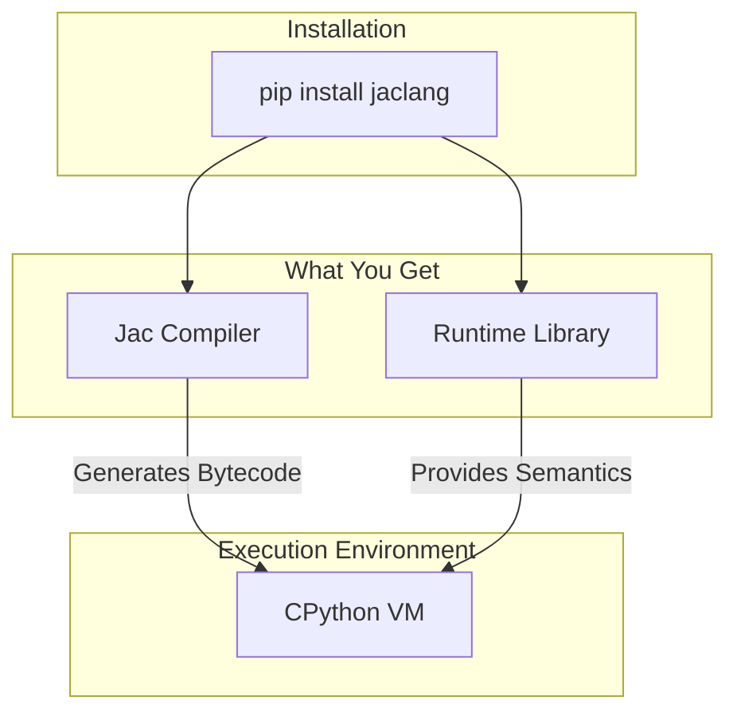
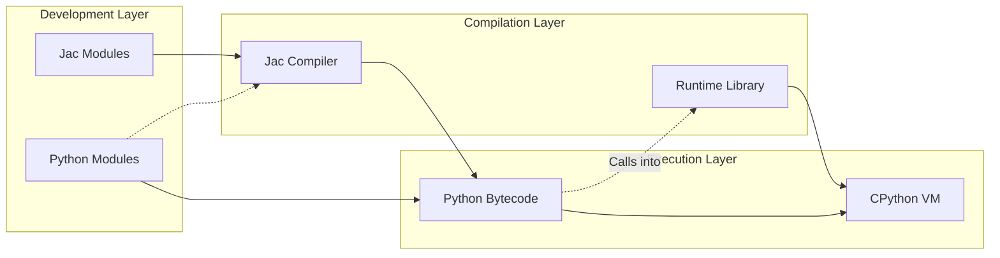
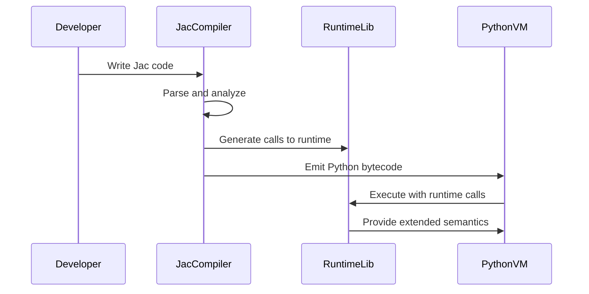
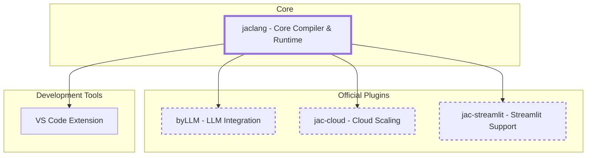
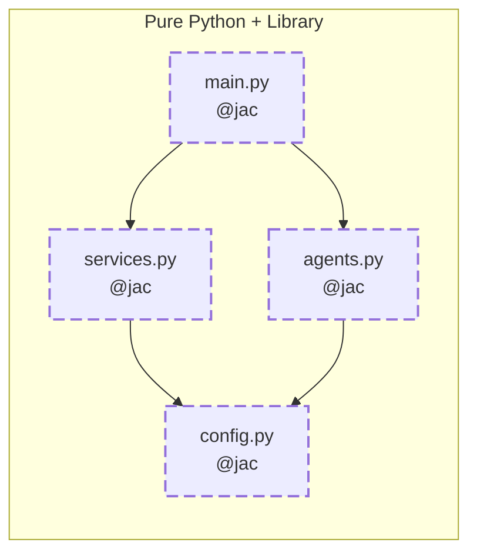
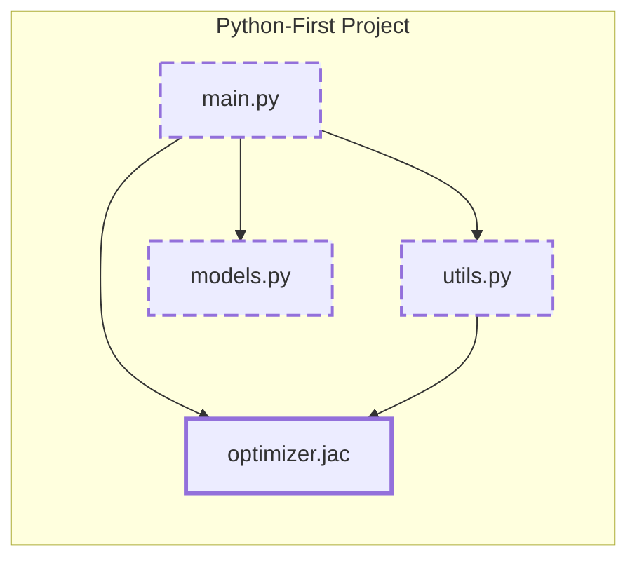
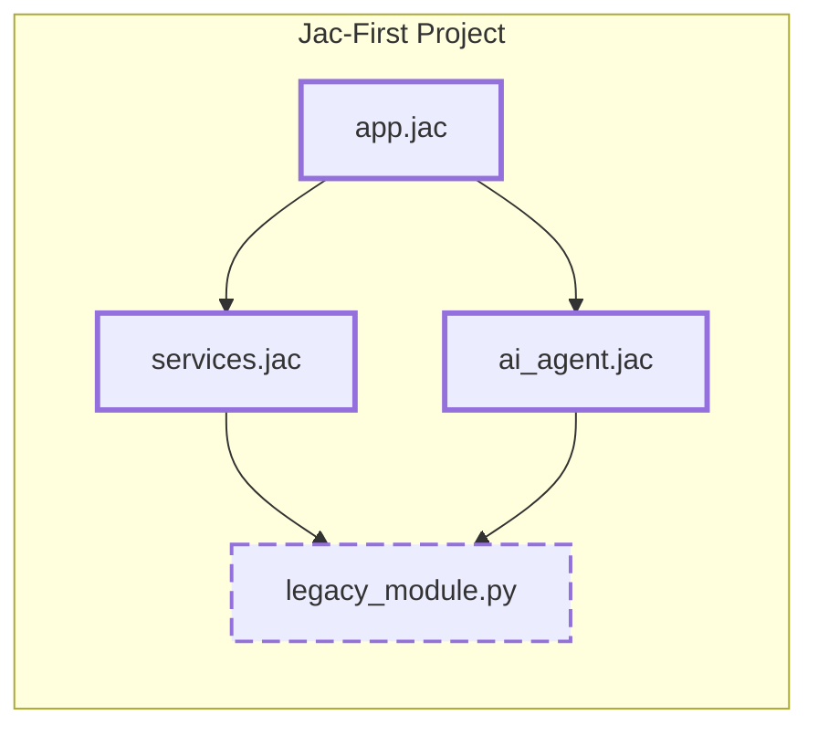
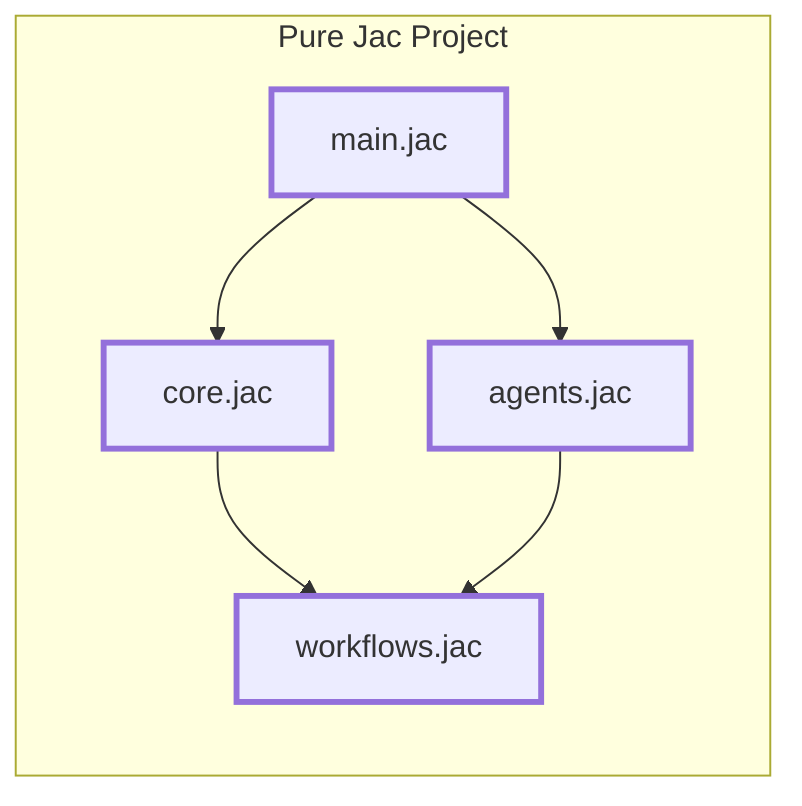
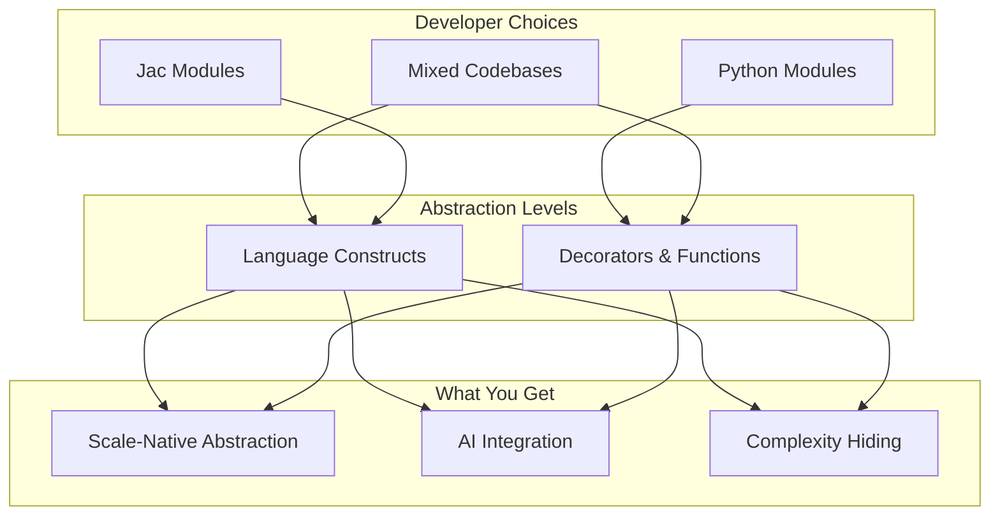

# How Does Python Get Jac'd with Jaseci?

When explaining complex software architectures, there's this tendency to start with the grand vision and work down to implementation details. But honestly, for developers who actually need to use a tool, the opposite approach makes way more sense. This post if for the Python developer exploring Jac, a programming language and runtime that extends Python rather than trying to replace it. We'll start with what you can actually install and use today, then work our way up to why it exists.

[Watch on YouTube!](https://www.youtube.com/watch?v=psREgIezkJo)

<!-- more -->

[](https://www.youtube.com/watch?v=psREgIezkJo)


The thinking behind Jac is pretty straightforward: we're still using programming abstractions from the 1980s and 1990s, but our applications look nothing like what we built back then. Pretty much every app today has cloud components, needs to scale, and increasingly includes AI stuff. Jac tries to provide new abstractions for these realities while staying compatible with Python.

## It Starts with a Simple Pip

At its core, Jac is surprisingly simple to get:

```bash
pip install jaclang
```

That's it. You get a pure Python library with zero dependencies. They vendored a few small things rather than maintaining a dependency chain, which is a nice touch for reliability. What this gets you is both a compiler and a runtime library, all written in pure Python that runs on the standard CPython VM.



## The Architecture: How It Actually Works

The interesting bit about Jac's architecture is how it uses Python's existing infrastructure while adding new capabilities. Instead of building a separate runtime or requiring a different execution environment, Jac compiles to Python bytecode that runs on the regular Python VM. This means you can use all your existing Python libraries and tools without any hassle.

**Core Components and Their Interactions**

| Component | Purpose | Implementation |
|-----------|---------|----------------|
| Jac Compiler | Translates Jac code to Python bytecode | Pure Python, leverages PEP 302 |
| Runtime Library | Provides semantics beyond pure Python | Python library with system bindings |
| Plugin Interface | Extends core functionality | Based on pytest's plugin architecture |
| CLI Tool | Executes Jac programs directly | Part of jaclang package |

The relationship between these components creates a flexible yet powerful system:



**The Import Hook Magic: PEP 302**

One of Python's most underused features is PEP 302, which lets you modify how imports work. Jac uses this really well. When you import jaclang into any Python project, Jac becomes automatically enabled. Your project can then import and use Jac modules just like regular Python modules. The integration is smooth enough that Jac modules basically are Python modules, just with extra capabilities.

What's nice about this is that existing Python projects can adopt Jac incrementally, module by module. You don't need to rewrite everything. A team can try out Jac in a single module while keeping the rest of their codebase in standard Python, see if they like it, then expand from there.

## The Runtime Library: Where Things Get Interesting

While the compiler generates standard Python bytecode, the runtime library is where Jac's extended features actually live. This library provides the capabilities that go beyond what regular Python can do. The generated bytecode includes calls to the runtime library, which show up as decorators, functions, and base classes in the compiled code.



This setup lets Jac do things beyond just code semantics. For example, one of Jac's features lets you automatically scale applications to handle multiple users through language-level constructs. The runtime library handles this by talking to various system components, from Kubernetes to GPU compilers like those in PyTorch.

The flexibility here is pretty cool. Python already has bindings for basically everything. By building on this, Jac can control distributed systems, manage GPU computations, interact with cloud services, and more—all through language-level abstractions that hide the messy details.

## The Plugin Ecosystem: Extensibility by Design

Jac's plugin system, modeled after pytest's successful plugin architecture, enables both the core team and the community to extend the language's capabilities without modifying the core compiler or runtime. This design promotes innovation while maintaining stability in the core system.

**Current Plugin Landscape**

The Jac ecosystem currently includes several official plugins that demonstrate the power of this architecture:



The **byLLM** plugin provide the implementation for the `by` keyword, enabling seamless integration with large language models directly in the language syntax. This isn't just syntactic sugar—it represents a fundamental rethinking of how AI capabilities should be integrated into programming languages. Rather than treating AI as an external service called through APIs, Jac treats it as a first-class language construct.

The **jac-cloud** plugin embodies an even more ambitious goal: write once, scale anywhere. It promises the ability to run the same code on a single machine or distributed across millions of machines without code changes. While still a work in progress, this plugin demonstrates how language-level abstractions can hide the complexity of distributed systems from developers.

## Developer Adoption Philosophy: Gradual Jacification

Jac's relationship with Python is worth understanding because it represents a deliberate choice. Instead of trying to replace Python or create yet another incompatible ecosystem, Jac extends Python while keeping everything compatible. This gives you some nice flexibility in how you use it.

**Adoption Patterns: Pick What Works for You**

Jac's design lets you adopt it in four different ways, depending on what makes sense for your project.

**Pure Python + Library Pattern**



Don't want any new syntax at all? Fair enough. You can access Jac's features entirely through decorators, base classes, and function calls. You lose some compile-time optimizations, but if your organization has strong Python standards or adding a new file extension requires three meetings and a committee approval, this works great.

**Python-First Project Pattern**



Got a large Python codebase? This approach lets you add Jac surgically. Maybe one service needs different scaling, or one algorithm would benefit from Jac's concurrency model. You add a single `.jac` file, import it like any Python module, and everything else stays the same. Low risk, easy to try.

**Jac-First Project Pattern**



This is probably the most practical approach for many teams. Your core application logic lives in Jac, but you keep existing Python modules that already work well. That authentication module you spent months getting right? Keep it. The data pipeline that's already optimized? Leave it alone. Write new stuff in Jac where it makes sense.

**Pure Jac Project Pattern**



When you're building something new from scratch, you might go all-in with Jac. Every module uses Jac syntax, which gives the compiler full visibility into your program's structure. This lets it do things like automatic service boundary detection and cross-module state synchronization. Pretty neat if you're starting fresh.

<div class="code-block">
```jac
node Person {
    has name: str;
}

walker FindPerson {
    has target: str;

    can start with `root entry {
        visit [-->];
    }

    can search with Person entry {
        if here.name == self.target {
            print(f"Found {here.name}!");
            disengage;  # Stops immediately
        }
        visit [-->];
    }
}

with entry {
    alice = Person(name="Alice");
    bob = Person(name="Bob");
    charlie = Person(name="Charlie");

    root ++> alice ++> bob ++> charlie;

    root spawn FindPerson(target="Bob");
}
```
</div>

**Mix and Match**

These patterns play nicely together. A Pure Jac microservice can call a Python-First API server. You can start with Pure Python + Library decorators and gradually move to Jac-First as you get comfortable. Use whatever makes sense for your situation.

## Practical Implications for Python Developers

So what does this actually mean for Python developers? The benefits show up at different levels of the stack, and which ones you get depends on how you adopt Jac.

**Language Design Layer**

At the language level, Jac introduces new ways to express common patterns in modern software. These aren't just syntax tweaks—they're different ways of thinking about problems. Being able to express  AI integration, distributed computing, and scaling through language constructs instead of library calls can make code a lot cleaner and easier to reason about.

If you're using Pure Jac or Jac-First patterns, the compiler can see what your program is trying to do and optimize accordingly. Teams using the Pure Python + Library pattern get fewer compile-time optimizations but still benefit from the runtime features.

**Compiler Infrastructure Layer**

The compiler generates Python bytecode with embedded runtime calls, which enables optimizations you can't get with pure libraries. With higher-level semantic information, the compiler can make smarter decisions about implementation patterns.

In Pure Jac projects, the compiler can analyze across modules, automatically figure out service boundaries, and find optimization opportunities. Even in Python-First projects with just one Jac module, that module gets these compiler optimizations internally.

**Runtime Systems Layer**

The runtime library's integration with Python's ecosystem means Jac programs can use any existing Python library without issues. Need PyTorch for machine learning? Works fine. Kubernetes bindings for orchestration? No problem. Any of the hundreds of thousands of packages on PyPI? They all work with Jac code.



**System Software Layer**

Jac also aims to change how software runs on machines. Through its runtime library and plugin system, it can handle system-level concerns that usually require separate configuration and deployment steps. The idea of writing code that automatically scales from your laptop to production clusters without changes is pretty ambitious, but that's the direction they're heading.

## Unlocking New Ways to Deal with Modern Complexity

The motivation for Jac becomes clearer when you look at where we are today. We're building incredibly complex applications using abstractions from an era when software was much simpler. Today's apps deal with distributed systems, real-time data, machine learning, and global scale—none of which existed when our current programming patterns were designed.

Jac is one attempt to bridge this gap. It provides abstractions that match modern software complexity while staying grounded in the Python ecosystem. The focus on backward compatibility and incremental adoption shows they understand that programming languages don't succeed through revolution—they succeed through gradual adoption and proving their value.

Some interesting possibilities emerge when you have higher-level semantic information available throughout the stack. When the compiler understands not just what the code does but what you're trying to achieve, new optimizations become possible. Things like automatic schema generation, intelligent microservice boundaries, and self-optimizing memory hierarchies are being explored.

## A Practical Approach to Evolution

Jac shows that you can innovate in programming languages without throwing away existing ecosystems. By building on Python while introducing new abstractions for modern challenges, it offers a realistic path forward for developers dealing with today's software complexity.

The project's architecture—from its zero-dependency installation to its plugin system—reflects practical design choices aimed at real-world adoption. The story of Jac's specific abstractions turning out to be the right ones will continue to evolve over time, but the approach of extending rather than replacing, of building on what works while reaching for new capabilities, makes a lot of sense IMO.

For Python developers, Jac offers a chance to experiment with next-generation programming concepts without leaving familiar territory. As software continues to grow in complexity, tools that help manage that complexity while staying practical will become increasingly valuable. We clearly need new abstractions for modern software development.