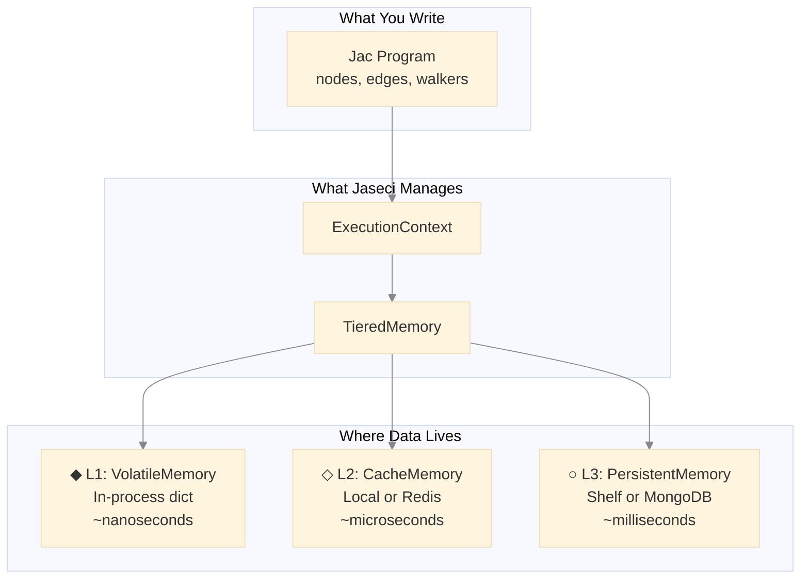
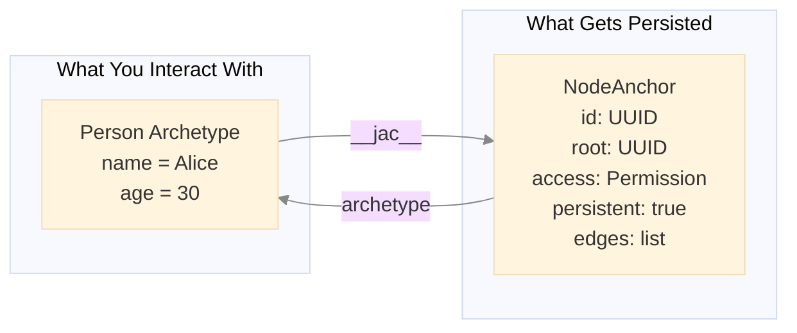
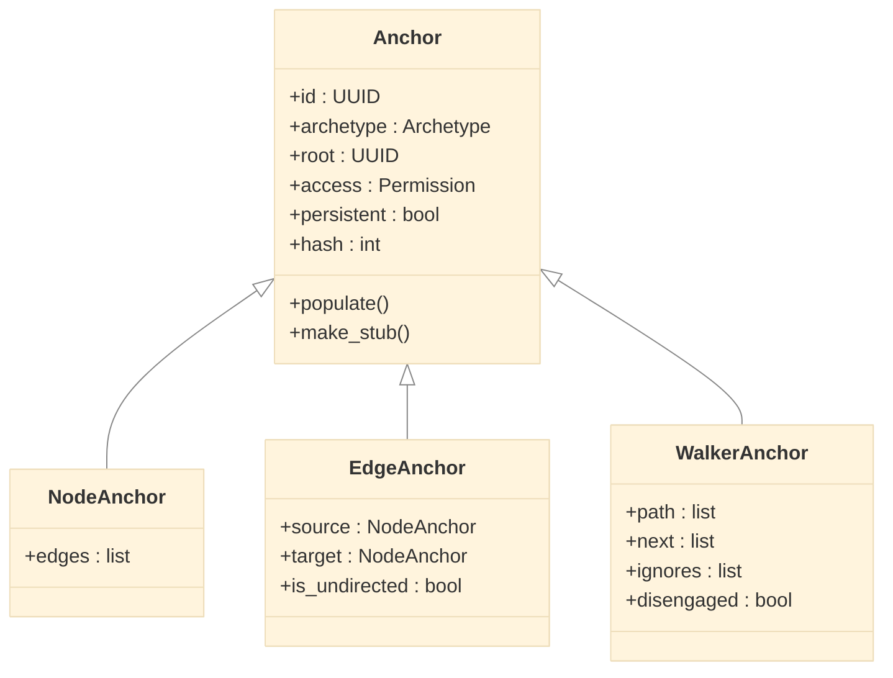
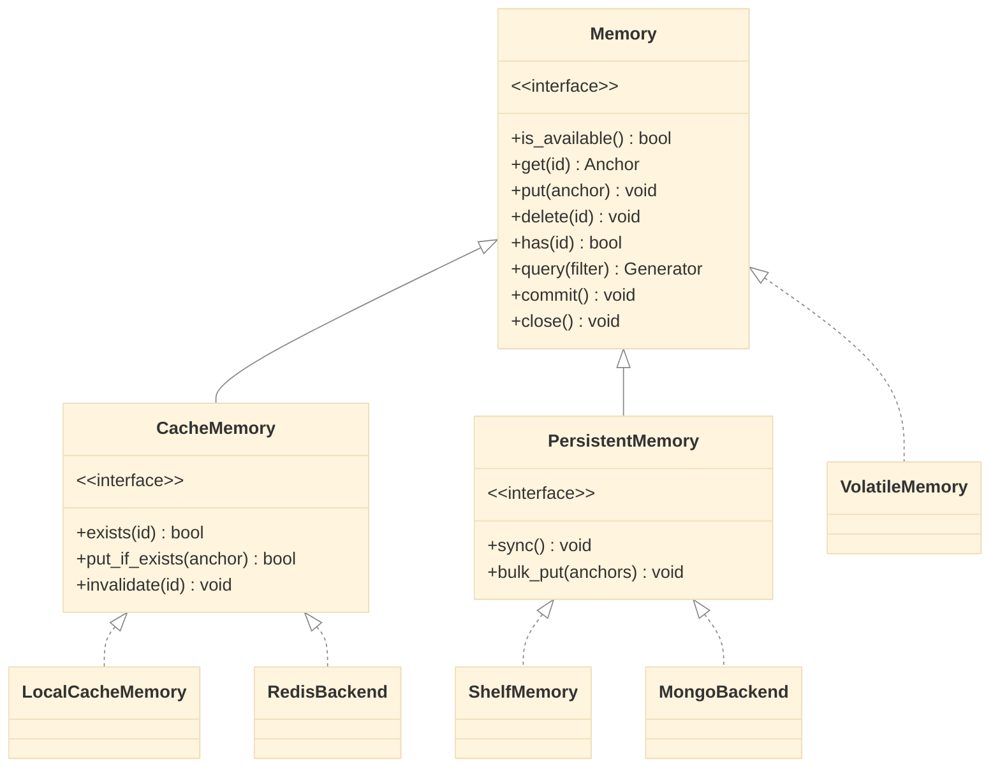
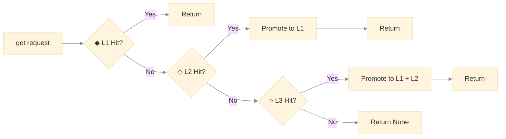
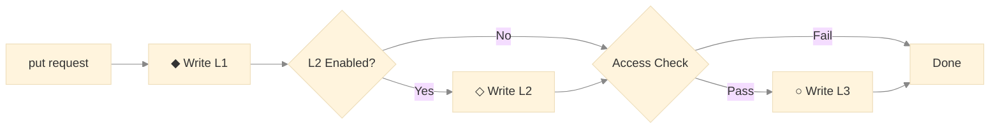
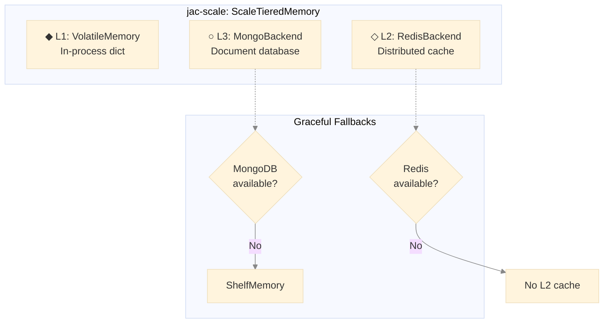
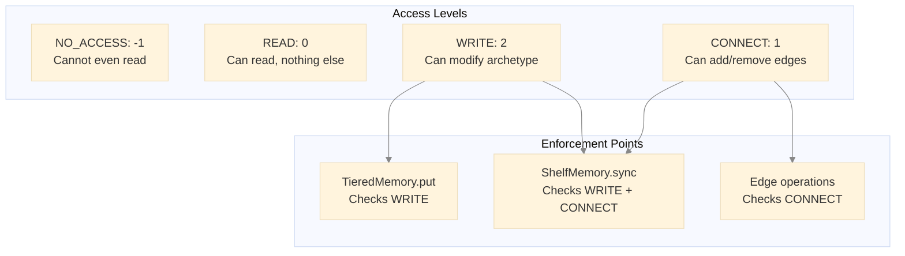
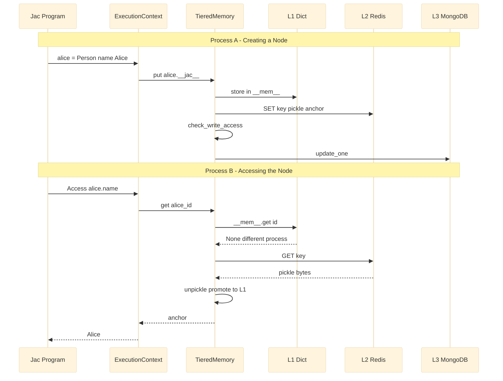

# Jaseci's Automatic and Scalable Object Storage: A Deep Dive

## The Problem: Persistence is Painful

If you've built applications with traditional frameworks, you know the ritual: define your database models, configure an ORM, write migrations, handle serialization for caching, manage connection pools, and sprinkle `session.commit()` calls throughout your code. For graph-structured data, it's even worse—you're either fighting with rigid relational schemas or wrestling with a graph database's query language.

What if your programming language just *handled* all of this?

<!-- more -->

```jac
# This is a complete, persistent application in Jac
node Person {
    has name: str,
        age: int;
}

node Company {
    has name: str;
}

edge WorksAt {
    has since: int;
}

with entry {
    # Create a graph - it's automatically persisted
    alice = Person(name="Alice", age=30);
    bob = Person(name="Bob", age=25);
    acme = Company(name="Acme Corp");

    root ++> alice;  # Connect to root (persistence anchor)
    root ++> bob;
    root ++> acme;

    alice +[WorksAt(since=2020)]+> acme;
    bob +[WorksAt(since=2022)]+> acme;
}
# That's it. No ORM. No migrations. No commit().
# Restart your program - the graph is still there.
```

This article explores the elegant architecture that makes this magic possible. We'll journey from the core abstractions that enable transparent persistence, through the tiered memory system that balances speed with durability, to the distributed backends that scale to production workloads.

**Who is this for?** This deep dive is intended for:

- **Jac developers** who want to understand what happens beneath the surface
- **Language implementers** interested in persistence patterns
- **Systems engineers** evaluating Jaseci for production deployments

**Prerequisites:** Familiarity with Python, basic understanding of caching concepts, and ideally some exposure to the Jac language.

---

## The Big Picture

Before diving into details, let's establish the overall architecture:



Jaseci implements a **three-tier memory hierarchy**—a pattern borrowed from CPU cache design:

| Tier | Name | Speed | Durability | Use Case |
|------|------|-------|------------|----------|
| **L1** | VolatileMemory | Fastest | None (process-local) | Hot working set |
| **L2** | CacheMemory | Fast | Ephemeral | Cross-process sharing |
| **L3** | PersistentMemory | Slower | Durable | Long-term storage |

**Why three tiers?** Two would suffice for correctness (memory + disk), but the middle tier is crucial for distributed deployments. When you have multiple Jac processes (e.g., in Kubernetes), L2 (Redis) provides shared state without the latency of hitting the database for every read. The hierarchy lets you optimize for your deployment: local development skips L2 entirely, while production systems leverage all three.

Now, let's understand the foundational abstraction that makes this transparent to your code.

---

## Core Abstraction: The Anchor-Archetype Pattern

The key insight enabling transparent persistence is **separating what users see from what gets stored**. This is the Anchor-Archetype pattern.

**The Two Faces of Every Object**

When you write `Person(name="Alice")` in Jac, two objects are actually created:



**Archetypes** are the user-facing objects—your nodes, edges, and walkers with the fields you defined. They're plain data classes focused on your domain logic.

**Anchors** are internal wrappers that handle everything else: unique identity, ownership, access control, persistence flags, and graph connectivity. Think of an anchor as the "metadata envelope" around your business object.

This separation is powerful because:

1. **Your code stays clean** - You work with `Person` objects, not `PersistablePersonWithMetadata` monstrosities
2. **Persistence is orthogonal** - The same archetype can be persistent or transient based on context
3. **Graph structure lives in anchors** - Node archetypes don't know about edges; NodeAnchors do

**The Anchor Family**

Different Jac constructs need different metadata, so there's an anchor type for each:



- **NodeAnchor**: Tracks outgoing edges (the graph structure)
- **EdgeAnchor**: Knows its source and target nodes
- **WalkerAnchor**: Maintains traversal state (path history, next nodes to visit)

**The Magic of Lazy Loading**

Here's where it gets clever. When you deserialize a node from storage, you don't want to load the entire graph into memory. Jaseci solves this with **lazy loading through Python's `__getattr__`**:

```python
# In the Anchor class
def __getattr__(self, name: str) -> object:
    """Trigger load if detects unloaded state."""
    if not self.is_populated():
        self.populate()  # Load from storage on-demand
        if not self.is_populated():
            raise ValueError(f"Anchor [{self.id}] is not a valid reference!")
        return getattr(self, name)
    raise AttributeError(...)
```

When a node is loaded from disk, its connected edges initially exist as **stubs**—minimal objects containing only a UUID. The moment you access any property on a stub, `__getattr__` fires, triggering a load from the memory hierarchy. This means:

```jac
# Loading alice doesn't load her entire social network
alice = root.get_person("Alice");  # Only alice loaded

# Accessing edges triggers lazy loading of just what's needed
for friend in alice --> Person {   # Now friend edges load
    print(friend.name);            # Each friend loads on access
}
```

**Serialization Without Infinite Loops**

Graphs have cycles. If Alice knows Bob and Bob knows Alice, naive serialization would loop forever. The **stub pattern** solves this:

```python
def __getstate__(self) -> dict[str, object]:
    """Serialize Node Anchor."""
    state = super().__getstate__()
    if self.is_populated():
        # Convert edge references to stubs (just UUIDs)
        state["edges"] = [edge.make_stub() for edge in self.edges]
    return state
```

When serializing, connected anchors become stubs. When deserializing, those stubs lazy-load on demand. The graph is stored as a collection of independent nodes with UUID references—just like a normalized database, but automatic.

---

## The Memory Interface Hierarchy

With the Anchor-Archetype pattern handling *what* gets stored, we now need to address *where* and *how*. Jaseci defines a clean interface hierarchy that allows swapping storage backends without changing application code.

**Why Interfaces Matter**

Consider these deployment scenarios:

- **Local development**: Store everything in a simple file
- **Single server**: Add in-memory caching for speed
- **Distributed cluster**: Use Redis for shared cache, MongoDB for persistence
- **Serverless**: Maybe DynamoDB instead of MongoDB

Without good abstractions, each scenario would require code changes. Jaseci's interface hierarchy makes these just configuration choices:



**The Base Contract: Memory**

Every storage tier implements this interface:

```jac
obj Memory {
    # Lifecycle
    def is_available -> bool abs;
    def close -> None abs;

    # CRUD operations
    def get(id: UUID) -> (Anchor | None) abs;
    def put(anchor: Anchor) -> None abs;
    def delete(id: UUID) -> None abs;
    def has(id: UUID) -> bool abs;

    # Queries
    def query(filter: Callable | None) -> Generator[Anchor] abs;
    def find(ids: UUID | Iterable[UUID]) -> Generator[Anchor] abs;

    # Durability
    def commit(anchor: Anchor | None) -> None abs;
}
```

This interface is deliberately minimal—just enough to store and retrieve anchors by UUID. Simplicity here enables flexibility in implementations.

**Cache-Specific Operations: CacheMemory**

Caches have unique requirements beyond basic storage:

```jac
obj CacheMemory(Memory) {
    # Check existence without loading (saves bandwidth)
    def exists(id: UUID) -> bool abs;

    # Update only if already cached (don't pollute cache with cold data)
    def put_if_exists(anchor: Anchor) -> bool abs;

    # Explicit invalidation for consistency
    def invalidate(id: UUID) -> None abs;
}
```

**Why `put_if_exists`?** In a cache-aside pattern, you only want to update cache entries that are already there. If a node isn't cached, there's no point caching it during a write—it wasn't hot enough to be cached during reads, so it's probably cold.

**Persistence-Specific Operations: PersistentMemory**

Durable storage needs guarantees that caches don't:

```jac
obj PersistentMemory(Memory) {
    # Ensure all pending writes reach stable storage
    def sync -> None abs;

    # Efficient batch writes (crucial for performance)
    def bulk_put(anchors: Iterable[Anchor]) -> None abs;
}
```

**Why `sync`?** Databases often buffer writes for performance. `sync` forces a flush, guaranteeing durability. This is called at context close and periodically during long operations.

---

## Concrete Implementations: From Dict to MongoDB

Now let's see how these interfaces come to life.

**L1: VolatileMemory — The Speed Demon**

The simplest possible implementation—a Python dictionary:

```jac
obj VolatileMemory(Memory) {
    has __mem__: dict[UUID, Anchor] = {},
        __gc__: set[Anchor] = {};
}

impl VolatileMemory.get(id: UUID) -> (Anchor | None) {
    return self.__mem__.get(id);
}

impl VolatileMemory.put(anchor: Anchor) -> None {
    self.__mem__[anchor.id] = anchor;
}

impl VolatileMemory.delete(id: UUID) -> None {
    if (anchor := self.__mem__.pop(id, None)) {
        self.__gc__.add(anchor);  # Track for cleanup in other tiers
    }
}
```

**Why track deletions in `__gc__`?** When a node is deleted from L1, we need to propagate that deletion to L2 and L3. The garbage collection set ensures we don't forget what was deleted when `sync` is called.

**Performance**: Dictionary lookups are O(1). This is as fast as it gets without dropping to C.

**L2: LocalCacheMemory — Development's Best Friend**

For single-process deployments, this extends VolatileMemory with cache semantics:

```jac
obj LocalCacheMemory(VolatileMemory, CacheMemory) {
    # Inherits all Memory methods from VolatileMemory
}

impl LocalCacheMemory.put_if_exists(anchor: Anchor) -> bool {
    if anchor.id in self.__mem__ {
        self.__mem__[anchor.id] = anchor;
        return True;
    }
    return False;  # Not in cache, don't add it
}

impl LocalCacheMemory.invalidate(id: UUID) -> None {
    self.__mem__.pop(id, None);  # Silent removal
}
```

This is the default L2 for local development. No Redis to install, no configuration needed.

**L3: ShelfMemory — File-Based Persistence**

Python's `shelve` module provides a dict-like interface backed by files:

```jac
obj ShelfMemory(PersistentMemory) {
    has path: str,
        __mem__: dict[UUID, Anchor] = {},   # Read-through cache
        __gc__: set[Anchor] = {},
        __shelf__: shelve.Shelf | None = None;
}

impl ShelfMemory.init(path: str) -> None {
    self.path = path;
    self.__shelf__ = shelve.open(path);
}
```

The read-through pattern optimizes repeated access:

```jac
impl ShelfMemory.get(id: UUID) -> (Anchor | None) {
    # Check in-memory cache first (fast path)
    if (anchor := self.__mem__.get(id)) {
        return anchor;
    }

    # Fall back to disk
    if isinstance(self.__shelf__, shelve.Shelf) {
        if (anchor := self.__shelf__.get(str(id))) {
            self.__mem__[id] = anchor;  # Promote to cache
            return anchor;
        }
    }
    return None;
}
```

The `sync` operation is where access control gets enforced:

```jac
impl ShelfMemory.sync -> None {
    import from jaclang { JacRuntimeInterface as Jac }

    # Process deletions first
    for anchor in self.__gc__ {
        self.__shelf__.pop(str(anchor.id), None);
    }
    self.__gc__.clear();

    # Persist modified anchors with access control
    for (id, anchor) in self.__mem__.items() {
        if not anchor.persistent {
            continue;  # Skip transient objects
        }

        # Check write permission before persisting
        if Jac.check_write_access(anchor) {
            self.__shelf__[str(id)] = anchor;
        }
    }
}
```

**Key insight**: Access control is enforced at the persistence boundary. You can modify an object in memory all you want, but unauthorized changes won't reach disk.

---

## TieredMemory: The Orchestrator

Individual tiers are simple. The magic is in how they compose. `TieredMemory` inherits from `VolatileMemory` (becoming L1) and orchestrates optional L2 and L3 layers:

```jac
obj TieredMemory(VolatileMemory) {
    has l2: CacheMemory | None = None,
        l3: PersistentMemory | None = None;
}
```

**Read Path: Hunt Through the Hierarchy**



```jac
impl TieredMemory.get(id: UUID) -> (Anchor | None) {
    # L1: Check in-process memory (nanoseconds)
    if (anchor := self.__mem__.get(id)) {
        return anchor;
    }

    # L2: Check distributed cache (microseconds)
    if self.l2 and (anchor := self.l2.get(id)) {
        self.__mem__[anchor.id] = anchor;  # Promote to L1
        return anchor;
    }

    # L3: Check persistent storage (milliseconds)
    if self.l3 and (anchor := self.l3.get(id)) {
        self.__mem__[anchor.id] = anchor;  # Promote to L1
        if self.l2 {
            self.l2.put(anchor);           # Warm the cache
        }
        return anchor;
    }

    return None;
}
```

**Why promote on read?** If you're reading something, you'll likely read it again soon (temporal locality). Promotion ensures subsequent reads hit faster tiers.

**Write Path: Write-Through with Access Control**



```jac
impl TieredMemory.put(anchor: Anchor) -> None {
    import from jaclang { JacRuntimeInterface as Jac }

    # Always write to L1 (unconditional, fast)
    self.__mem__[anchor.id] = anchor;

    # Write-through to L2 if enabled
    if self.l2 {
        self.l2.put(anchor);
    }

    # Write-through to L3 with access control
    if self.l3 and anchor.persistent {
        if Jac.check_write_access(anchor) {
            self.l3.put(anchor);
        }
    }
}
```

**Why write-through instead of write-back?** Write-back (lazy persistence) is faster but risks data loss on crashes. Write-through is safer and simpler—crucial for a language runtime where users don't expect to manage transactions.

**Delete Path: Cascade Down**

```jac
impl TieredMemory.delete(id: UUID) -> None {
    # Remove from L1, track for GC
    if (anchor := self.__mem__.pop(id, None)) {
        self.__gc__.add(anchor);
    }

    # Invalidate L2 (don't serve stale cached data)
    if self.l2 {
        self.l2.invalidate(id);
    }

    # Delete from L3 (remove from durable storage)
    if self.l3 {
        self.l3.delete(id);
    }
}
```

Deletions propagate immediately to all tiers. There's no "mark for deletion" complexity—when it's gone, it's gone everywhere.

---

## ExecutionContext: Where It All Begins

The `ExecutionContext` is the entry point that wires everything together. Every Jac program runs within a context:

```jac
class ExecutionContext {
    has mem: Memory,           # The tiered memory system
        system_root: NodeAnchor,  # The global root node
        entry_node: NodeAnchor,   # Current entry point
        reports: list[Any];       # Walker reports collector
}
```

**Initialization: Finding or Creating Root**

```jac
impl ExecutionContext.init(
    session: str | None = None,
    <>root: str | None = None
) -> None {
    # Create the tiered memory system
    self.mem = TieredMemory(session=session);
    self.reports = [];

    # Every graph needs a root. Try to load it, or create it.
    system_root = self.mem.get(UUID(SUPER_ROOT_UUID));

    if not isinstance(system_root, NodeAnchor) {
        # First run: create the root node
        system_root = Root().__jac__;
        system_root.id = UUID(SUPER_ROOT_UUID);
        self.mem.put(system_root);
    }

    self.system_root = system_root;
    self.entry_node = self._get_anchor(<>root) if <>root else self.system_root;
}
```

**The SUPER_ROOT_UUID**: This is a well-known UUID constant. Every Jaseci graph has exactly one super root, and its UUID is deterministic. This enables persistence—on restart, we look up this UUID and recover the entire graph through lazy loading.

**Lifecycle: Clean Shutdown**

```jac
impl ExecutionContext.close -> None {
    self.mem.close();  # Sync L3, close connections
}
```

When the context closes, `TieredMemory.close()` cascades: L3 syncs to disk, L2 connections close, L1 clears. Your data is safe.

---

## Scaling with jac-scale

Everything so far works great for single-machine deployments. But what about:

- Multiple Jac processes sharing state?
- Kubernetes pods that come and go?
- Data too large for a single file?

The `jac-scale` package extends the base hierarchy with distributed backends.



**ScaleTieredMemory: Smart Backend Selection**

```jac
obj ScaleTieredMemory(TieredMemory) {
    has _cache_available: bool = False,
        _persistence_type: str = 'none';
}

impl ScaleTieredMemory.init(session: str | None = None, use_cache: bool = True) -> None {
    # L1: Always in-process (inherited)
    self.__mem__ = {};
    self.__gc__ = set();

    # L2: Try Redis, gracefully degrade to no cache
    redis_backend = RedisBackend();
    if redis_backend.is_available() and use_cache {
        self.l2 = redis_backend;
        logger.info("Redis cache backend initialized");
    } else {
        self.l2 = None;
        logger.debug("Running without distributed cache");
    }

    # L3: Try MongoDB, fall back to ShelfMemory
    mongo_backend = MongoBackend();
    if mongo_backend.is_available() {
        self.l3 = mongo_backend;
        self._persistence_type = 'mongodb';
        logger.info("MongoDB persistence backend initialized");
    } else {
        self.l3 = ShelfMemory(path=session or DEFAULT_PATH);
        self._persistence_type = 'shelf';
        logger.info("Using ShelfMemory fallback");
    }
}
```

**Graceful degradation**: Your application doesn't crash if Redis is down—it just runs without distributed caching. MongoDB unavailable? It falls back to file storage. This is crucial for development (no infrastructure needed) and resilience in production.

**RedisBackend: Distributed L2 Cache**

```jac
obj RedisBackend(CacheMemory) {
    has redis_url: str,
        redis_client: redis.Redis | None = None;
}

impl RedisBackend.get(id: UUID) -> (Anchor | None) {
    if self.redis_client is None {
        return None;
    }
    try {
        raw = self.redis_client.get(storage_key(id));
        if raw {
            return pickle.loads(raw);  # Deserialize anchor
        }
    } except Exception as e {
        logger.debug(f"Redis get failed: {e}");
    }
    return None;
}

impl RedisBackend.put(anchor: Anchor) -> None {
    if self.redis_client is None {
        return;
    }
    try {
        data = pickle.dumps(anchor);  # Serialize anchor
        self.redis_client.set(storage_key(anchor.id), data);
    } except Exception as e {
        logger.debug(f"Redis put failed: {e}");
    }
}
```

**Why pickle?** Anchors are Python objects with complex nested structures. Pickle handles this natively. For cross-language scenarios, you'd use a different serialization format—the interface doesn't care.

**MongoBackend: Scalable L3 Persistence**

```jac
obj MongoBackend(PersistentMemory) {
    has mongo_url: str,
        client: MongoClient | None = None,
        db_name: str = 'jac_db',
        collection_name: str = 'anchors';
}

impl MongoBackend.put(anchor: Anchor) -> None {
    if self.client is None or not anchor.persistent {
        return;
    }
    try {
        data_blob = pickle.dumps(anchor);
        self.collection.update_one(
            {'_id': str(anchor.id)},
            {'$set': {'data': data_blob, 'type': type(anchor).__name__}},
            upsert=True  # Insert or update
        );
    } except Exception as e {
        logger.debug(f"MongoDB put failed: {e}");
    }
}

impl MongoBackend.bulk_put(anchors: Iterable[Anchor]) -> None {
    # Batch writes for efficiency
    ops = [
        UpdateOne(
            {'_id': str(a.id)},
            {'$set': {'data': pickle.dumps(a), 'type': type(a).__name__}},
            upsert=True
        )
        for a in anchors if a.persistent
    ];
    if ops {
        self.collection.bulk_write(ops);
    }
}
```

**Why store serialized blobs?** MongoDB is schema-flexible, but Jac archetypes are user-defined and arbitrary. Storing pickled blobs means any archetype works without schema management. The `type` field enables future optimizations (like indexing by node type).

---

## Access Control: Security at the Boundary

Jaseci doesn't just persist data—it enforces who can modify what.



Each anchor carries a `Permission` structure:

```python
@dataclass
class Permission:
    all: AccessLevel = AccessLevel.NO_ACCESS  # Default for everyone
    roots: Access = field(default_factory=Access)  # Per-root overrides
```

Access checks happen at persistence boundaries:

```jac
# In TieredMemory.put
if self.l3 and anchor.persistent {
    if Jac.check_write_access(anchor) {  # <-- Security gate
        self.l3.put(anchor);
    }
}

# In ShelfMemory.sync
if stored.edges != anchor.edges and Jac.check_connect_access(anchor) {
    stored.edges = anchor.edges;  # Only if allowed
}
```

**Why at the boundary?** Checking on every in-memory operation would kill performance. By checking only at persistence points, we get security without overhead. Unauthorized modifications exist only in the attacker's local memory—they never reach shared storage.

---

## Complete Data Flow: A Visual Journey

Let's trace what happens when you create a node and later access it from another process:



Process A's write flows through all tiers. Process B's read hits L2 (Redis) because L1 is process-local. The graph is shared without explicit coordination.

---

## Configuration and Deployment

**Local Development (Zero Config)**

```bash
jac run myapp.jac
```

Uses `TieredMemory` with `ShelfMemory`—data persists to a local file. No infrastructure needed.

**Production with jac-scale**

Set environment variables or `jac.toml`:

```toml
[database]
mongodb_uri = "mongodb://localhost:27017"
redis_url = "redis://localhost:6379"
shelf_db_path = "./fallback.shelf"  # Fallback if MongoDB unavailable
```

```bash
jac run myapp.jac  # Automatically uses ScaleTieredMemory
```

**Kubernetes Deployment**

jac-scale includes utilities for cloud-native deployment:

```jac
import from jac_scale.kubernetes { deploy_to_k8s }

with entry {
    deploy_to_k8s(
        replicas=3,
        mongo_replicas=3,
        redis_mode="cluster"
    );
}
```

---

## Key Design Principles

**1. Transparency Over Control**

Users write business logic; the runtime handles persistence. No `@Entity` annotations, no `session.add()`, no explicit transactions.

**2. Layered Abstraction**

Clean interfaces (`Memory` → `CacheMemory`/`PersistentMemory`) let you swap implementations. Development uses files; production uses databases; tests use mocks.

**3. Graceful Degradation**

Missing Redis? No cache, but it works. Missing MongoDB? Falls back to files. The system adapts to its environment.

**4. Security at Boundaries**

Access control is enforced where data leaves the process. In-memory operations are fast and unchecked; persistence is the security gate.

**5. Graph-Native Design**

The anchor-archetype pattern and lazy loading are designed for graphs. Cycles, references, and partial loading "just work."

---

## Conclusion: Why This Matters

Jaseci's memory hierarchy represents a philosophical shift: **persistence is a language feature, not an application concern**.

Traditional approach:

```python
# Define models (again, differently than your classes)
class PersonModel(Base):
    __tablename__ = 'persons'
    id = Column(UUID, primary_key=True)
    name = Column(String)
    # ... more boilerplate ...

# Application code
session = Session()
person = PersonModel(name="Alice")
session.add(person)
session.commit()  # Don't forget this!
session.close()   # Or this!
```

Jaseci approach:

```jac
node Person { has name: str; }
root ++> Person(name="Alice");
# Done. Persisted. Scalable.
```

The three-tier hierarchy, anchor-archetype pattern, and lazy loading aren't just implementation details—they're what makes this simplicity possible. By designing persistence into the runtime from the ground up, Jaseci eliminates an entire category of boilerplate and bugs.

For graph-structured applications—social networks, knowledge graphs, workflow engines, game worlds—this is transformative. You model your domain as nodes and edges, and the infrastructure handles the rest.

---

## Further Reading

- **Jac Language Guide**: Core syntax and concepts
- **jac-scale Documentation**: Distributed deployment options
- **Jaseci GitHub**: Source code for everything discussed here
  - `jaclang/runtimelib/memory.jac`: Memory interfaces and implementations
  - `jaclang/runtimelib/context.jac`: ExecutionContext
  - `jaclang/pycore/archetype.py`: Anchor and Archetype definitions
  - `jac-scale/jac_scale/memory_hierarchy.jac`: Scalable backends

---

*This article is based on analysis of the Jaseci codebase. Code samples are simplified for clarity; see the source for complete implementations.*
