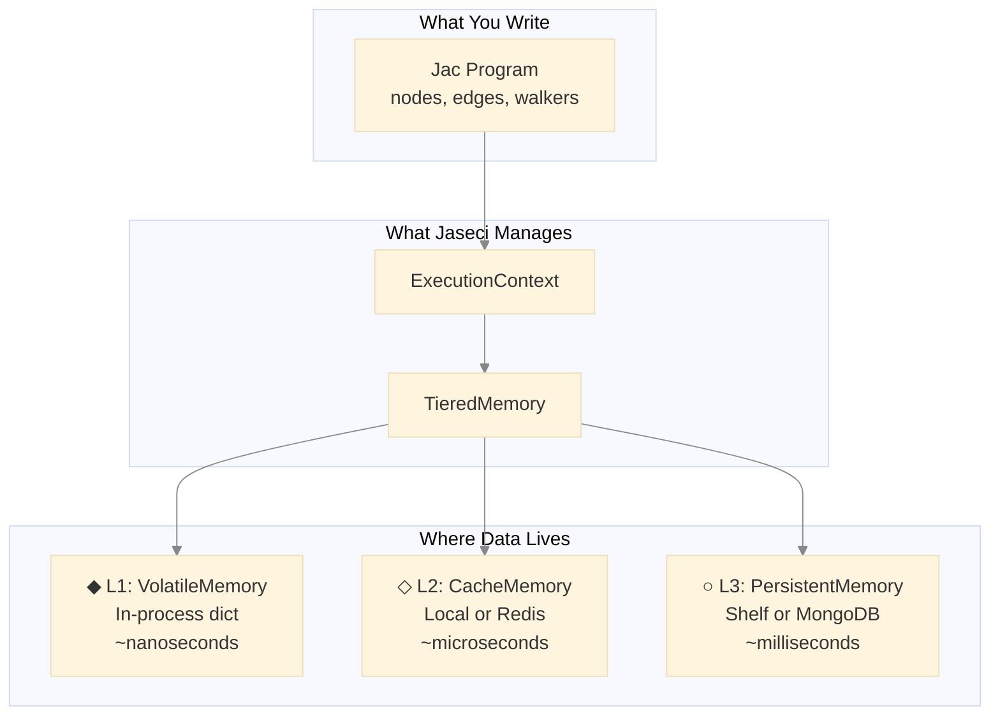
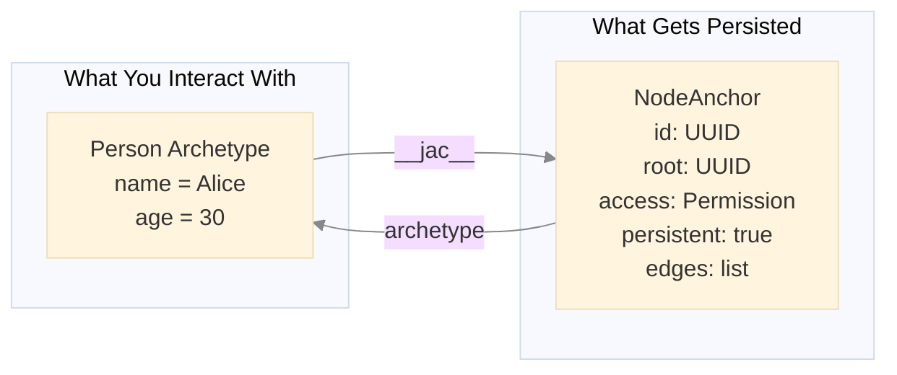
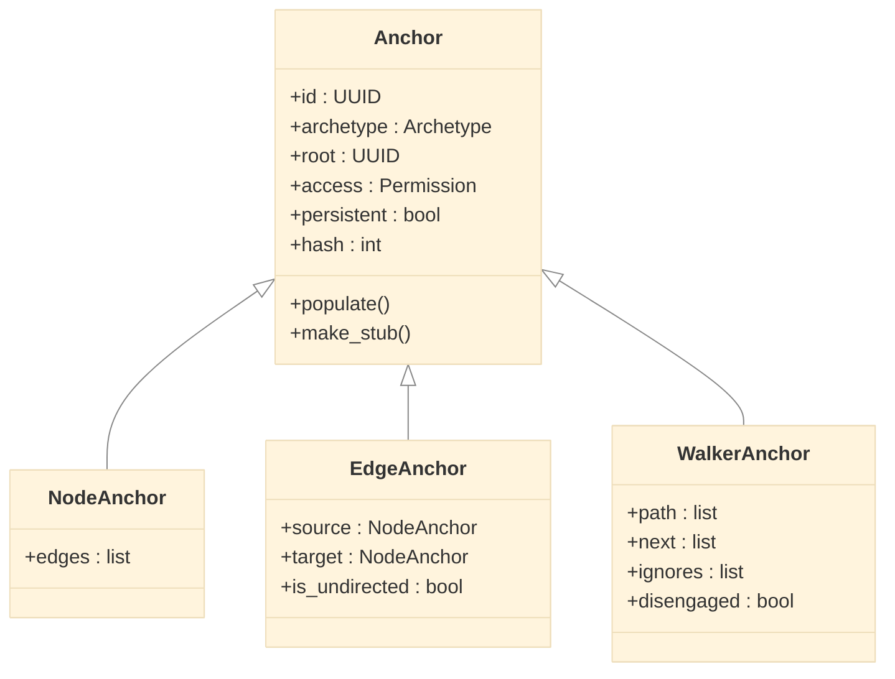
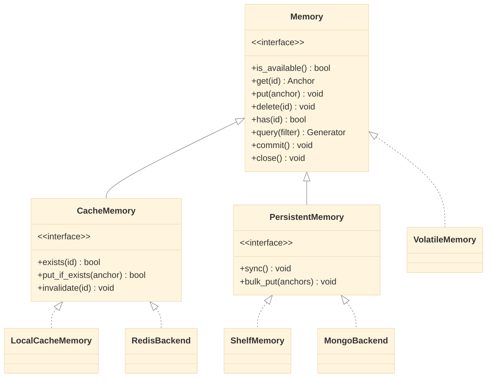
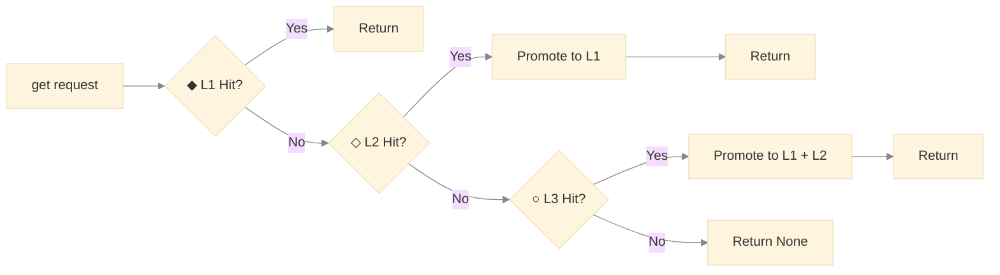
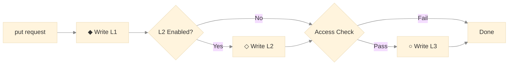
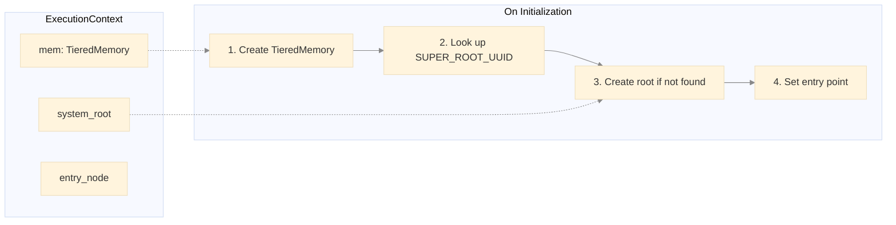
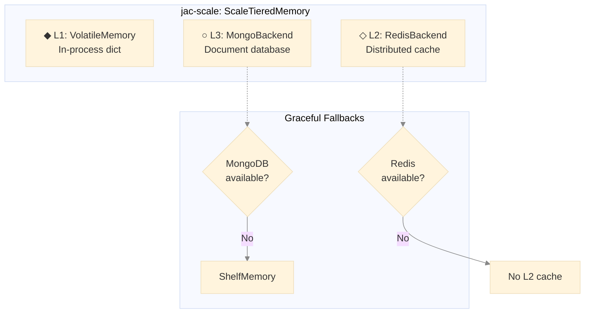
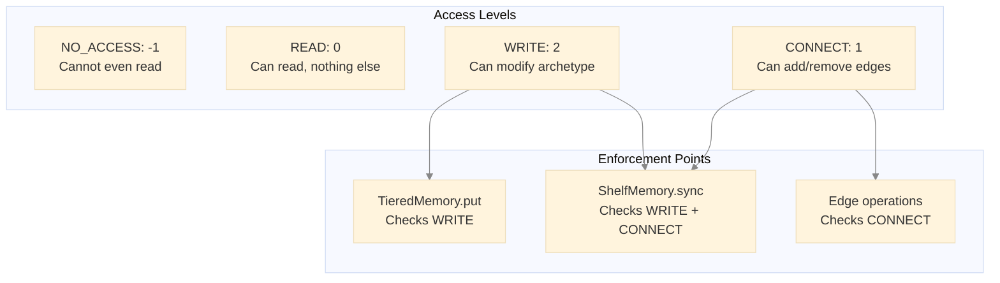
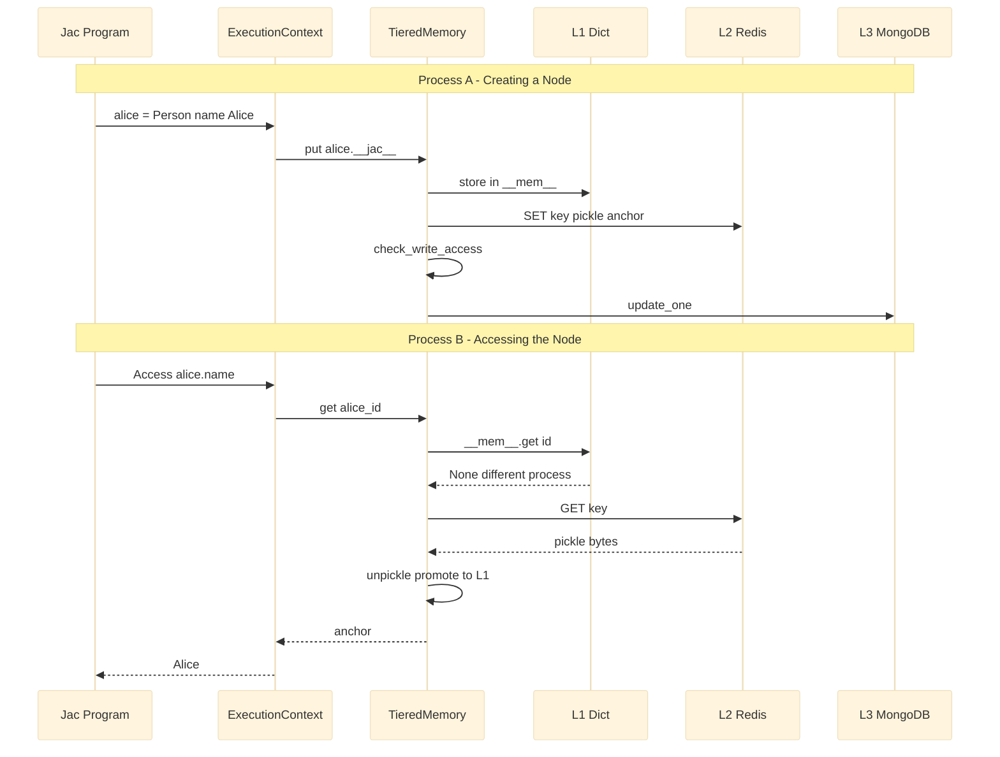

# Jaseci's Automatic and Scalable Object Storage: A Deep Dive

## The Problem: Persistence is Painful

If you've built applications with traditional frameworks, you know the ritual: define your database models, configure an ORM, write migrations, handle serialization for caching, manage connection pools, and sprinkle `session.commit()` calls throughout your code. For graph-structured data, it's even worse—you're either fighting with rigid relational schemas or wrestling with a graph database's query language.

Jaseci's approach is to handle all of this at the language runtime level.

<!-- more -->

```jac
# This is a complete, persistent application in Jac
node Person {
    has name: str,
        age: int;
}

node Company {
    has name: str;
}

edge WorksAt {
    has since: int;
}

with entry {
    # Create a graph - it's automatically persisted
    alice = Person(name="Alice", age=30);
    bob = Person(name="Bob", age=25);
    acme = Company(name="Acme Corp");

    root ++> alice;  # Connect to root (persistence anchor)
    root ++> bob;
    root ++> acme;

    alice +[WorksAt(since=2020)]+> acme;
    bob +[WorksAt(since=2022)]+> acme;
}
# That's it. No ORM. No migrations. No commit().
# Restart your program - the graph is still there.
```

This article explores the architecture that makes this possible. We'll examine the core abstractions that enable transparent persistence, the tiered memory system that balances speed with durability, and the distributed backends that scale to production workloads.

**Who is this for?** This deep dive is intended for:

- **Jac developers** who want to understand what happens beneath the surface
- **Language implementers** interested in persistence patterns
- **Systems engineers** evaluating Jaseci for production deployments

**Prerequisites:** Familiarity with Python, basic understanding of caching concepts, and ideally some exposure to the Jac language.

---

## The Big Picture

Before diving into details, let's establish the overall architecture:



Jaseci implements a **three-tier memory hierarchy**—a pattern borrowed from CPU cache design:

| Tier | Name | Speed | Durability | Use Case |
|------|------|-------|------------|----------|
| **L1** | VolatileMemory | Fastest | None (process-local) | Hot working set |
| **L2** | CacheMemory | Fast | Ephemeral | Cross-process sharing |
| **L3** | PersistentMemory | Slower | Durable | Long-term storage |

**Why three tiers?** Two would suffice for correctness (memory + disk), but the middle tier is crucial for distributed deployments. When you have multiple Jac processes (e.g., in Kubernetes), L2 (Redis) provides shared state without the latency of hitting the database for every read. The hierarchy lets you optimize for your deployment: local development skips L2 entirely, while production systems leverage all three.

Now, let's understand the foundational abstraction that makes this transparent to your code.

> **Summary:** Jaseci uses a three-tier memory hierarchy (L1: in-process dict, L2: distributed cache, L3: persistent storage) inspired by CPU cache design. This balances speed with durability while enabling both single-machine and distributed deployments.

---

## Core Abstraction: The Anchor-Archetype Pattern

The key insight enabling transparent persistence is **separating what users see from what gets stored**. This is the Anchor-Archetype pattern.

**The Two Faces of Every Object**

When you write `Person(name="Alice")` in Jac, two objects are actually created:



**Archetypes** are the user-facing objects—your nodes, edges, and walkers with the fields you defined. They're plain data classes focused on your domain logic.

**Anchors** are internal wrappers that handle everything else: unique identity, ownership, access control, persistence flags, and graph connectivity. Think of an anchor as the "metadata envelope" around your business object.

This separation is powerful because:

1. **Your code stays clean** - You work with `Person` objects, not `PersistablePersonWithMetadata` monstrosities
2. **Persistence is orthogonal** - The same archetype can be persistent or transient based on context
3. **Graph structure lives in anchors** - Node archetypes don't know about edges; NodeAnchors do

**The Anchor Family**

Different Jac constructs need different metadata, so there's an anchor type for each:



- **NodeAnchor**: Tracks outgoing edges (the graph structure)
- **EdgeAnchor**: Knows its source and target nodes
- **WalkerAnchor**: Maintains traversal state (path history, next nodes to visit)

**Lazy Loading**

Here's where it gets clever. When you deserialize a node from storage, you don't want to load the entire graph into memory. Jaseci solves this with **lazy loading through Python's `__getattr__`**:

**Source:** [`jac/jaclang/pycore/archetype.py` (lines 236-247)](https://github.com/jaseci-labs/jaseci/blob/36c202fcf2c1699b77f5b1e4a249e88a76a3b7b7/jac/jaclang/pycore/archetype.py#L236-L247)

```python
def __getattr__(self, name: str) -> object:
    """Trigger load if detects unloaded state."""
    if not self.is_populated():
        self.populate()
        if not self.is_populated():
            raise ValueError(
                f"{self.__class__.__name__} [{self.id}] is not a valid reference!"
            )
        return getattr(self, name)
    raise AttributeError(
        f"'{self.__class__.__name__} object has not attribute {name}'"
    )
```

The `populate()` method retrieves the anchor from the memory hierarchy:

**Source:** [`jac/jaclang/pycore/archetype.py` (lines 226-234)](https://github.com/jaseci-labs/jaseci/blob/36c202fcf2c1699b77f5b1e4a249e88a76a3b7b7/jac/jaclang/pycore/archetype.py#L226-L234)

```python
def populate(self) -> None:
    """Retrieve the Archetype from db and return."""
    from jaclang import JacRuntimeInterface as Jac

    ctx = Jac.get_context()
    # Orchestrator handles read-through caching (L1 -> L3)
    anchor = ctx.mem.get(self.id)
    if anchor:
        self.__dict__.update(anchor.__dict__)
```

When a node is loaded from disk, its connected edges initially exist as **stubs**—minimal objects containing only a UUID. The moment you access any property on a stub, `__getattr__` fires, triggering a load from the memory hierarchy. This means:

```jac
# Traversing from root loads only direct connections
for person in [root -->](`?Person)(?name == "Alice") {
    # At this point, only alice is loaded—not her connections

    # Now accessing alice's edges triggers lazy loading
    for friend in [person -->](`?Person) {
        print(friend.name);  # Each friend loads on first access
    }
}
```

**Serialization Without Infinite Loops**

Graphs have cycles. If Alice knows Bob and Bob knows Alice, naive serialization would loop forever. The **stub pattern** solves this:

**Source:** [`jac/jaclang/pycore/archetype.py` (lines 304-316)](https://github.com/jaseci-labs/jaseci/blob/36c202fcf2c1699b77f5b1e4a249e88a76a3b7b7/jac/jaclang/pycore/archetype.py#L304-L316)

```python
@dataclass(eq=False, repr=False, kw_only=True)
class NodeAnchor(Anchor):
    """Node Anchor."""

    archetype: NodeArchetype
    edges: list[EdgeAnchor]

    def __getstate__(self) -> dict[str, object]:
        """Serialize Node Anchor."""
        state = super().__getstate__()
        if self.is_populated():
            state["edges"] = [edge.make_stub() for edge in self.edges]
        return state
```

The `make_stub()` method creates a minimal reference containing only the UUID:

**Source:** [`jac/jaclang/pycore/archetype.py` (lines 218-224)](https://github.com/jaseci-labs/jaseci/blob/36c202fcf2c1699b77f5b1e4a249e88a76a3b7b7/jac/jaclang/pycore/archetype.py#L218-L224)

```python
def make_stub(self: TANCH) -> TANCH:
    """Return unsynced copy of anchor."""
    if self.is_populated():
        unloaded = object.__new__(self.__class__)
        unloaded.id = self.id
        return unloaded
    return self
```

When serializing, connected anchors become stubs. When deserializing, those stubs lazy-load on demand. The graph is stored as a collection of independent nodes with UUID references—just like a normalized database, but automatic.

> **Summary:** The Anchor-Archetype pattern separates user-facing objects (archetypes) from persistence metadata (anchors). Lazy loading via `__getattr__` ensures only accessed data is loaded. Stubs (UUID-only references) prevent infinite loops when serializing cyclic graphs.

---

## The Memory Interface Hierarchy

With the Anchor-Archetype pattern handling *what* gets stored, we now need to address *where* and *how*. Jaseci defines a clean interface hierarchy that allows swapping storage backends without changing application code.

**Why Interfaces Matter**

Consider these deployment scenarios:

- **Local development**: Store everything in a simple file
- **Single server**: Add in-memory caching for speed
- **Distributed cluster**: Use Redis for shared cache, MongoDB for persistence
- **Serverless**: Maybe DynamoDB instead of MongoDB

Without good abstractions, each scenario would require code changes. Jaseci's interface hierarchy makes these just configuration choices:



**The Base Contract: Memory**

Every storage tier implements this interface:

**Source:** [`jac/jaclang/runtimelib/memory.jac` (lines 46-87)](https://github.com/jaseci-labs/jaseci/blob/36c202fcf2c1699b77f5b1e4a249e88a76a3b7b7/jac/jaclang/runtimelib/memory.jac#L46-L87)

```jac
obj Memory {
    """Check if the memory is available and operational."""
    def is_available -> bool abs;

    """Retrieve an anchor by its UUID."""
    def get(id: UUID) -> (Anchor | None) abs;

    """Store an anchor."""
    def put(anchor: Anchor) -> None abs;

    """Remove an anchor by ID."""
    def delete(id: UUID) -> None abs;

    """Close the memory and release resources."""
    def close -> None abs;

    """Check if an anchor is currently in memory."""
    def has(id: UUID) -> bool abs;

    """Query all anchors with optional filter."""
    def query(
        filter: (Callable[[Anchor], bool] | None) = None
    ) -> Generator[Anchor, None, None] abs;

    """Get all root anchors."""
    def get_roots -> Generator[Root, None, None] abs;

    """Find anchors by IDs with optional filter."""
    def find(
        ids: (UUID | Iterable[UUID]),
        filter: (Callable[[Anchor], Anchor] | None) = None
    ) -> Generator[Anchor, None, None] abs;

    """Find one anchor by ID(s) with optional filter."""
    def find_one(
        ids: (UUID | Iterable[UUID]),
        filter: (Callable[[Anchor], Anchor] | None) = None
    ) -> (Anchor | None) abs;

    """Commit/sync pending changes."""
    def commit(anchor: (Anchor | None) = None) -> None abs;
}
```

This interface is deliberately minimal—just enough to store and retrieve anchors by UUID. Simplicity here enables flexibility in implementations.

**Cache-Specific Operations: CacheMemory**

Caches have unique requirements beyond basic storage:

**Source:** [`jac/jaclang/runtimelib/memory.jac` (lines 89-104)](https://github.com/jaseci-labs/jaseci/blob/36c202fcf2c1699b77f5b1e4a249e88a76a3b7b7/jac/jaclang/runtimelib/memory.jac#L89-L104)

```jac
"""Cache Memory Interface.

Extends Memory with operations specific to ephemeral caching.
Cache backends are expected to be fast but data loss is acceptable.
Used for L2 (local or distributed cache like Redis) in the tiered hierarchy.
"""
obj CacheMemory(Memory) {
    """Check if a key exists in the cache without loading the value."""
    def exists(id: UUID) -> bool abs;

    """Store an anchor only if it already exists in the cache."""
    def put_if_exists(anchor: Anchor) -> bool abs;

    """Invalidate a cache entry by ID."""
    def invalidate(id: UUID) -> None abs;
}
```

**Why `put_if_exists`?** In a cache-aside pattern, you only want to update cache entries that are already there. If a node isn't cached, there's no point caching it during a write—it wasn't hot enough to be cached during reads, so it's probably cold.

**Persistence-Specific Operations: PersistentMemory**

Durable storage needs guarantees that caches don't:

**Source:** [`jac/jaclang/runtimelib/memory.jac` (lines 106-117)](https://github.com/jaseci-labs/jaseci/blob/36c202fcf2c1699b77f5b1e4a249e88a76a3b7b7/jac/jaclang/runtimelib/memory.jac#L106-L117)

```jac
"""Persistent Memory Interface.

Extends Memory with operations specific to durable storage.
Implementations must guarantee data durability after sync().
"""
obj PersistentMemory(Memory) {
    """Flush pending writes to durable storage."""
    def sync -> None abs;

    """Bulk store multiple anchors efficiently."""
    def bulk_put(anchors: Iterable[Anchor]) -> None abs;
}
```

**Why `sync`?** Databases often buffer writes for performance. `sync` forces a flush, guaranteeing durability. This is called at context close and periodically during long operations.

> **Summary:** Three interfaces define the contract: `Memory` (base CRUD operations), `CacheMemory` (adds `exists`, `put_if_exists`, `invalidate`), and `PersistentMemory` (adds `sync`, `bulk_put`). This abstraction allows swapping backends without code changes.

---

## Concrete Implementations: From Dict to MongoDB

Now let's see how these interfaces come to life. We'll focus on the object definitions—what state each tier maintains and what operations it supports. The implementation details follow straightforward patterns documented in the [implementation files](https://github.com/jaseci-labs/jaseci/blob/36c202fcf2c1699b77f5b1e4a249e88a76a3b7b7/jac/jaclang/runtimelib/impl/memory.impl.jac).

**L1: VolatileMemory — In-Process Dictionary**

The simplest possible storage—a Python dictionary with O(1) lookups:

**Source:** [`jac/jaclang/runtimelib/memory.jac` (lines 122-158)](https://github.com/jaseci-labs/jaseci/blob/36c202fcf2c1699b77f5b1e4a249e88a76a3b7b7/jac/jaclang/runtimelib/memory.jac#L122-L158)

```jac
"""Volatile Memory - Simple in-memory storage with no persistence.

This is the L1 tier in a tiered memory hierarchy. All data is lost when
the process exits. Used as the fast cache layer in TieredMemory.
"""
obj VolatileMemory(Memory) {
    has __mem__: dict[UUID, Anchor] = {},   # The actual storage
        __gc__: set[Anchor] = {};           # Tracks deletions for sync

    # Memory interface implementation
    def is_available -> bool;
    def get(id: UUID) -> (Anchor | None);
    def put(anchor: Anchor) -> None;
    def delete(id: UUID) -> None;
    def close -> None;
    def has(id: UUID) -> bool;
    def query(filter: (Callable[[Anchor], bool] | None) = None)
        -> Generator[Anchor, None, None];
    def get_roots -> Generator[Root, None, None];
    def find(ids: (UUID | Iterable[UUID]),
             filter: (Callable[[Anchor], Anchor] | None) = None)
        -> Generator[Anchor, None, None];
    def find_one(ids: (UUID | Iterable[UUID]),
                 filter: (Callable[[Anchor], Anchor] | None) = None)
        -> (Anchor | None);
    def commit(anchor: (Anchor | None) = None) -> None;
}
```

**Key design decisions:**

- **`__mem__`**: Direct dict access gives nanosecond lookups—as fast as Python allows
- **`__gc__`**: Tracks deleted anchors so higher tiers can propagate deletions during sync
- **No persistence**: Data lives only for the process lifetime; that's the point of L1

**L2: LocalCacheMemory — Single-Process Cache**

Extends `VolatileMemory` with cache-specific semantics through multiple inheritance:

**Source:** [`jac/jaclang/runtimelib/memory.jac` (lines 160-170)](https://github.com/jaseci-labs/jaseci/blob/36c202fcf2c1699b77f5b1e4a249e88a76a3b7b7/jac/jaclang/runtimelib/memory.jac#L160-L170)

```jac
"""Local Cache Memory - In-process cache implementing CacheMemory interface.

Extends VolatileMemory with cache-specific methods (exists, put_if_exists, invalidate).
This is the default L2 tier. jac-scale overrides with Redis-based distributed cache.
"""
obj LocalCacheMemory(VolatileMemory, CacheMemory) {
    # Inherits __mem__ and __gc__ from VolatileMemory
    # Adds CacheMemory interface
    def exists(id: UUID) -> bool;
    def put_if_exists(anchor: Anchor) -> bool;
    def invalidate(id: UUID) -> None;
}
```

**Why multiple inheritance?** `LocalCacheMemory` *is* a `VolatileMemory` (same storage mechanism) but also satisfies the `CacheMemory` contract. This lets `TieredMemory` treat it uniformly with `RedisBackend`—both implement `CacheMemory`.

This is the default L2 for local development. No Redis to install, no configuration needed.

**L3: ShelfMemory — File-Based Persistence**

Python's `shelve` module provides a dict-like interface backed by files:

**Source:** [`jac/jaclang/runtimelib/memory.jac` (lines 172-214)](https://github.com/jaseci-labs/jaseci/blob/36c202fcf2c1699b77f5b1e4a249e88a76a3b7b7/jac/jaclang/runtimelib/memory.jac#L172-L214)

```jac
"""Shelf-based Persistent Memory.

Uses Python's shelve module for file-based durable storage.
Maintains an in-memory cache for fast reads with write-through to shelf.
"""
obj ShelfMemory(PersistentMemory) {
    has path: str,                              # File path for shelf
        __mem__: dict[UUID, Anchor] = {},       # Read-through cache
        __gc__: set[Anchor] = {},               # Deletion tracking
        __shelf__: (shelve.Shelf | None) = None; # Underlying file storage

    def init(path: str) -> None;

    # Memory interface
    def is_available -> bool;
    def get(id: UUID) -> (Anchor | None);
    def put(anchor: Anchor) -> None;
    def delete(id: UUID) -> None;
    def close -> None;
    def has(id: UUID) -> bool;
    def query(filter: (Callable[[Anchor], bool] | None) = None)
        -> Generator[Anchor, None, None];
    def get_roots -> Generator[Root, None, None];
    def find(ids: (UUID | Iterable[UUID]),
             filter: (Callable[[Anchor], Anchor] | None) = None)
        -> Generator[Anchor, None, None];
    def find_one(ids: (UUID | Iterable[UUID]),
                 filter: (Callable[[Anchor], Anchor] | None) = None)
        -> (Anchor | None);
    def commit(anchor: (Anchor | None) = None) -> None;

    # PersistentMemory interface
    def sync -> None;
    def bulk_put(anchors: Iterable[Anchor]) -> None;
}
```

**Key design decisions:**

- **Read-through caching**: `get()` checks `__mem__` first, then `__shelf__`, promoting hits to memory
- **Write-through**: `put()` writes to both memory and shelf
- **Access control on sync**: The `sync()` method checks `WRITE` and `CONNECT` permissions before persisting changes—unauthorized modifications never reach disk

See the [implementation](https://github.com/jaseci-labs/jaseci/blob/36c202fcf2c1699b77f5b1e4a249e88a76a3b7b7/jac/jaclang/runtimelib/impl/memory.impl.jac#L155-L328) for the full read-through/write-through logic and access control enforcement.

> **Summary:** L1 (`VolatileMemory`) is a Python dict. L2 (`LocalCacheMemory`) adds cache semantics for single-process use. L3 (`ShelfMemory`) uses Python's `shelve` for file-based persistence with read-through caching and access control enforcement on sync.

---

## TieredMemory: The Orchestrator

Individual tiers are simple. The real work is in how they compose. `TieredMemory` inherits from `VolatileMemory` (becoming L1) and orchestrates optional L2 and L3 layers:

**Source:** [`jac/jaclang/runtimelib/memory.jac` (lines 216-238)](https://github.com/jaseci-labs/jaseci/blob/36c202fcf2c1699b77f5b1e4a249e88a76a3b7b7/jac/jaclang/runtimelib/memory.jac#L216-L238)

```jac
"""Tiered Memory - Extends VolatileMemory with L2 cache + L3 persistent tiers.

This is the main memory abstraction used by ExecutionContext. It provides:
- Fast reads via inherited L1 (VolatileMemory) with L2/L3 fallback and automatic promotion
- Write-through to all tiers with access control
- Configurable tiers (L2 and L3 are optional)

TieredMemory IS the L1 tier (inherits __mem__, __gc__ from VolatileMemory).
jac-scale extends this by providing Redis-based L2 and database L3.
"""
obj TieredMemory(VolatileMemory) {
    has l2: (CacheMemory | None) = None,
        l3: (PersistentMemory | None) = None;

    def init(session: (str | None) = None, use_cache: bool = False) -> None;

    # Override only methods that need tiering logic
    def get(id: UUID) -> (Anchor | None);
    def put(anchor: Anchor) -> None;
    def delete(id: UUID) -> None;
    def close -> None;
    def has(id: UUID) -> bool;
    def commit(anchor: (Anchor | None) = None) -> None;
}
```

**Key architectural insight:** `TieredMemory` *is* the L1 tier (via inheritance) while *having* L2 and L3 tiers (via composition). This means L1 operations are direct method calls on `self`, while L2/L3 operations delegate to pluggable backends.

**Read Path: Hunt Through the Hierarchy**



The `get()` implementation follows the classic cache lookup pattern: check each tier in order, promoting hits to faster tiers. **Why promote on read?** Temporal locality—if you're reading something, you'll likely read it again soon.

**Write Path: Write-Through with Access Control**



The `put()` implementation always writes to L1, optionally to L2, and to L3 only if `anchor.persistent` is true *and* access control passes. **Why write-through instead of write-back?** Write-back risks data loss on crashes. Write-through is safer—crucial for a language runtime where users don't manage transactions.

**Delete Path: Cascade Down**

Deletions propagate immediately to all tiers: remove from L1 (tracking in `__gc__`), invalidate L2 cache, delete from L3 persistence. There's no "mark for deletion" complexity—when it's gone, it's gone everywhere.

See the [implementation](https://github.com/jaseci-labs/jaseci/blob/36c202fcf2c1699b77f5b1e4a249e88a76a3b7b7/jac/jaclang/runtimelib/impl/memory.impl.jac#L380-L433) for the complete read/write/delete logic.

> **Summary:** `TieredMemory` orchestrates the three tiers. Reads use read-through (L1→L2→L3 with promotion). Writes use write-through (always L1, then L2/L3 with access control). Deletes cascade to all tiers immediately.

---

## ExecutionContext: Where It All Begins

The `ExecutionContext` is the entry point that wires everything together. Every Jac program runs within a context:

**Source:** [`jac/jaclang/runtimelib/context.jac` (lines 13-37)](https://github.com/jaseci-labs/jaseci/blob/36c202fcf2c1699b77f5b1e4a249e88a76a3b7b7/jac/jaclang/runtimelib/context.jac#L13-L37)

```jac
"""Execution Context.

The `mem` field is a Memory implementation (typically TieredMemory) that provides
a unified interface to all storage tiers. TieredMemory handles read-through
caching and write-through persistence with access control internally.
"""
class ExecutionContext {
    has mem: Memory,                    # The tiered memory system
        reports: list[Any],             # Walker report accumulator
        custom: Any,                    # User-defined context data
        system_root: NodeAnchor,        # The global root (SUPER_ROOT_UUID)
        entry_node: NodeAnchor,         # Current entry point for walkers
        root_state: NodeAnchor;         # Current user's root context

    def init(
        self: ExecutionContext,
        session: (str | None) = None,   # Persistence path (optional)
        <>root: (str | None) = None     # Override root UUID (optional)
    ) -> None;

    def _get_anchor(self: ExecutionContext, anchor_id: str) -> NodeAnchor;
    def set_entry_node(self: ExecutionContext, entry_node: (str | None)) -> None;
    def close(self: ExecutionContext) -> None;
    def get_root(self: ExecutionContext) -> Root;
}
```

**How the Pieces Connect**

The `ExecutionContext` is the glue between your Jac code and the memory hierarchy:



**The SUPER_ROOT_UUID**: This is a well-known UUID constant. Every Jaseci graph has exactly one super root, and its UUID is deterministic. On initialization, `ExecutionContext` looks up this UUID via `mem.get()`. If found, the entire graph is recoverable through lazy loading. If not found, a new root is created.

**Lifecycle: Clean Shutdown**

When the context closes, `mem.close()` cascades through the tiers: L3 syncs to disk, L2 connections close, L1 clears. Your data is safe.

See the [implementation](https://github.com/jaseci-labs/jaseci/blob/36c202fcf2c1699b77f5b1e4a249e88a76a3b7b7/jac/jaclang/runtimelib/impl/context.impl.jac#L11-L55) for initialization and shutdown logic.

> **Summary:** `ExecutionContext` initializes `TieredMemory` and locates or creates the system root (a well-known UUID). On close, it ensures all tiers sync and release resources.

---

## Scaling with jac-scale

Everything so far works great for single-machine deployments. But what about:

- Multiple Jac processes sharing state?
- Kubernetes pods that come and go?
- Data too large for a single file?

The `jac-scale` package extends the base hierarchy with distributed backends.



**ScaleTieredMemory: Smart Backend Selection**

`ScaleTieredMemory` extends `TieredMemory` with production-ready backends:

**Source:** [`jac-scale/jac_scale/memory_hierarchy.jac` (lines 113-129)](https://github.com/jaseci-labs/jaseci/blob/36c202fcf2c1699b77f5b1e4a249e88a76a3b7b7/jac-scale/jac_scale/memory_hierarchy.jac#L113-L129)

```jac
"""
Scalable Tiered Memory - extends TieredMemory with distributed backends.

Swaps the default implementations:
- L2: RedisBackend instead of LocalCacheMemory (when Redis available)
- L3: MongoBackend instead of ShelfMemory (when MongoDB available)

Falls back to jaclang's ShelfMemory for L3 when MongoDB is unavailable.
"""
obj ScaleTieredMemory(TieredMemory) {
    has _cache_available: bool = False,     # Redis connectivity status
        _persistence_type: str = 'none',    # 'mongodb' or 'shelf'
        session_path: (str | None) = None;  # Fallback path for ShelfMemory

    def init(session: (str | None) = None, use_cache: bool = True) -> None;
    def close -> None;
}
```

**Graceful degradation**: On initialization, `ScaleTieredMemory` probes Redis and MongoDB. If Redis is unavailable, L2 is simply `None`—no distributed cache, but the system works. If MongoDB is unavailable, it falls back to `ShelfMemory`. Your application doesn't crash; it adapts.

See the [initialization logic](https://github.com/jaseci-labs/jaseci/blob/36c202fcf2c1699b77f5b1e4a249e88a76a3b7b7/jac-scale/jac_scale/impl/memory_hierarchy.main.impl.jac#L7-L42) for the backend selection algorithm.

**RedisBackend: Distributed L2 Cache**

**Source:** [`jac-scale/jac_scale/memory_hierarchy.jac` (lines 34-70)](https://github.com/jaseci-labs/jaseci/blob/36c202fcf2c1699b77f5b1e4a249e88a76a3b7b7/jac-scale/jac_scale/memory_hierarchy.jac#L34-L70)

```jac
"""
Redis cache backend - implements CacheMemory for distributed L2 caching.
Replaces LocalCacheMemory when Redis is available.
"""
obj RedisBackend(CacheMemory) {
    has redis_url: str = _db_config['redis_url'],
        redis_client: (redis.Redis | None) = None;

    def postinit -> None;
    def is_available -> bool;

    # Memory interface
    def get(id: UUID) -> (Anchor | None);
    def put(anchor: Anchor) -> None;
    def delete(id: UUID) -> None;
    def has(id: UUID) -> bool;
    def close -> None;
    def query(filter: (Callable[[Anchor], bool] | None) = None)
        -> Generator[Anchor, None, None];
    def commit(anchor: (Anchor | None) = None) -> None;

    # CacheMemory interface
    def exists(id: UUID) -> bool;
    def put_if_exists(anchor: Anchor) -> bool;
    def invalidate(id: UUID) -> None;
}
```

**Serialization**: Anchors are pickled before storage. This handles complex nested structures natively. For cross-language scenarios, you'd swap pickle for JSON or MessagePack—the interface doesn't care.

See the [Redis implementation](https://github.com/jaseci-labs/jaseci/blob/36c202fcf2c1699b77f5b1e4a249e88a76a3b7b7/jac-scale/jac_scale/impl/memory_hierarchy.redis.impl.jac) for get/put/invalidate logic.

**MongoBackend: Scalable L3 Persistence**

**Source:** [`jac-scale/jac_scale/memory_hierarchy.jac` (lines 72-111)](https://github.com/jaseci-labs/jaseci/blob/36c202fcf2c1699b77f5b1e4a249e88a76a3b7b7/jac-scale/jac_scale/memory_hierarchy.jac#L72-L111)

```jac
"""
MongoDB persistence backend - implements PersistentMemory for durable L3 storage.
Replaces ShelfMemory when MongoDB is available.
"""
obj MongoBackend(PersistentMemory) {
    has client: (MongoClient | None) = None,
        db_name: str = 'jac_db',
        collection_name: str = 'anchors',
        mongo_url: str = _db_config['mongodb_uri'];

    def postinit -> None;
    def is_available -> bool;

    # Memory interface
    def get(id: UUID) -> (Anchor | None);
    def put(anchor: Anchor) -> None;
    def delete(id: UUID) -> None;
    def has(id: UUID) -> bool;
    def close -> None;
    def query(filter: (Callable[[Anchor], bool] | None) = None)
        -> Generator[Anchor, None, None];
    def get_roots -> Generator[Root, None, None];
    def commit(anchor: (Anchor | None) = None) -> None;

    # PersistentMemory interface
    def sync -> None;
    def bulk_put(anchors: Iterable[Anchor]) -> None;
}
```

**Why store serialized blobs?** MongoDB is schema-flexible, but Jac archetypes are user-defined and arbitrary. Storing pickled blobs means any archetype works without schema management. The `type` field enables future optimizations (like indexing by node type).

See the [MongoDB implementation](https://github.com/jaseci-labs/jaseci/blob/36c202fcf2c1699b77f5b1e4a249e88a76a3b7b7/jac-scale/jac_scale/impl/memory_hierarchy.mongo.impl.jac) for storage and query logic.

> **Summary:** `jac-scale` provides `ScaleTieredMemory` with distributed backends: `RedisBackend` for L2 cache, `MongoBackend` for L3 persistence. The system gracefully degrades—missing Redis means no distributed cache; missing MongoDB falls back to `ShelfMemory`.

---

## Access Control: Security at the Boundary

Jaseci doesn't just persist data—it enforces who can modify what.



Each anchor carries a `Permission` structure:

**Source:** [`jac/jaclang/pycore/archetype.py` (lines 24-59)](https://github.com/jaseci-labs/jaseci/blob/36c202fcf2c1699b77f5b1e4a249e88a76a3b7b7/jac/jaclang/pycore/archetype.py#L24-L59)

```python
class AccessLevel(IntEnum):
    """Access level enum."""

    NO_ACCESS = -1
    READ = 0
    CONNECT = 1
    WRITE = 2

    @staticmethod
    def cast(val: int | str | AccessLevel) -> AccessLevel:
        """Cast access level."""
        if isinstance(val, int):
            return AccessLevel(val)
        elif isinstance(val, str):
            return AccessLevel[val.upper()]
        else:
            return val


@dataclass
class Access:
    """Access Structure."""

    anchors: dict[str, AccessLevel] = field(default_factory=dict)

    def check(self, anchor: str) -> AccessLevel | None:
        """Validate access."""
        return self.anchors.get(anchor)


@dataclass
class Permission:
    """Anchor Access Handler."""

    all: AccessLevel = AccessLevel.NO_ACCESS
    roots: Access = field(default_factory=Access)
```

Access checks happen at persistence boundaries:

**Source:** [`jac/jaclang/pycore/runtime.py` (lines 208-219)](https://github.com/jaseci-labs/jaseci/blob/36c202fcf2c1699b77f5b1e4a249e88a76a3b7b7/jac/jaclang/pycore/runtime.py#L208-L219)

```python
@staticmethod
def check_write_access(to: Anchor) -> bool:
    """Write Access Validation."""
    if not (
        access_level := JacRuntimeInterface.check_access_level(to)
        > AccessLevel.CONNECT
    ):
        logger.info(
            "Current root doesn't have write access to "
            f"{to.__class__.__name__} {to.archetype.__class__.__name__}[{to.id}]"
        )
    return access_level
```

**Source:** [`jac/jaclang/pycore/runtime.py` (lines 221-264)](https://github.com/jaseci-labs/jaseci/blob/36c202fcf2c1699b77f5b1e4a249e88a76a3b7b7/jac/jaclang/pycore/runtime.py#L221-L264)

```python
@staticmethod
def check_access_level(to: Anchor, no_custom: bool = False) -> AccessLevel:
    """Access validation."""
    if not to.persistent or to.hash == 0:
        return AccessLevel.WRITE

    jctx = JacRuntimeInterface.get_context()
    jroot = jctx.root_state

    # if current root is system_root
    # if current root id is equal to target anchor's root id
    # if current root is the target anchor
    if jroot == jctx.system_root or jroot.id == to.root or jroot == to:
        return AccessLevel.WRITE

    if (
        not no_custom
        and (custom_level := to.archetype.__jac_access__()) is not None
    ):
        return AccessLevel.cast(custom_level)

    access_level = AccessLevel.NO_ACCESS

    # if target anchor have set access.all
    if (to_access := to.access).all > AccessLevel.NO_ACCESS:
        access_level = to_access.all

    # if target anchor's root have set allowed roots
    if to.root and isinstance(to_root := jctx.mem.get(to.root), Anchor):
        if to_root.access.all > access_level:
            access_level = to_root.access.all

        if (level := to_root.access.roots.check(str(jroot.id))) is not None:
            access_level = level

    # if target anchor have set allowed roots
    if (level := to_access.roots.check(str(jroot.id))) is not None:
        access_level = level

    return access_level
```

**Why at the boundary?** Checking on every in-memory operation would kill performance. By checking only at persistence points, we get security without overhead. Unauthorized modifications exist only in the attacker's local memory—they never reach shared storage.

> **Summary:** Access levels (NO_ACCESS, READ, CONNECT, WRITE) are stored per-anchor. Checks occur at persistence boundaries—`TieredMemory.put` and `ShelfMemory.sync`—not on every in-memory operation, balancing security with performance.

---

## Complete Data Flow: A Visual Journey

Let's trace what happens when you create a node and later access it from another process:



Process A's write flows through all tiers. Process B's read hits L2 (Redis) because L1 is process-local. The graph is shared without explicit coordination.

---

## Configuration and Deployment

**Local Development (Zero Config)**

```bash
jac run myapp.jac
```

Uses `TieredMemory` with `ShelfMemory`—data persists to a local file. No infrastructure needed.

**Production with jac-scale**

Set environment variables or `jac.toml`:

```toml
[database]
mongodb_uri = "mongodb://localhost:27017"
redis_url = "redis://localhost:6379"
shelf_db_path = "./fallback.shelf"  # Fallback if MongoDB unavailable
```

```bash
jac run myapp.jac  # Automatically uses ScaleTieredMemory
```

**Kubernetes Deployment**

jac-scale includes utilities for cloud-native deployment:

```jac
import from jac_scale.kubernetes { deploy_to_k8s }

with entry {
    deploy_to_k8s(
        replicas=3,
        mongo_replicas=3,
        redis_mode="cluster"
    );
}
```

---

## Key Design Principles

**1. Transparency Over Control**

Users write business logic; the runtime handles persistence. No `@Entity` annotations, no `session.add()`, no explicit transactions.

**2. Layered Abstraction**

Clean interfaces (`Memory` → `CacheMemory`/`PersistentMemory`) let you swap implementations. Development uses files; production uses databases; tests use mocks.

**3. Graceful Degradation**

Missing Redis? No cache, but it works. Missing MongoDB? Falls back to files. The system adapts to its environment.

**4. Security at Boundaries**

Access control is enforced where data leaves the process. In-memory operations are fast and unchecked; persistence is the security gate.

**5. Graph-Native Design**

The anchor-archetype pattern and lazy loading are designed for graphs. Cycles, references, and partial loading "just work."

---

## Conclusion: Why This Matters

Jaseci's memory hierarchy represents a philosophical shift: **persistence is a language feature, not an application concern**.

Traditional approach:

```python
# Define models (again, differently than your classes)
class PersonModel(Base):
    __tablename__ = 'persons'
    id = Column(UUID, primary_key=True)
    name = Column(String)
    # ... more boilerplate ...

# Application code
session = Session()
person = PersonModel(name="Alice")
session.add(person)
session.commit()  # Don't forget this!
session.close()   # Or this!
```

Jaseci approach:

```jac
node Person { has name: str; }
root ++> Person(name="Alice");
# Done. Persisted. Scalable.
```

The three-tier hierarchy, anchor-archetype pattern, and lazy loading aren't just implementation details—they're what makes this simplicity possible. By designing persistence into the runtime from the ground up, Jaseci eliminates an entire category of boilerplate and bugs.

For graph-structured applications—social networks, knowledge graphs, workflow engines, game worlds—this is transformative. You model your domain as nodes and edges, and the infrastructure handles the rest.

---

*This article is based on analysis of the Jaseci codebase. Code snippets are taken verbatim from the implementation files with file paths and line numbers cited for reference.*
